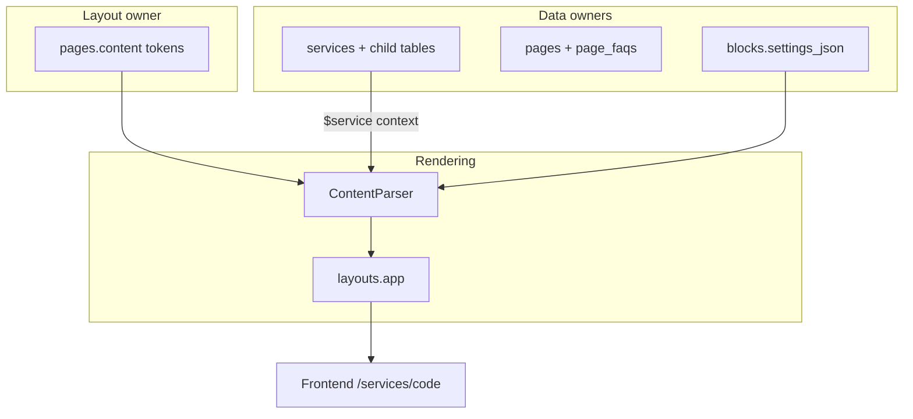
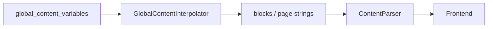
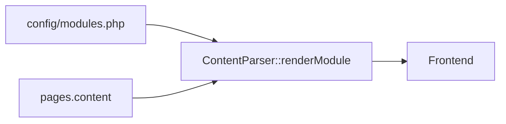
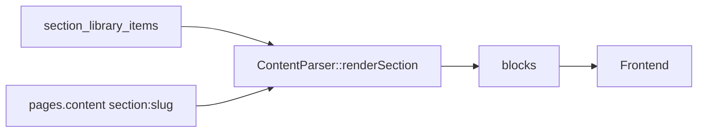

# Platform-wide composition & ownership repair plan

**Project:** Medca Health Care — recovery, consolidation, execution completion (not redesign)  
**Date:** 2026-06-03  
**Authority:** Evidence from forensic audits + live codebase inspection  
**Backups:** `/var/backups/medca-composition-repair-20260603-164521/` (see `BACKUP-MANIFEST.md`)

**Source reports:**

- `PLATFORM-FORENSIC-AUTOPSY.md`
- `SERVICES-MODULE-FORENSIC-DEEP-DIVE.md`
- `SERVICES-ARCHITECTURE-DECISION-REPORT.md`
- `SERVICES-IMPLEMENTATION-MASTERPLAN.md`
- `SITE-COMPOSITION-OWNERSHIP-MAP.md`

**Blockers:** `PLATFORM-COMPOSITION-BLOCKERS.md`  
**Rules (code):** `config/platform_composition.php`

---

## Executive summary

The platform already contains the correct **composition architecture** (Page tokens → ContentParser → Blocks/Sections/Modules + Service context). The failure mode is **inconsistent ownership, editing surfaces, and preview paths**, causing frontend/backend mismatch and “block code only” admin experience.

**Goal:** One source of truth, one editing path per concern, one production render path, one matching preview path.

**Approach:** Recover and wire existing artifacts; do not replace Block Factory with a new CMS.

---

## 0. Pre-flight backups (completed)

| Asset | Location |
|-------|----------|
| Database (SQLite) | `.../database/database.sqlite` |
| Routes | `.../routes/routes.json`, `routes.txt` |
| Config tree | `.../config/config-tree/` |
| Project snapshot | `.../project-snapshot/medca-project-snapshot.tar.gz` |

**Snapshot counts (repair-time DB):** pages 6, blocks 71 (71 active), section_library 0, services 1, modules 2.

---

## 1. Complete ownership matrix

Legend: **A** Data owner · **B** Layout owner · **C** Rendering owner · **D** Editing location · **E** Preview path · **F** Public render path

### 1.1 Service (catalog entity)

| | |
|--|--|
| **A** | `services` table (+ `service_seo`, `service_faqs`, `service_schema`, `service_pincodes`, `custom_fields`) |
| **B** | Linked `pages.content` token order (not service row) |
| **C** | `ServicePublicController` + `ContentParser` when page resolved; else `public/services/show.blade.php` |
| **D** | Operations → Enterprise Services; Page/blocks for layout |
| **E** | `operations.services.preview` → **now** `layouts.app` + `PagePublicPreviewService` when page exists; else public fallback |
| **F** | `GET /services/{code}` → `public.services.show` |

**Evidence:** `ServiceController.php`, `ServicePublicController.php`, `ServicesDetailPageResolver.php`, forensic deep dive §4.

---

### 1.2 Page

| | |
|--|--|
| **A** | `pages` (title, slug, meta_*, `content`, `block_overrides_json`, `schema_*`) + `page_faqs` |
| **B** | `pages.content` lines (`{{block:}}`, `{{section:}}`, `{{module:}}`) |
| **C** | `layouts/app.blade.php` → `ContentParser::parse($page->content)` |
| **D** | Site Architect → Pages (Livewire) |
| **E** | `site-architect.pages.preview` → `PagePublicPreviewService` + `layouts.app` |
| **F** | `GET /{slug}` (public page routes) or service URL when linked |

**Evidence:** `routes/web.php` L156–168, `ContentParser.php`, `Page.php` token helpers.

---

### 1.3 Block

| | |
|--|--|
| **A** | Presentation only: `blocks.code`, `settings_json`, `custom_css` — **must not** own service facts |
| **B** | Referenced from Page content (order on page) |
| **C** | `ContentParser::renderBlock()` → `BlockSettingsResolver` → `Blade::render` |
| **D** | Block Factory (code) + Block Studio (media/section/style) |
| **E** | Block Factory live preview; Block Studio `previewHtml()` |
| **F** | Expanded inside public page parse |

**Evidence:** `BlockFactory` Livewire, `BlockSettingsEditor.php`, 71 active blocks in DB.

---

### 1.4 Section (Section Library)

| | |
|--|--|
| **A** | `section_library_items` (pack of block tokens + overrides) |
| **B** | `{{section:slug}}` on Page |
| **C** | `ContentParser::renderSection()` → expand to blocks |
| **D** | Site Architect → Section Library |
| **E** | Same as page preview after expansion |
| **F** | Via page parse |

**Violation:** DB has **0** section rows at repair time — tokens may reference missing sections.

---

### 1.5 Element (Element Library)

| | |
|--|--|
| **A** | Reusable partials / wrap patterns (`element-wrap`, typography) |
| **B** | Embedded inside block `code` / views under `resources/views/blocks/` |
| **C** | Rendered as part of block Blade |
| **D** | Block Factory code + block view paths in `config/block_templates.php` |
| **E** | Block preview |
| **F** | Inside block output |

**Note:** Elements are not separate page tokens today — **consolidate** documentation to avoid “fourth composer.”

---

### 1.6 Module (Livewire / dynamic)

| | |
|--|--|
| **A** | `config/modules.php` map + dynamic `mod_*` tables |
| **B** | `{{module:slug}}` on Page |
| **C** | `ContentParser::renderModule()` / `DynamicModuleRenderer` |
| **D** | Module Builder + Page “Add module line” |
| **E** | Page preview (must mount module) |
| **F** | Public page |

**Evidence:** Only `job-portal`, `careers-listing` registered — contact not a module.

---

### 1.7 Global Content

| | |
|--|--|
| **A** | `global_content_variables` (+ snapshots) |
| **B** | N/A (injected into strings) |
| **C** | `GlobalContentInterpolator` before parse |
| **D** | Settings → Global content |
| **E** | Any preview using parser |
| **F** | Interpolated in blocks/page strings |

**Rule:** Shared business constants only (phone, email, brand lines).

---

### 1.8 Theme

| | |
|--|--|
| **A** | `theme_config` / appearance settings (repository) |
| **B** | `layouts/app`, header/footer shells |
| **C** | `ThemeResolver` in `global/header.blade.php`, `footer` |
| **D** | Settings → Appearance |
| **E** | `theme_preview_public` session for draft theme |
| **F** | All public layouts |

---

### 1.9 SEO (page + entity)

| | |
|--|--|
| **A** | **Page** meta canonical when filled; **Service** `service_seo` for fallback; **Growth** `seo_entities` for global |
| **B** | N/A |
| **C** | `site-seo-meta` partial + `ServiceObserver` / sync services |
| **D** | Page SEO tab; Operations service SEO; Growth Center |
| **E** | Page preview head |
| **F** | Public `<head>` |

**Violation:** Duplicate edit surfaces — see B4 in blockers.

---

### 1.10 FAQ

| | |
|--|--|
| **A** | `page_faqs` (page) + `service_faqs` (service) |
| **B** | FAQ blocks (`faq-accordion`) on page |
| **C** | Block render + schema `toFaqEntities()` |
| **D** | Page FAQs + Operations service FAQ tab |
| **E** | Page preview |
| **F** | Public page / service schema |

---

### 1.11 Contact forms

| | |
|--|--|
| **A** | **Leads** table (submission); labels/fields **orphaned** across blocks/lang |
| **B** | Page placement (`contact-split`, `form-callback` stub) |
| **C** | Not unified — placeholder blocks link to `/contact` |
| **D** | Unclear single surface |
| **E** | N/A |
| **F** | Public contact page if exists in `pages` |

**Violation:** **Recover** — designate form owner (blocker B3).

---

### 1.12 Header / Footer

| | |
|--|--|
| **A** | Theme branding + `SiteNavigationResolver` + config `medca.*` |
| **B** | Global layout (not page content) |
| **C** | `global/header.blade.php`, `global/footer.blade.php` |
| **D** | Settings → Appearance (header preset); Navigation manager |
| **E** | All previews using `layouts.app` |
| **F** | All public pages |

---

### 1.13 CTA

| | |
|--|--|
| **A** | Block `settings_json` / hardcoded in `cta-*` block views |
| **B** | Page token `{{block:cta-home}}` etc. |
| **C** | Block render |
| **D** | Block Factory + Block Studio |
| **E** | Block preview |
| **F** | Public page |

---

### 1.14 Hero

| | |
|--|--|
| **A** | **Should be** `blockSettings.content` — **is** hardcoded in Blade today |
| **B** | Page `{{block:hero-*}}` |
| **C** | Block views `blocks/home/hero-home`, etc. |
| **D** | Block Factory code (not friendly) |
| **E** | Block / page preview |
| **F** | Public page |

**Violation:** Hardcoded copy — **consolidate** to settings (blocker B1).

---

### 1.15 Testimonials

| | |
|--|--|
| **A** | Static block content OR future CMS — not `reviews` table for marketing quotes |
| **B** | Page blocks `testimonials-*` |
| **C** | Block render |
| **D** | Block Factory |
| **E** | Block preview |
| **F** | Public |

**Note:** `reviews` table = patient reviews tied to **Service** (Operations), separate from marketing testimonial blocks.

---

### 1.16 Media

| | |
|--|--|
| **A** | `blocks.settings_json.media`, `pages` OG image, `services.featured_image` / gallery |
| **B** | Block placement |
| **C** | `BlockMediaUrl`, storage paths |
| **D** | Block Studio uploads; Service form media |
| **E** | Previews |
| **F** | Public URLs |

---

## 2. Violations catalog

| ID | Type | Finding | Severity |
|----|------|---------|----------|
| V1 | Duplicate ownership | SEO/FAQ editable on Page + Service + Growth | High |
| V2 | Multiple edit locations | Hero copy in Blade + possible global + Operations summary | High |
| V3 | Preview mismatch | Operations preview used isolated `operations.services.preview` blade | High → **fixed Phase C** |
| V4 | Frontend/backend | Service form changes don't change block layout | Medium (by design; needs UX) |
| V5 | Hardcoded content | hero-home, hero-contact, hero-healthcare inline strings | High |
| V6 | Dead settings | No `content` in `settings_json` schema | Medium |
| V7 | Orphan sections | 0 section_library rows | Medium |
| V8 | Unused modules | No contact module; form-callback placeholder | Medium |
| V9 | Token-only Page UI | Editors see `{{block:}}` not layout | Medium (UX) |
| V10 | Hidden content | Service tokens in block code not visible on Page list | Low |
| V11 | sync* was dead | syncSeo/Faqs/Schema unwired | Fixed in prior sprint |
| V12 | Inactive blocks | 0 inactive of 71 — low risk now | Low |

---

## 3. Repair strategy (per violation)

| ID | Action | Justification |
|----|--------|---------------|
| V1 | **Consolidate** + banner; optional read-only Service SEO when page filled | Page canonical per masterplan |
| V2 | **Recover** via B1 content schema | One edit surface per hero |
| V3 | **Recover** | Production parser path (implemented) |
| V4 | **Keep** + **guidance UI** | Correct architecture; add wayfinding |
| V5 | **Consolidate** | Move to settings_json.content |
| V6 | **Recover** | Extend BlockSettingsEditor |
| V7 | **Recover** or **Deprecate** | Import sections from blueprint pack |
| V8 | **Recover** | Define contact form module or block-owned form |
| V9 | **Recover** Phase B | Preview-first composer |
| V10 | **Keep** | Document in ownership map |
| V11 | **Recover** | Already wired |
| V12 | **Keep** | Monitor |

---

## 4. Platform rules (permanent)

Codified in `config/platform_composition.php`:

1. **Data has one owner.**  
2. **Layout has one owner** (Page content).  
3. **Preview must use production render path** (`ContentParser` + `layouts.app`).  
4. **Blocks render data; they do not own data.**  
5. **Pages compose; they do not duplicate service facts.**  
6. **Global content = shared business information only.**  
7. **Services own service facts.**  
8. **Forms own submissions; pages own placement.**  
9. **Service tokens (`{{service:code}}`) belong in block regions for related offerings.**  
10. **When `detail_page_id` is set and page SEO is filled, Page SEO is canonical for live site.**

---

## 5. Target architecture (diagrams)

### 5.1 Primary: Service public detail



### 5.2 Global content path



### 5.3 Modules path



### 5.4 Sections path



---

## 6. Implementation phases

### Phase A — Critical ownership fixes (in progress)

| Task | Status |
|------|--------|
| Document rules in `config/platform_composition.php` | Done |
| Operations service SEO/FAQ/schema wired | Done (prior) |
| Composition guidance on service edit | Done |
| Service preview → production path | Done |
| `PLATFORM-COMPOSITION-BLOCKERS.md` | Done |

### Phase B — Admin UX recovery (blocked partial)

- Page composer preview panel
- Block `content` fields in Block Studio (B1)
- Contact form owner (B3)
- Section library seed/import (B5)

### Phase C — Preview parity (started)

| Surface | Target | Status |
|---------|--------|--------|
| `operations.services.preview` | `layouts.app` + parser | **Done** |
| Site Architect page preview | Already production | Done |
| Block Factory preview | Uses `ContentParser` | Done |
| Operations isolated preview blade | Deprecated for linked pages | Bypassed |

### Phase D — Dead-code cleanup (later)

- Audit blocks with empty `code` and unused slugs
- Remove duplicate preview templates if unused
- Align `operations.services.preview.blade.php` (keep for docs only or delete)

### Phase E — Future-proofing

- Composition health check on page save (validate slugs active)
- CI test: page tokens resolve
- Editor onboarding doc (Malayalam/English)

---

## 7. Changes made (this repair session)

| File | Change |
|------|--------|
| `config/platform_composition.php` | **New** — platform rules |
| `app/Http/Controllers/Operations/Services/ServiceController.php` | Preview uses `PagePublicPreviewService` / public fallback |
| `resources/views/operations/services/_composition-guidance.blade.php` | **New** — ownership wayfinding |
| `resources/views/operations/services/edit.blade.php` | Include guidance partial |
| `tests/Feature/OperationsServicesStoreTest.php` | Test production preview path |
| `PLATFORM-COMPOSITION-BLOCKERS.md` | **New** |
| `PLATFORM-COMPOSITION-REPAIR-PLAN.md` | **New** (this file) |
| `/var/backups/medca-composition-repair-20260603-164521/*` | Backups |

---

## 8. Rollback instructions

```bash
BACKUP=/var/backups/medca-composition-repair-20260603-164521

# Database
cp -a "$BACKUP/database/database.sqlite" /var/www/medcahealthcare/database/database.sqlite

# Config
rm -rf /var/www/medcahealthcare/config
cp -a "$BACKUP/config/config-tree" /var/www/medcahealthcare/config

# Single file rollback (preview behavior)
git checkout -- app/Http/Controllers/Operations/Services/ServiceController.php
```

After rollback, run `php artisan test --filter=OperationsServices`.

---

## 9. Evidence index

| Claim | Source |
|-------|--------|
| ContentParser token pipeline | `app/Services/ContentParser.php` |
| Service dual render path | `ServicePublicController.php` L56–72 |
| Page preview production | `routes/web.php` L156–168, `PagePublicPreviewService.php` |
| Hero hardcoded | `resources/views/blocks/home/hero-home.blade.php` |
| Block settings scope | `config/design_system.php`, `BlockSettingsEditor.php` |
| Forensic ownership | `PLATFORM-FORENSIC-AUTOPSY.md`, `SERVICES-MODULE-FORENSIC-DEEP-DIVE.md` |
| Recovery verdict | `SERVICES-ARCHITECTURE-DECISION-REPORT.md` |
| Phase roadmap | `SERVICES-IMPLEMENTATION-MASTERPLAN.md` |

---

## 10. Success criteria

- [ ] Editor can answer “where do I edit the home hero?” in one step  
- [ ] `operations.services.preview` matches `/services/{code}` for linked pages  
- [ ] No public HTML shows raw `{{block:}}` tokens  
- [ ] Service save + page save + block save documented without contradiction  
- [ ] Section library populated or `{{section:}}` documented as disabled  
- [ ] Contact form has single owner  

---

## 11. Next actions

1. Approve blockers **B1–B6** in `PLATFORM-COMPOSITION-BLOCKERS.md`.  
2. Execute Phase B (hero content schema + page composer preview).  
3. Import section library from active blueprint pack.  
4. Run full `php artisan test` before production deploy.

---

*This is a recovery plan, not a redesign. The architecture in the forensic reports is retained; execution and editor coherence are completed.*
