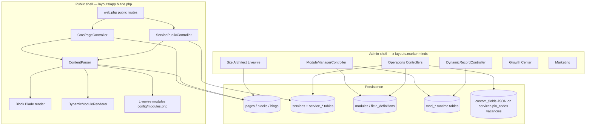
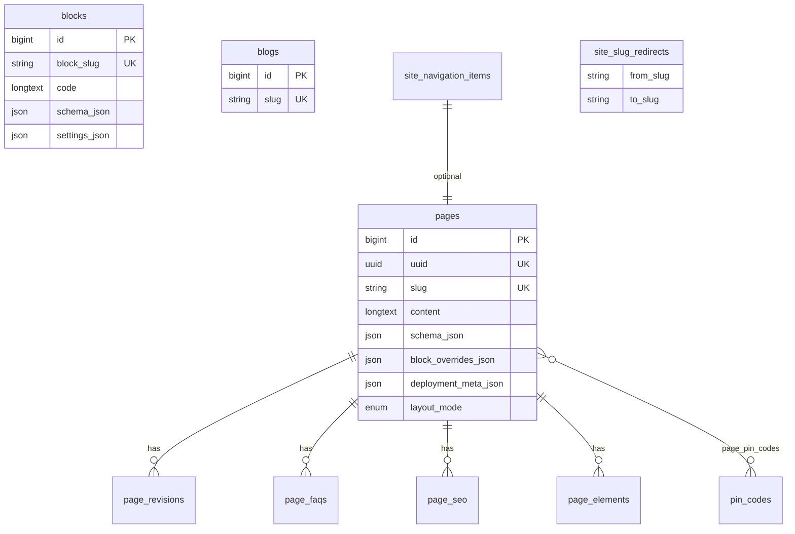
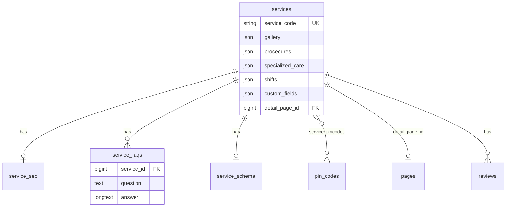
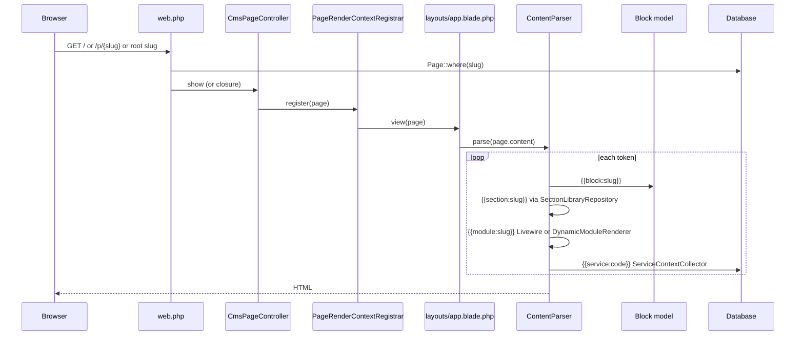
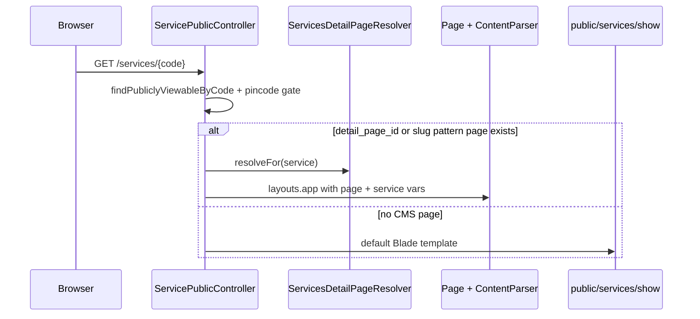
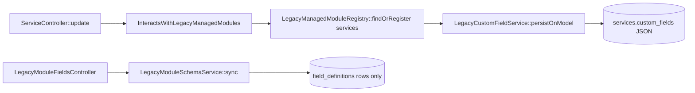

# PLATFORM FORENSIC AUTOPSY & ARCHITECTURE AUDIT

**Project:** Medca Health Care / MarkOnMinds  
**Repository:** `/var/www/medcahealthcare`  
**Audit date:** 2026-06-03  
**Mode:** Read-only — no code, database, migrations, routes, or settings were modified.

**Stack (evidence):** Laravel 13, PHP 8.5, Livewire, Blade, Tailwind, Vite, SQLite/MySQL-capable schema (`database/database.sqlite`).

---

## Table of contents

1. [Executive summary](#executive-summary)
2. [A. Platform architecture map](#a-platform-architecture-map)
3. [B. Database relationship diagram](#b-database-relationship-diagram)
4. [C. Data flow diagram](#c-data-flow-diagram)
5. [D. Current workflow documentation](#d-current-workflow-documentation)
6. [E. Custom field engine analysis](#e-custom-field-engine-analysis)
7. [F. Service module analysis](#f-service-module-analysis)
8. [G. Scalability assessment](#g-scalability-assessment)
9. [H. Recommended future architecture](#h-recommended-future-architecture)
10. [Problems discovered](#problems-discovered)
11. [Risks discovered](#risks-discovered)
12. [Recommended roadmap](#recommended-roadmap)
13. [Appendix: evidence index](#appendix-evidence-index)

---

## Executive summary

Medca is a **monolithic Laravel application** with two UI shells (public Medca + admin MarkOnMinds). Content is driven by:

- **CMS pages** (`pages` table) whose `content` column holds token lines (`{{block:slug}}`, `{{module:slug}}`, `{{section:slug}}`, `{{service:code}}`).
- **Blocks** (`blocks` table) storing Blade/HTML executed at render time via `ContentParser`.
- **Operations entities** (services, pin codes, vacancies) as first-class Eloquent models with dedicated tables—not generic CMS records.
- **Dynamic Module Builder** for admin-defined modules (`modules` + `field_definitions` registry; runtime `mod_{slug}` tables OR legacy JSON `custom_fields` on existing tables).

There is **no classic EAV** (entity-attribute-value) table. Custom fields are either **physical columns** on `mod_*` tables or **JSON blobs** on legacy tables.

**Services** already support FAQs (`service_faqs`), gallery JSON, bullet lists (`procedures`, `specialized_care`, `shifts` JSON arrays), SEO side tables, and optional CMS detail pages—**outside** the dynamic field engine.

---

## A. Platform architecture map



### Layer responsibilities

| Layer | Location | Responsibility |
|-------|----------|----------------|
| **HTTP routes** | `routes/web.php`, `routes/api.php`, `routes/auth.php` | Public CMS, services, careers, admin modules, API leads/payments |
| **Controllers** | `app/Http/Controllers/**` | Thin orchestration; Operations + Site Architect module CRUD |
| **Livewire** | `app/Livewire/**` | Heavy admin UI (Pages, Block Factory, Blueprint Builder, Marketing, Bookings) |
| **Domain services** | `app/Services/**` (~88 classes per `docs/system-inventory-report.md`) | Content parse, deployment, dynamic modules, growth, marketing |
| **Models** | `app/Models/**` (~60 models) | Eloquent relations, casts, scopes |
| **Views** | `resources/views/**` | Blade + components; public tokens resolved at runtime |
| **Config** | `config/*.php` | Blueprints, modules, medca brand, typography, integrations |
| **Migrations** | `database/migrations/**` (77 files) | Schema source of truth |

### Module access (admin workspaces)

**Evidence:** `app/ModuleAccess.php`, middleware `EnsureModuleAccess`, `users.module_access` JSON.

| Key | Route prefix | Typical roles |
|-----|--------------|---------------|
| `dashboard` | `/dashboard` | viewer+ |
| `site_architect` | `/site-architect` | editor+ |
| `operations` | `/operations` | manager+ |
| `marketing` | `/marketing` | manager+ |
| `growth_center` | `/growth-center` | viewer read / editor write |
| `user_management` | `/user-management` | manager+ CRUD |
| `security` | `/security` | admin |
| `settings` | `/settings` | admin |

---

## B. Database relationship diagram

### B.1 Core CMS & content



**Migrations:**  
- `2026_05_04_170218_create_pages_table.php`  
- `2026_05_04_170218_create_blocks_table.php`  
- `2026_05_06_000000_modify_blocks_table_for_block_factory.php` (block factory rename)  
- `2026_05_06_174850_create_page_revisions_table.php`  
- `2026_05_20_113243_create_page_faqs_table.php`  
- `2026_05_31_120000_create_deployment_engine_tables.php` (`block_overrides_json`, `deployment_meta_json`, `block_presets`, `deployment_generations`)

### B.2 Services domain



**Migrations:**  
- `2026_05_04_120000_create_services_table.php`  
- `2026_05_04_120001_create_service_seo_table.php`  
- `2026_05_04_120002_create_service_faqs_table.php`  
- `2026_05_04_120003_create_service_schema_table.php`  
- `2026_05_04_120004_create_service_pincodes_table.php`  
- `2026_05_10_184534_add_detail_page_id_to_services_table.php`  
- `2026_05_19_185213_add_listing_arrays_to_services_table.php`  
- `2026_05_30_180000_add_custom_fields_to_legacy_managed_tables.php`

### B.3 Dynamic modules

```mermaid
erDiagram
    modules ||--o{ field_definitions : defines
    modules {
        string slug UK
        string table_name UK
        json settings
    }
    field_definitions {
        bigint module_id FK
        string field_name
        string field_type
        json settings
    }
    mod_example["mod_{slug} (runtime)"] {
        bigint id PK
        columns per field_definitions
    }
    modules ||--|| mod_example : creates
```

**Registry migrations:** `2026_05_30_170000_create_dynamic_module_registry_tables.php`  
**DDL at runtime:** `App\Services\DynamicModules\DynamicTableManager` (not migration files per module)

### B.4 Operations & geo

| Table | Purpose | Migration |
|-------|---------|-----------|
| `pin_codes` | Coverage directory | `2026_05_03_201029_create_pin_codes_table.php` |
| `pin_code_import_logs` | CSV import audit | `2026_05_03_203504_create_pin_code_import_logs_table.php` |
| `vacancies` | Job portal | `2026_05_04_000001_create_vacancies_table.php` |
| `applications` | Job applications | `2026_05_04_000002_create_applications_table.php` |
| `leads` | Bookings | `2026_05_06_000001_create_leads_table.php` |
| `lead_notes` | Lead notes | `2026_05_06_000002_create_lead_notes_table.php` |
| `reviews` | Service reviews | `2026_05_30_140001_create_reviews_table.php` |

**Note:** Legacy `pincodes` table was dropped in `2026_05_30_100001_drop_redundant_pincodes_table.php` after geo unification into `pin_codes`.

### B.5 Deployment / blueprint artifacts

| Table | Migration |
|-------|-----------|
| `block_presets` | `2026_05_31_120000_create_deployment_engine_tables.php` |
| `deployment_generations` | same |
| `deployment_packages` | `2026_05_31_140000_phase85_supplemental_patch.php` |
| `section_library_items` | same |
| `global_content_variables` | same |
| `global_content_variable_snapshots` | `2026_05_31_160000_phase85_completion_patch.php` |

### B.6 Growth, marketing, theme (abbreviated)

| Area | Tables |
|------|--------|
| Growth | `competitors`, `competitor_keywords`, `competitor_trackings`, `competitor_leads`, `competitor_backlinks`, `site_backlinks`, `seo_entities`, `seo_technical`, `seo_ai_signals`, `geo_locations`, `intercepts`, `site_keyword_rankings` |
| Marketing | `marketing_settings`, `marketing_campaigns`, `marketing_communication_snapshots`, `marketing_email_trackers`, `marketing_click_events`, `marketing_analytics_daily_stats`, `marketing_conversion_events`, `lead_pipeline_stage_histories`, `lead_activities` |
| Theme | `theme_presets`, `theme_configurations` |
| Integrations | `integrations`, `integration_accounts`, `outbound_webhooks`, `webhook_deliveries` |
| System | `users`, `sessions`, `activity_logs`, `media`, `jobs`, `failed_jobs`, `cache`, `personal_access_tokens` |

### B.7 Pivot tables summary

| Pivot | Parent entities |
|-------|-----------------|
| `page_pin_codes` | `pages` ↔ `pin_codes` (serviceability, delivery_charge, location_keywords) |
| `service_pincodes` | `services` ↔ `pin_codes` |

### B.8 JSON columns (high-signal)

| Table | JSON columns | Role |
|-------|--------------|------|
| `pages` | `schema_json`, `focus_keywords`, `heading_h2`, `heading_h3`, `hreflang_json`, `entity_tags`, `block_overrides_json`, `deployment_meta_json` | SEO + deployment overrides |
| `blocks` | `schema_json`, `settings_json` | Block factory settings / media |
| `services` | `gallery`, `procedures`, `specialized_care`, `shifts`, `target_keywords`, `ai_keywords`, `custom_fields` | Media, bullet lists, dynamic extras |
| `modules` | `settings` | legacy flag, storage mode, model class |
| `field_definitions` | `settings` | select options |
| `theme_configurations` | `published_shape`, `draft_shape`, token blobs | Phase 8 theme |
| Legacy managed rows | `custom_fields` | Admin-defined extra fields (not EAV) |

---

## C. Data flow diagram

### C.1 Public page render



**Evidence:**  
- `app/Http/Controllers/Public/CmsPageController.php`  
- `resources/views/layouts/app.blade.php`  
- `app/Services/ContentParser.php` (`TOKEN_PATTERN`, `MAX_BLOCK_DEPTH = 4`)  
- `app/Services/Public/PageRenderContextRegistrar.php`

### C.2 Service detail render



**Evidence:**  
- `app/Http/Controllers/Public/ServicePublicController.php`  
- `app/Services/Public/ServicesDetailPageResolver.php`  
- Route: `Route::get('/services/{code}', ...)` name `public.services.show` in `routes/web.php`

### C.3 Dynamic module record lifecycle

```mermaid
flowchart LR
    A[Admin: ModuleManagerController::store] --> B[Module + field_definitions rows]
    B --> C[DynamicTableManager::createTable]
    C --> D[(mod_slug table)]
    E[DynamicRecordController::store] --> F[DynamicRecordService::validateAndExtract]
    F --> G[DynamicRecordRepository::create]
    G --> D
    H[Page content {{module:slug}}] --> I[DynamicModuleRenderer]
    I --> G
```

**Evidence:**  
- `app/Http/Controllers/SiteArchitect/ModuleManagerController.php`  
- `app/Http/Controllers/SiteArchitect/DynamicRecordController.php`  
- `app/Services/DynamicModules/DynamicTableManager.php`  
- `resources/views/dynamic-modules/public-listing.blade.php`

### C.4 Legacy custom fields on Operations entities



**Evidence:**  
- `app/Http/Controllers/Concerns/InteractsWithLegacyManagedModules.php`  
- `app/Services/DynamicModules/LegacyCustomFieldService.php`  
- Route: `PUT operations/managed-modules/{module}/fields` → `LegacyModuleFieldsController`

---

## D. Current workflow documentation

### D.1 Schema creation workflows

| Workflow | Creates physical columns? | Auto migration file? | Storage |
|----------|---------------------------|----------------------|---------|
| **New dynamic module** (Site Architect → Module Builder) | Yes — `Schema::create` on `mod_{slug}` | No — runtime DDL via `DynamicTableManager` | One column per `field_definition` |
| **Add field to dynamic module** | Yes — `ALTER TABLE` add column; removed defs → `dropColumn` | No | Same |
| **Legacy module field defs** (services, pin-codes, job-portal) | No (storage=`json`) | No | Values in `custom_fields` JSON; defs in `field_definitions` |
| **Laravel migrations** (core platform) | Yes | Yes — `database/migrations/*.php` | Versioned schema |
| **Service native fields** | Yes — dedicated migrations | Yes | `services`, `service_faqs`, etc. |

### D.2 Page authoring workflow

1. Editor opens **Site Architect → Pages** (`Livewire\SiteArchitect\Pages`).
2. Page row stored in `pages` with `content` as newline-separated tokens.
3. Blocks maintained in **Block Factory** (`blocks` table; Git sync via `BlockTemplateSyncService`).
4. Preview: `GET /site-architect/pages/{page}/preview` → `PagePublicPreviewService` → `layouts.app`.
5. Publish: `is_active = true`; public route resolves slug via `Page::publicPath()` rules (`config/public_pages.root_slugs`).

**Token grammar (Page model):**  
`app/Models/Page.php` — `parseContentTokens()`, `buildContentFromParts()` — regex: `{{block|module|section}:slug}}`

### D.3 Block workflow

1. Templates live under `resources/views/blocks/` (22 Git-managed per inventory doc).
2. `blocks:sync` command copies into `blocks` table (`BlockTemplateSyncService`).
3. Block `code` is Blade executed inside `ContentParser::renderBlockCodeWithVariables`.
4. Settings: `settings_json` resolved by `BlockSettingsResolver` (style_variant, media, section wrappers).

### D.4 Blueprint / deployment workflow

1. Admin opens **Blueprint Builder** (`Livewire\SiteArchitect\BlueprintBuilder`).
2. Select blueprint from `config/blueprints.php` + `config/blueprint_packs.php`.
3. `BlueprintPageGenerator::generate()` upserts `Page` records with token content + `deployment_meta_json`.
4. Row logged in `deployment_generations`.
5. Optional theme draft apply via `ThemeConfigRepository`.

**Evidence:** `app/Services/Deployment/BlueprintPageGenerator.php`, `config/blueprints.php`

### D.5 Service operations workflow

1. **Operations → Services** CRUD via `ServiceController`.
2. Native fields + `syncFaqs`, `syncSeo`, `syncSchema`, `syncPincodes`, `syncMedia`.
3. Listing bullets: textarea lines → JSON arrays via `NormalizesServiceListingLines` concern.
4. Optional **detail page** link → public `/services/{code}` renders linked `Page` through `ContentParser`.
5. Custom admin fields → `custom_fields` JSON via unified dynamic-fields table on form.

### D.6 Module builder lifecycle (user-defined)

| Stage | Action | Component |
|-------|--------|-----------|
| Register | Create module name/slug | `ModuleManagerController::store` |
| Schema | Define fields | `persistFieldDefinitions` |
| DDL | Create `mod_{slug}` | `DynamicTableManager::createTable` |
| Records | CRUD | `DynamicRecordController` |
| Public | Embed `{{module:slug}}` in page | `DynamicModuleRenderer` |
| Destroy | Drop table + module row | `ModuleManagerController::destroy` + `dropTable` |

---

## E. Custom field engine analysis

### E.1 How custom fields are created

1. **Field definitions** stored in `field_definitions` linked to `modules` (`FieldDefinition` model).
2. **User-defined modules:** Admin UI `components/dynamic-fields/manager.blade.php` + `ModuleManagerController::persistFieldDefinitions`.
3. **Legacy modules:** Same UI embedded in Operations forms via `x-dynamic-fields.unified-table`; schema-only updates go to `LegacyModuleFieldsController`.

### E.2 Physical columns vs JSON

| Module type | `modules.settings` | Values stored |
|-------------|-------------------|---------------|
| Dynamic (`mod_*`) | `legacy: false`, default column storage | Physical columns on `mod_{slug}` |
| Legacy services / pin-codes / job-portal | `legacy: true`, `storage: json` | `custom_fields` JSON column on entity table |

**Evidence:** `app/Models/Module.php` — `isLegacy()`, `usesJsonStorage()`, `usesColumnStorage()`  
**Evidence:** `app/Services/DynamicModules/LegacyManagedModuleRegistry.php`

### E.3 Automatic migrations?

**No.** Dynamic modules use **runtime `Schema::create` / `Schema::table`** in `DynamicTableManager`, not checked-in migration files. Core platform schema uses normal Laravel migrations only.

### E.4 EAV?

**No separate EAV table.** Pattern is:

- **Wide table** (`mod_*` with one column per field), or  
- **JSON document** (`custom_fields` on legacy tables), or  
- **Dedicated child tables** (e.g. `service_faqs`) for first-class domain features.

### E.5 Supported field types

**Evidence:** `app/Models/FieldDefinition.php` — `types()`:

`text`, `textarea`, `number`, `boolean`, `email`, `url`, `date`, `select`

**SQL mapping:** `app/Services/DynamicModules/DynamicTableManager.php` — `addColumn()` match expression.

**Validation:** `app/Services/DynamicModules/DynamicFieldValidator.php`

**Rendering:**  
- Admin: `resources/views/components/dynamic-fields/value-cell.blade.php`, `form.blade.php`, `unified-table.blade.php`  
- Public dynamic modules: flat table listing `dynamic-modules/public-listing.blade.php` (not per-field-type templates)

### E.6 Limitations

| Limitation | Impact |
|------------|--------|
| No repeater / group / nested field types | Cannot model FAQ lists, packages, variants in field engine alone |
| No `json` field type in FieldDefinition | Complex structures require native columns or manual JSON in textarea |
| Dynamic module public render is list-only | No configurable card layouts per module without Blade changes |
| `syncFields` drops columns on field removal | Data loss risk on schema edit |
| Legacy JSON fields are flat key-value | No typed sub-structure validation beyond field type |
| Slug rename on non-legacy module updates `table_name` metadata but not physical rename | Orphan / mismatch risk if slug changed after creation |
| Select options only via `settings.options` array | No relational foreign keys from custom fields |
| No automatic inverse relations | Cannot link Service → Category entity via module builder |

---

## F. Service module analysis

### F.1 Architecture

Services are **first-class domain models**, not CMS pages. Public discovery uses pincode-scoped queries; detail URLs are always `/services/{service_code}`.

**Model:** `app/Models/Service.php`  
**Controller:** `app/Http/Controllers/Operations/Services/ServiceController.php`  
**Public controller:** `app/Http/Controllers/Public/ServicePublicController.php`

### F.2 Categories

**No `service_categories` table or model found.** Taxonomy is not implemented as relational categories; grouping is via `sort_order`, `is_featured`, blocks/pages, or future custom fields.

### F.3 Service records & storage

| Concern | Storage | Evidence |
|---------|---------|----------|
| Core copy | `services.title`, `description`, `short_summary` | create_services migration |
| Bullet lists | JSON `procedures`, `specialized_care`, `shifts` | `2026_05_19_185213_add_listing_arrays_to_services_table.php`, `NormalizesServiceListingLines` |
| Gallery | JSON `gallery` + file uploads | `ServiceController::syncMedia` |
| FAQs | `service_faqs` child rows | `ServiceController::syncFaqs`, `ServiceFaq` model |
| SEO | `service_seo` 1:1 | `ServiceSeo` model |
| Schema.org extras | `service_schema` 1:1 | `ServiceSchema` model |
| GEO | `service_pincodes` pivot | `scopeForPincode` |
| Reviews | `reviews` table | `Review` model |
| Admin extras | `custom_fields` JSON | legacy module `services` slug |
| Detail layout | `detail_page_id` → `pages` | CMS-driven layout |

### F.4 Service detail pages & routing

| Route | Name | Handler |
|-------|------|---------|
| `GET /services-catalog` | `public.services.index` | `ServicePublicController@index` |
| `GET /services/{code}` | `public.services.show` | `ServicePublicController@show` |

**Detail resolution:** If `detail_page_id` (or slug pattern page) exists → render `layouts.app` with `page` + service context variables. Else → `resources/views/public/services/show.blade.php`.

**Block binding:** `{{service:CODE}}` registers schema in `<head>` via `ServiceContextCollector`; visual output depends on block Blade (may scrub token from block code).

### F.5 Service categories vs custom field engine

Operational bullets and FAQs **do not use** `field_definitions`. They use native schema. Custom field engine only adds optional flat extras on `services.custom_fields`.

---

## G. Scalability assessment

### G.1 Architectural strengths

| Strength | Evidence |
|----------|----------|
| Clear separation Operations vs Site Architect | Route groups + `ModuleAccess` |
| Token-based composable pages | `ContentParser`, revision snapshots on `Page` |
| Service binding for SEO independent of layout | `preregister()`, `ServiceContextCollector` |
| Blueprint-driven multi-page generation | `BlueprintPageGenerator`, deployment metadata |
| Hyper-local GEO model | `pin_codes` + pivots, pincode modal |
| Test coverage documented | `docs/system-inventory-report.md` — 303 tests |
| Policy gates on previews | `Gate::authorize` in preview routes |

### G.2 Limitations & technical debt

| Item | Severity | Notes |
|------|----------|-------|
| Runtime DDL for `mod_*` tables | High | No migration history per module; harder to replicate environments |
| Dual storage models (column vs JSON legacy) | Medium | Cognitive load; different code paths |
| Livewire-heavy admin | Medium | Memory/CPU on large forms (documented in phase-6 review) |
| Public typography not unified | Low | Hardcoded Tailwind on some partials vs theme system |
| Legacy `pincodes` drop migration | Medium | Environment must run migrations in order |
| SQLite in production path | Medium | Concurrent write limits vs MySQL |
| Dynamic module public UI minimal | Low | Not a full content presentation layer |

### G.3 Database risks

- **Column drop on field delete** (`DynamicTableManager::syncFields`) — irreversible data loss without backup.
- **JSON `custom_fields` without schema versioning** — breaking changes if field names renamed.
- **No DB-level FK from `pages.content` tokens to `blocks.block_slug`** — orphan tokens render empty.
- **Pincode table unification** — old docs referencing `pincodes` table are obsolete.

### G.4 Schema risks

- Expanding services via **only** custom fields loses queryability (cannot filter services by category in SQL without JSON queries).
- Adding **repeaters** to `FieldDefinition` requires engine + validator + UI + storage redesign—not a small patch.

---

## H. Recommended future architecture

### H.1 Target state (high level)

1. **Domain-first service catalog** — Introduce `service_categories` (self-referential parent_id for subcategories) as real tables, not custom fields.
2. **Structured child tables** for `service_packages`, `service_variants`, `service_benefits`, `service_deliverables` (or JSON columns with Form Request validation) — mirror existing `service_faqs` pattern.
3. **Unify presentation** — Wire public partials to theme typography tokens; keep Operations data in Eloquent.
4. **Module builder** — Either restrict to simple tabular data OR add a `json` / `repeater` field type with documented JSON schema (not EAV).
5. **Migration discipline** — Export runtime `mod_*` DDL to generated migrations on module publish (audit trail).

### H.2 What NOT to do

- Do not model FAQs/packages/variants solely in `custom_fields` JSON if you need filtering, SEO, or reporting.
- Do not use dynamic modules as a replacement for the Services domain model.
- Do not drop `service_faqs` in favor of textarea custom fields without migration plan.

---

## Specific investigation: custom-field system vs required structures

| Requirement | Supported today? | How today | Architectural issues if forced into custom fields only |
|-------------|------------------|-----------|--------------------------------------------------------|
| **Categories** | ❌ No native | N/A | No taxonomy table; select field = flat string, no hierarchy |
| **Sub categories** | ❌ | N/A | No parent-child in field engine |
| **Features (bullet lists)** | ✅ Native (not custom fields) | `services.procedures` etc. JSON arrays | Custom field = single text/textarea only; poor UX |
| **Benefits (bullet lists)** | ⚠️ Partial | Could use `specialized_care` JSON or new column | Same as above |
| **Deliverables** | ❌ | Would need new column/table or custom JSON | No repeater |
| **FAQs** | ✅ Native | `service_faqs` table + `page_faqs` | Child rows don't map to flat custom fields |
| **Packages** | ❌ | "Deployment packages" are site export manifests (`deployment_packages`), not service SKUs | Name collision confusion |
| **Service variants** | ❌ | Block `style_variant` only (presentation) | Not inventory variants |
| **Gallery items** | ✅ Native | `services.gallery` JSON + uploads | Custom fields cannot upload multi-file without extension |
| **Repeater fields** | ❌ | Not in `FieldDefinition::types()` | Requires engine redesign |
| **Group fields** | ❌ | No nested schema | No |
| **Nested structures** | ⚠️ Limited | `schema_json` on pages/blocks/services | Ad-hoc JSON, not admin-guided for custom fields |

**Verdict:** The **current custom-field system alone cannot support** the full service catalog model without architectural issues. **Native service tables + child tables + CMS pages** already cover part of the list; gaps (categories, packages, variants, deliverables) need **explicit schema design**, not more `field_definitions`.

---

## Problems discovered

1. **Two parallel extension mechanisms** — native columns/child tables vs `modules`/`custom_fields` vs `mod_*` tables; easy to choose wrong layer.
2. **No service categories** — marketing/catalog grouping relies on sort order, blocks, or manual pages.
3. **Dynamic module slug/table_name drift** — `Module::updating` changes `table_name` without renaming physical table.
4. **Public dynamic module output** — generic listing view; not suitable for rich service merchandising.
5. **Typography system not applied** to all public partials (hardcoded Tailwind) — operational inconsistency, not data bug.
6. **Documentation drift** — inventory cites 73 migrations; repo has 77; `pincodes` table removed in migration path.
7. **Packages terminology overload** — `DeploymentPackage` (export/import) vs commercial service packages.

---

## Risks discovered

| Risk | Category | Mitigation direction (documentation only) |
|------|----------|----------------------------------------|
| Runtime schema DDL on production | Operational | Backup before module schema edits; generated migrations |
| Field column drops | Data loss | Soft-delete field defs; deprecate columns |
| Orphan `{{block:slug}}` tokens | Content | Validation job in Site Architect |
| JSON `custom_fields` shape drift | Integration | Version key inside JSON document |
| SQLite write contention | Scale | MySQL/Postgres for production |
| Pincode/DNS unrelated but ops-critical | Infra | Separate from CMS (documented in ops history) |

---

## Recommended roadmap

| Phase | Focus | Outcome |
|-------|-------|---------|
| **0 — Freeze** | No schema changes until sign-off on this autopsy | Baseline agreed |
| **1 — Catalog model** | `service_categories`, optional `parent_id` | Real taxonomy |
| **2 — Structured service children** | `service_packages`, `service_variants` tables + admin forms | Queryable offers |
| **3 — Deliverables/benefits** | Either dedicated JSON columns with repeaters in Operations UI or child tables | Parity with FAQs pattern |
| **4 — Custom field scope** | Limit legacy JSON to true extras; document forbidden use cases | Less architecture drift |
| **5 — Module builder** | Optional: repeater JSON type + migration export | Safer dynamic data |
| **6 — Presentation** | Theme tokens on public partials; service detail blocks consume new fields | Launch-ready UI |

---

## Appendix: evidence index

### Key models

| Model | Path |
|-------|------|
| Page | `app/Models/Page.php` |
| Block | `app/Models/Block.php` |
| Service | `app/Models/Service.php` |
| Module | `app/Models/Module.php` |
| FieldDefinition | `app/Models/FieldDefinition.php` |
| ServiceFaq | `app/Models/ServiceFaq.php` |
| PageFaq | `app/Models/PageFaq.php` |
| DeploymentGeneration | `app/Models/DeploymentGeneration.php` |
| BlockPreset | `app/Models/BlockPreset.php` |

### Key services

| Service | Path |
|---------|------|
| ContentParser | `app/Services/ContentParser.php` |
| DynamicTableManager | `app/Services/DynamicModules/DynamicTableManager.php` |
| DynamicRecordService | `app/Services/DynamicModules/DynamicRecordService.php` |
| LegacyCustomFieldService | `app/Services/DynamicModules/LegacyCustomFieldService.php` |
| BlueprintPageGenerator | `app/Services/Deployment/BlueprintPageGenerator.php` |
| ServicesDetailPageResolver | `app/Services/Public/ServicesDetailPageResolver.php` |

### Key controllers

| Controller | Path |
|------------|------|
| CmsPageController | `app/Http/Controllers/Public/CmsPageController.php` |
| ServicePublicController | `app/Http/Controllers/Public/ServicePublicController.php` |
| ServiceController | `app/Http/Controllers/Operations/Services/ServiceController.php` |
| ModuleManagerController | `app/Http/Controllers/SiteArchitect/ModuleManagerController.php` |
| DynamicRecordController | `app/Http/Controllers/SiteArchitect/DynamicRecordController.php` |
| LegacyModuleFieldsController | `app/Http/Controllers/Operations/LegacyModuleFieldsController.php` |
| LeadController (API) | `app/Http/Controllers/Api/LeadController.php` |

### API routes (`routes/api.php`)

| Method | Path | Controller |
|--------|------|------------|
| POST | `/api/leads` | `LeadController@store` |
| POST | `/api/payments/notify` | `PaymentNotificationController@store` |
| GET/POST | `/api/admin/growth/competitors/*` | `Admin\Growth\CompetitorController` (Sanctum) |

### Public routes (sample — full list in `routes/web.php`)

| Route | Name |
|-------|------|
| `/` | `public.home` |
| `/services-catalog` | `public.services.index` |
| `/services/{code}` | `public.services.show` |
| `/p/{slug}` | `pages.public` |
| `/blog/{slug}` | `blog.public` |
| `/site-architect/modules` | `site-architect.modules.index` |

### Config

| File | Purpose |
|------|---------|
| `config/blueprints.php` | Blueprint definitions |
| `config/blueprint_packs.php` | Industry packs |
| `config/modules.php` | Livewire module map (`job-portal`, `careers-listing`) |
| `config/public_pages.php` | Root CMS slugs |
| `config/module_builder.php` | Module builder rules |

### Tests referencing architecture

| Test file | Topic |
|-----------|-------|
| `tests/Feature/LegacyManagedModulesTest.php` | Custom fields JSON on services |
| `tests/Feature/PublicLayoutConsistencyTest.php` | Near-you partial |
| `tests/Feature/ServicesBlockLayoutsTest.php` | Service procedures in blocks |

---

**End of audit.** No fixes, migrations, or code changes were applied during this investigation.
