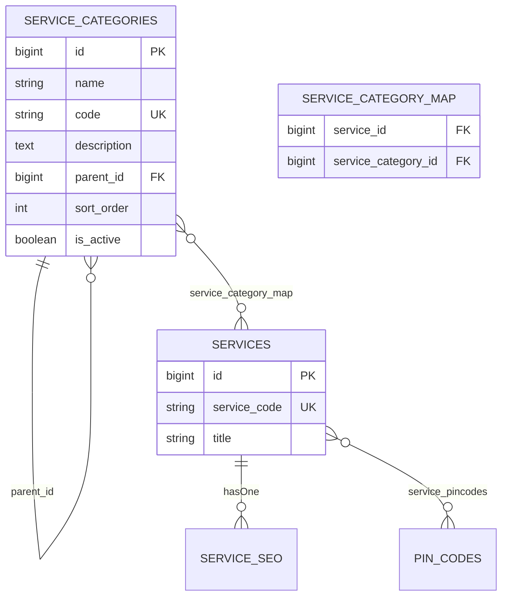

# Service Category Management — Feature Verification Report

**Date:** 2026-06-02  
**Module:** Operations → Service Categories  
**Architecture:** Taxonomy only — no category SEO tables or fields

---

## Database schema

### `service_categories`

| Column | Type | Notes |
|--------|------|--------|
| `id` | bigint PK | |
| `name` | string | Required display name |
| `code` | string(120) unique | URL slug (`/service-categories/{code}`) |
| `description` | text nullable | Organizational copy only |
| `parent_id` | FK nullable | Self-reference → `service_categories.id`, null on delete |
| `sort_order` | unsigned int default 0 | Listing order |
| `is_active` | boolean default true | Active / Inactive |
| `created_at`, `updated_at` | timestamps | |
| `deleted_at` | timestamp nullable | Soft delete |

Indexes: `(is_active, sort_order)`, `parent_id`

### `service_category_map` (pivot)

| Column | Type | Notes |
|--------|------|--------|
| `id` | bigint PK | |
| `service_id` | FK → `services` | cascade delete |
| `service_category_id` | FK → `service_categories` | cascade delete |
| `created_at`, `updated_at` | timestamps | |

Unique: `(service_id, service_category_id)` — no duplicate assignments

---

## Relationships diagram



**Rules**

- Many-to-many only via pivot (no duplicated service rows)
- Category delete: soft delete + detach services + reparent children to deleted node’s parent
- Service SEO / schema / FAQs unchanged — still owned by `Service` + `ServiceSeo`

---

## Routes created

### Admin (middleware: `auth`, `active`, `verified`, `module:operations`, `role:manager,admin,super_admin`)

| Method | Path | Name |
|--------|------|------|
| GET | `/operations/service-categories` | `operations.service-categories.index` |
| GET | `/operations/service-categories/create` | `operations.service-categories.create` |
| POST | `/operations/service-categories` | `operations.service-categories.store` |
| GET | `/operations/service-categories/{service_category}/edit` | `operations.service-categories.edit` |
| PUT | `/operations/service-categories/{service_category}` | `operations.service-categories.update` |
| DELETE | `/operations/service-categories/{service_category}` | `operations.service-categories.destroy` |

### Public

| Method | Path | Name |
|--------|------|------|
| GET | `/service-categories` | `public.service-categories.index` |
| GET | `/service-categories/{code}` | `public.service-categories.show` |

### API (`auth:sanctum`, `active`, `module:operations`)

| Method | Path | Purpose |
|--------|------|---------|
| GET | `/api/admin/operations/service-categories` | List categories |
| GET | `/api/admin/operations/service-categories/picker` | Active picker list |
| GET | `/api/admin/operations/service-categories/{service_category}` | Single category |
| GET | `/api/admin/operations/service-categories/{service_category}/services` | Paginated services in category |

---

## Pages created

| View | Purpose |
|------|---------|
| `operations/service-categories/index.blade.php` | List, search, status/parent filters, sort |
| `operations/service-categories/create.blade.php` | Create form |
| `operations/service-categories/edit.blade.php` | Edit form |
| `operations/service-categories/_form.blade.php` | Shared fields |
| `operations/service-categories/partials/toolbar.blade.php` | Workspace toolbar |
| `public/service-categories/index.blade.php` | Public category directory |
| `public/service-categories/show.blade.php` | Category detail + paginated services |
| `operations/services/partials/category-badges.blade.php` | Admin table badges |

**Enhanced existing**

- `operations/services/index.blade.php` — multi-category filter, categories column
- `operations/services/_form.blade.php` — category multi-select (Basic tab)
- `operations/partials/primary-tabs.blade.php` — **Categories** tab

---

## Permissions

| Policy | `ServiceCategoryPolicy` |
| Gate | `Gate::policy(ServiceCategory::class, ServiceCategoryPolicy::class)` |
| Access | `User::hasModuleAccess(ModuleAccess::OPERATIONS)` for all actions |

Same gate as Services and Pin Codes — no new permission keys.

---

## Files modified / added

### New

- `database/migrations/2026_06_02_120000_create_service_categories_table.php`
- `database/migrations/2026_06_02_120001_create_service_category_map_table.php`
- `app/Models/ServiceCategory.php`
- `app/Policies/ServiceCategoryPolicy.php`
- `app/Repositories/Operations/ServiceCategoryRepository.php`
- `app/Services/Operations/ServiceCategoryService.php`
- `app/Http/Controllers/Operations/ServiceCategories/ServiceCategoryController.php`
- `app/Http/Controllers/Public/ServiceCategoryPublicController.php`
- `app/Http/Controllers/Api/Operations/ServiceCategoryApiController.php`
- `app/Http/Requests/Operations/ServiceCategories/*`
- `app/Http/Resources/ServiceCategoryResource.php`
- `app/Http/Resources/ServiceSummaryResource.php`
- `database/factories/ServiceCategoryFactory.php`
- `database/seeders/MedcaServiceCategoriesSeeder.php`
- `tests/Feature/ServiceCategoryManagementTest.php`
- All views under `operations/service-categories/` and `public/service-categories/`

### Modified

- `app/Models/Service.php` — `categories()`, `scopeInCategories()`
- `app/Http/Controllers/Operations/Services/ServiceController.php` — sync, filters, duplicate
- `app/Http/Requests/Operations/Services/StoreServiceRequest.php`
- `app/Http/Requests/Operations/Services/UpdateServiceRequest.php`
- `app/Providers/AppServiceProvider.php` — policy registration
- `routes/web.php`, `routes/api.php`
- `app/Http/Middleware/EnsurePincodeDetected.php` — category public routes use pincode gating
- `resources/views/operations/services/*`
- `resources/views/components/operations/workspace.blade.php`
- `resources/views/operations/partials/primary-tabs.blade.php`

---

## Feature verification

### Automated tests

```bash
php artisan test tests/Feature/ServiceCategoryManagementTest.php
```

**Result:** 5 passed

| Test | Covers |
|------|--------|
| Create category + sync on service update | CRUD + M2M |
| Filter services by category | Admin listing filter |
| Public category page | Pagination + pincode session |
| Soft delete + detach | Delete behavior |
| API picker | Sanctum + JSON resources |

### Manual checklist

1. **Operations → Categories** — create “Home Care” (`home-care`), active, sort order 10.
2. **Operations → Services → Edit** — assign Home Care + Nursing; save; badges appear in list.
3. **Services index** — filter by one or more categories (Ctrl/Cmd multi-select).
4. **Public** — `/service-categories` and `/service-categories/home-care` with pincode set.
5. **Duplicate service** — categories copied to duplicate.
6. **Delete category** — soft deleted; services remain; links removed.

### Seed sample categories (optional)

```bash
php artisan db:seed --class=MedcaServiceCategoriesSeeder
```

Seeds: Home Care, Nursing Services, Elder Care, Post Hospital Care, Physiotherapy, Doctor Visits.

---

## Explicit non-goals (confirmed)

- No `service_category_seo` or meta/schema/OpenGraph on categories
- No change to `ContentParser`, block rendering, or service detail SEO ownership
- No duplicate service records per category

---

## Rollback

```bash
php artisan migrate:rollback --step=2
```

Remove policy registration and routes if reverting code. Pivot and category tables drop cleanly (cascade).
