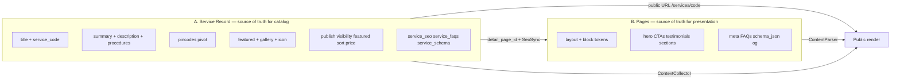

# Enterprise Services — Architecture Decision Report

**Audit date:** 2026-06-03  
**Mode:** Planning and analysis only — no code, database, routes, config, or UI changes.  
**Inputs:** `SERVICES-MODULE-FORENSIC-DEEP-DIVE.md`, `PLATFORM-FORENSIC-AUTOPSY.md`, live codebase read-only verification.

**Question:** Should Medca **recover and complete** existing hidden/backend capabilities, or **build new architecture**?

---

## Table of contents

1. [Service ownership model](#1-service-ownership-model)
2. [Hidden feature recovery analysis](#2-hidden-feature-recovery-analysis)
3. [UI recovery map](#3-ui-recovery-map)
4. [Duplicate architecture risk](#4-duplicate-architecture-risk)
5. [Medca Healthcare fit analysis](#5-medca-healthcare-fit-analysis)
6. [Recommended roadmap](#6-recommended-roadmap)
7. [Final verdict](#7-final-verdict)

---

## 1. Service ownership model

### 1.1 Design principle (evidence-based)

The codebase already encodes a **split ownership** model:

| Layer | Evidence |
|-------|----------|
| **Service record** = catalog entity, GEO, identity, machine-readable SEO signals | `Service` model, `service_pincodes`, `ServiceContextCollector`, sitemap `SeoService` |
| **Page** = presentation, layout, marketing composition | `_detail-page-panel.blade.php` copy; `ServiceDetailPageProvisioner`; `ContentParser` tokens |
| **Bridge** | `detail_page_id`, `ServiceDetailPageSeoSync`, `service-{code}` slug pattern (`config/public_pages.php`) |

Recovering architecture means **making this split explicit in UX**, not inventing a second CMS.

### 1.2 Ownership matrix

| Data / concern | Primary owner | Secondary / mirror | Rationale |
|----------------|---------------|-------------------|-----------|
| **Title** | **Service** | Page title may differ for marketing | Canonical product name; `service_code` is immutable binding key |
| **Code (`service_code`)** | **Service** | URL `/services/{code}` | Block tokens `{{service:code}}`, sitemap, Schema.org |
| **Summary (`short_summary`)** | **Service** | Page hero may repeat via blocks | Listing cards, near-you, OG fallback (`public/services/show.blade.php`) |
| **Description (`description`)** | **Service** | Blocks may reformat | Long-form clinical copy; fallback detail template |
| **Featured image** | **Service** | Page `og_image` optional | `syncMedia()` + `featured_image` column; OG on fallback |
| **Gallery** | **Service** | Media block on page optional | `services.gallery` JSON + upload logic exists |
| **FAQs (structured Q&A)** | **Page** (preferred) | **Service** (`service_faqs`) legacy | UI directs to Site Architect; `page_faqs` + `Livewire\SiteArchitect\Pages::syncPageFaqs` |
| **SEO meta (title, description, h1–h3, keywords)** | **Page** (preferred) | **Service** (`service_seo`) legacy + observer | Public URL is `/services/{code}` but panel says SEO lives on page; observer fills `service_seo` |
| **Schema JSON-LD (page-level)** | **Page** | **Service** (`service_schema`) legacy | `ServiceDetailPageSeoSync` migrates to `pages.schema_json` |
| **Schema JSON-LD (Service entity in &lt;head&gt;)** | **Service** | — | `Service::toServiceSchema()`, `ServiceContextCollector` — independent of block layout |
| **Related services** | **Page** (composition) | **Service** (data source) | `service-detail-related` block + `{{service:code}}` lines; not a DB relation |
| **Service areas / pincodes** | **Service** | Page GEO (`page_pin_codes`) for location pages only | `service_pincodes` — **active in Operations form** |
| **Procedures / specialized_care / shifts** | **Service** | Block `service-detail-carousel` displays | JSON columns on `services`; operational/clinical lists |
| **Media (icon, gallery files)** | **Service** | Block media settings | Storage under `services/{id}/` in `syncMedia()` |
| **Publish / visibility / featured / sort** | **Service** | — | Catalog rules: `scopePublicListing`, pincode scopes |
| **Price range** | **Service** | Offer in Schema.org | `hasPriceRange()`, operations form |
| **Reviews** | **Service** (entity) | **Page** testimonials blocks | `reviews` table; public `ReviewForm` on fallback template |
| **Custom fields** | **Service** (`custom_fields` JSON) | Module `field_definitions` | Legacy managed module `services` slug |
| **Layout (canvas vs contained)** | **Page** | — | `PageLayoutMode` |
| **Hero sections** | **Page** (blocks) | Service vars injected | e.g. `service-detail-hero` uses `$service` |
| **Content blocks** | **Page** | — | `{{block:slug}}` in `pages.content` |
| **Reusable sections** | **Page** | — | `{{section:slug}}` via `SectionLibraryRepository` |
| **Testimonials** | **Page** (blocks) | — | `testimonials-grid`, `reviews-grid` blocks — not per-service DB |
| **CTAs** | **Page** (blocks) | — | `cta-*` blocks in blueprint pack |
| **Landing page design** | **Page** | — | Blueprint `landing_pages` in `config/blueprint_packs.php` |
| **Categories (taxonomy)** | **Not implemented** | Sort order / CMS grids | No `service_categories` table |
| **Packages (commercial SKUs)** | **Not implemented** | `price_range` text only | Do not confuse with `deployment_packages` |

### 1.3 Authority diagram

### 1.4 Decision rule for new fields

| If the data is… | Put it on… |
|-----------------|------------|
| Used in listings, pincode filters, sitemap, or `{{service:code}}` | **Service** |
| Purely visual / A/B layout / campaign landing | **Page** |
| Both | **Service** for facts; **Page** for presentation; one-way sync on link (existing `ServiceDetailPageSeoSync` pattern) |

---

## 2. Hidden feature recovery analysis

| Capability | Classification | Recovery effort | Evidence |
|------------|----------------|-----------------|----------|
| **`syncSeo()`** | **Fully implemented but disconnected** | **Low** — wire to form + `UpdateServiceRequest` rules | `ServiceController.php` L360–378; never called from `store`/`update` (grep shows definitions only) |
| **`syncFaqs()`** | **Fully implemented but disconnected** | **Low** — repeater UI + call on save; **or** deprecate in favor of page FAQs | L384–396; duplicates risk if both UIs active |
| **`syncSchema()`** | **Fully implemented but disconnected** | **Low** — JSON textarea + call on save; **or** page-only | L399–422 |
| **`syncMedia()`** | **Fully implemented but disconnected** | **Low** — file inputs already on form `enctype` but no fields | L434–457; `edit.blade.php` has `multipart` |
| **`description`** | **Partially implemented** | **Low** — textarea on `_form`; add to FormRequest | Column + factory + `preview` + fallback public view; not in `_form` |
| **`short_summary`** | **Partially implemented** | **Low** | Same |
| **`gallery`** | **Partially implemented** | **Medium** — multi-file UI + delete/reorder | Column + `syncMedia`; no inputs |
| **`procedures` / `specialized_care` / `shifts`** | **Partially implemented** | **Medium** — line-based textareas; trait exists but unused | `NormalizesServiceListingLines.php`; `service-detail-carousel.blade.php`; migration `2026_05_19_185213_*` |
| **`featured_image` / `icon`** | **Partially implemented** | **Low** | `syncMedia()` ready |
| **`target_keywords` / `ai_keywords`** | **Partially implemented** | **Medium** | Columns on model; `NormalizesServiceKeywordArrays` unused |
| **Related services** | **Partially implemented** (composition, not DB) | **Medium** — picker UI → write `{{service:code}}` into page content | `ServiceInsertCatalog`, `service-detail-related` block; not Operations |
| **`managed-module-schema.blade.php`** | **Dead code** | **Low** — delete or include in settings | File exists; **zero** `@include` references (grep) |
| **`service_seo` via observer** | **Active (hidden path)** | **Low** — document; optional toggle | `ServiceObserver` → `ContentSeoAutoFillService::applyAndSyncService` |
| **`ServiceDetailPageSeoSync`** | **Active** | **N/A** — keep as bridge | Migrates legacy service SEO/FAQs → page when empty |
| **Preview screen** | **Active** | **N/A** | Shows data user cannot edit in form — UX inconsistency |

### 2.1 Legacy vs recover

| Item | Legacy? | Recommendation |
|------|---------|----------------|
| `service_faqs` | **Yes** — superseded by `page_faqs` in product copy | **Do not recover** as primary UI; keep table for migration/duplicate/observer only until data drained |
| `service_seo` | **Dual** — observer + page SEO | **Recover** only if single-admin workflow demanded; else **page-only** + observer as backfill |
| `service_schema` | **Legacy** | **Page-only** for editable schema; keep `toServiceSchema()` for head |

### 2.2 Effort summary

| Effort | Items |
|--------|--------|
| **Low** | Wire `sync*` methods; description/summary/featured; document observer; remove or wire dead blade |
| **Medium** | Gallery UI; procedures textareas; related-service picker in Site Architect (enhance existing) |
| **High** | New taxonomy (categories), commercial packages table, SKU variants — **new architecture**, not recovery |

---

## 3. UI recovery map

### 3.1 Current Enterprise Services UI (baseline)

| Screen | URL | Exposed today |
|--------|-----|----------------|
| List | `/operations/services` | Search, filters, CRUD links |
| Create / Edit | `.../create`, `.../edit` | Basic, Control, GEO pincodes, Custom fields |
| Detail page panel | Edit top | Link / create Site Architect page |
| Preview | `.../preview` | Read-only legacy fields |

**Menu:** Operations → tab **Services** (`primary-tabs.blade.php`).  
**Not default hub:** `/operations` → Job Portal (`OperationsHubController`).

### 3.2 Missing form fields (to expose existing backend)

| Field / action | View target | Request rules | Controller hook |
|----------------|-------------|---------------|-------------------|
| `short_summary` | `_form.blade.php` new section “Content” | `StoreServiceRequest` / `UpdateServiceRequest` | `$service->fill()` in store/update |
| `description` | WYSIWYG or textarea | max length rules | same |
| `procedures_lines`, `specialized_care_lines`, `shifts_lines` | Textareas | `NormalizesServiceListingLines` in FormRequest | merge in `prepareForValidation` |
| `featured_image`, `icon`, `gallery_files[]` | File inputs | file rules | call **`syncMedia()`** in update |
| SEO block | Tab “SEO” OR defer to page | seo.* array | call **`syncSeo()`** |
| FAQ repeater | Tab “FAQ” OR defer | faqs.* | call **`syncFaqs()`** — **conflicts** with page FAQs |
| Schema | Tab “Schema” OR defer | schema_type, schema_json | call **`syncSchema()`** |

### 3.3 Missing tabs (recommended IA)

| Tab | Purpose | Avoid duplication |
|-----|---------|-------------------|
| **Overview** | Title, code, price, publish, featured | Current “Basic” + “Control” |
| **Content** | Summary, description, procedures lists | Service-owned |
| **Media** | Featured, icon, gallery | Calls `syncMedia()` |
| **Coverage** | Pincodes | Existing GEO section |
| **Public page** | Detail page panel + deep link Site Architect | Existing panel |
| **SEO & FAQ** | *Optional* | Show banner: “Canonical SEO on linked page” + link; advanced toggle for legacy `service_seo` |
| **Custom** | `x-dynamic-fields.unified-table` | Existing |

### 3.4 Missing admin screens

| Screen | Needed? | Notes |
|--------|---------|-------|
| Service category manager | Only Phase 3+ | No table today |
| Package / variant manager | Phase 3+ | New schema |
| Review moderation under Services | Optional | `reviews` exist; no Operations route |
| Related services graph | Optional | Token editor in Site Architect suffices for Medca scale |
| `managed-module-schema` standalone | **No** | Use existing unified-table schema row |

### 3.5 Missing menu links

| Link | Status |
|------|--------|
| Services tab | **Exists** |
| Default Operations landing on Services | **Missing** — optional product tweak |
| Block Factory from detail panel | **Exists** |
| Site Architect from detail panel | **Exists** (needs `site_architect` module) |

### 3.6 UI components required (minimal recovery)

| Component | Type | Exposes |
|-----------|------|---------|
| `operations/services/_tabs.blade.php` | Blade partial | Tab IA |
| Content section in `_form` | Blade | summary, description, procedures |
| Media section in `_form` | Blade + file | gallery, featured, icon |
| Wire controller `update()` | PHP | `syncMedia`, optional `syncSeo` |
| Extend FormRequests | PHP | validation |
| Help callout on SEO tab | Blade | Redirect to `site-architect.pages.index?edit=` |

**No new migrations** required for Phase 1–2 recovery.

---

## 4. Duplicate architecture risk

### 4.1 If you add new tables without policy

| Proposed entity | Duplicates / conflicts with | Risk level |
|-----------------|----------------------------|------------|
| **Categories** | CMS page “Services”, `sort_order`, `is_featured`, blueprint service lines | **Medium** — useful but overlaps marketing grids |
| **Variants** | `service_code` uniqueness, separate services per line (Medca pattern) | **High** — two ways to model “Home Nursing vs ICU Nursing” |
| **Packages** | `price_range` string, blocks `comparison-features`, landing pages | **High** — unless formal pricing SKUs needed |
| **Features** | `procedures` JSON, `features-grid` block | **High** — triple storage |
| **Benefits** | `specialized_care` JSON, `services-benefits` block | **High** |
| **Deliverables** | `procedures` / description | **Medium** |

### 4.2 Safe patterns (no duplication)

| Medca need | Use existing |
|------------|--------------|
| Six clinical lines | Six **`Service`** rows + six **`service-{code}`** pages (blueprint pack already defines slugs) |
| Bullet lists | `procedures`, `specialized_care`, `shifts` JSON |
| FAQ | **`page_faqs`** on detail page |
| SEO | **Page** fields + Growth mirrors |
| Related offerings | **`{{service:code}}`** in related block |
| GEO | **`service_pincodes`** |

### 4.3 `deployment_packages` naming trap

**`deployment_packages`** = site export/import (`DeploymentPackages` Livewire), **not** care packages. New commercial “packages” must use a distinct name (e.g. `care_packages`) to avoid ops confusion.

---

## 5. Medca Healthcare fit analysis

Reference pack: `config/blueprint_packs.php` → `home_healthcare` (six lines: Home Care, Elder Care, Nursing, Doctor Visits, Physiotherapy, Palliative Care).

| Medca capability | Supported today without major architecture change? | How |
|------------------|-----------------------------------------------------|-----|
| **Elder Care** | **YES** | Service row + `service-elder-care` page pattern |
| **Home Nursing** | **YES** | Service + page + pincode coverage |
| **Caregivers** | **YES** | Documented example `caregivers` code in `config/public_pages.php` |
| **Doctor Visits** | **YES** | Blueprint `service-doctor-visits` |
| **Physiotherapy** | **YES** | Blueprint `service-physiotherapy` |
| **Packages (commercial)** | **PARTIAL** | `price_range` + CTA blocks only; no SKU/package table |
| **Service areas** | **YES** | `pin_codes` + `service_pincodes` + near-you |
| **FAQs** | **YES** | Page FAQs (preferred); fallback `service_faqs` |
| **SEO** | **YES** | Page SEO + `service_seo` observer + sitemap |
| **Gallery** | **PARTIAL** | DB + `syncMedia` ready; **UI missing** |
| **Related services** | **YES** | Block + tokens (editor skill required) |

**Major change required only if:** bundled pricing tiers, inventory-style variants, or hierarchical category navigation in catalog API — none exist today.

**Launch blocker alignment:** ~2% frontend — completing **Service form content/media** + **page linking** is recovery, not greenfield.

---

## 6. Recommended roadmap

### PHASE 1 — Recover existing capabilities (low risk, no new tables)

| # | Action | Owner |
|---|--------|-------|
| 1.1 | Add **Content** fields to `_form`: `short_summary`, `description` | Service |
| 1.2 | Add **procedures** line textareas; use `NormalizesServiceListingLines` in FormRequests | Service |
| 1.3 | Call **`syncMedia()`** from `update` (and create after id exists); add file inputs | Service |
| 1.4 | Document **single SEO authority**: Page wins; link from panel | UX |
| 1.5 | Stop expanding **`service_faqs`** UI; use Page FAQs only | Policy |
| 1.6 | Remove or include **`managed-module-schema.blade.php`** | Cleanup |
| 1.7 | Ensure **detail page provision** on create optional one-click | Service → Page |

**Outcome:** Operations can run catalog without Site Architect for basic copy; architect for layout.

### PHASE 2 — Complete missing UI (medium effort)

| # | Action |
|---|--------|
| 2.1 | Tabbed edit UI (Overview / Content / Media / Coverage / Public page / Custom) |
| 2.2 | Gallery manager (list + delete from JSON array) |
| 2.3 | Site Architect: related-service helper (insert tokens from picker) — enhance `service-insert-controls` |
| 2.4 | Align **preview** with what form edits |
| 2.5 | Optional: wire `syncSeo` behind “Advanced legacy SEO” accordion **or** remove dead methods |

### PHASE 3 — Architecture enhancements (only if product requires)

| # | Action | New schema? |
|---|--------|-------------|
| 3.1 | `service_categories` + optional `parent_id` | Yes |
| 3.2 | `care_packages` (name TBD) linked to services M:N | Yes |
| 3.3 | Formal **related_services** pivot (optional — tokens may suffice) | Optional |
| 3.4 | Reviews moderation in Operations | No |
| 3.5 | Deprecate `service_faqs` / `service_schema` tables after migration | Policy |

### PHASE 4 — Optional future expansion

| # | Action |
|---|--------|
| 4.1 | API for mobile/apps (`/api/services`) |
| 4.2 | Variant SKUs with separate codes |
| 4.3 | Dynamic pricing / integrations |
| 4.4 | Category-driven catalog filters on `/services-catalog` |

---

## 7. Final verdict

### **Answer: A — Recover and complete existing architecture**

**Not B (build new architecture)** for Medca’s current scope.

### Justification (evidence)

| Factor | Recover (A) | New build (B) |
|--------|-------------|---------------|
| **Schema** | `services` + child tables + pages already model Medca lines | New tables duplicate `procedures`, pages, blocks |
| **Public URLs** | `/services/{code}` + resolver stable | Rewrite breaks SEO tokens and sitemap |
| **CMS investment** | Block Factory, blueprint `home_healthcare`, section library | Sunk cost abandoned |
| **Hidden work** | `sync*` + columns + partials **already written** | Re-implement same logic |
| **Product copy** | Panel already says SEO/FAQs on page | New architecture fights documented UX |
| **Gaps** | Missing **wiring + form fields**, not missing **domain model** | Categories/packages need Phase 3, not replacement |
| **Risk** | Low if dual FAQ/SEO paths avoided | High duplication + migration |

### When B would be justified

Choose **new architecture** only if stakeholders require:

- Multi-level category taxonomy in SQL with faceted catalog
- Sellable **package entities** with independent pricing/inventory
- **Variants** as SKUs under one parent product
- Headless API-first catalog separate from Blade CMS

None of these are implemented; Medca’s six lines map cleanly to **six services + six pages** today.

### Single sentence decision

**Complete the Enterprise Services form and controller wiring on top of the existing Service + Page split; add new tables only in Phase 3 for categories/packages if the business still needs them after launch.**

---

## Appendix — Evidence index

| Topic | Location |
|-------|----------|
| Disconnected sync methods | `app/Http/Controllers/Operations/Services/ServiceController.php` |
| Minimal FormRequests | `app/Http/Requests/Operations/Services/StoreServiceRequest.php`, `UpdateServiceRequest.php` |
| Form surface | `resources/views/operations/services/_form.blade.php` |
| Page ownership copy | `resources/views/operations/services/_detail-page-panel.blade.php` |
| SEO bridge | `app/Services/Operations/ServiceDetailPageSeoSync.php` |
| Provisioner blocks | `app/Services/Operations/ServiceDetailPageProvisioner.php` |
| Medca blueprint | `config/blueprint_packs.php` (`home_healthcare`) |
| Slug pattern | `config/public_pages.php` |
| Dead blade | `resources/views/operations/partials/managed-module-schema.blade.php` |
| Deep dive | `SERVICES-MODULE-FORENSIC-DEEP-DIVE.md` |

---

**End of report.** No implementation performed.
