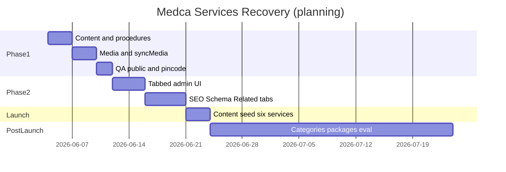

# Enterprise Services — Implementation Masterplan

**Document type:** Planning and architecture only  
**Date:** 2026-06-03  
**Status:** Approved direction — recover existing Service + Page architecture  
**Constraints:** No implementation, migrations, code changes, or database changes in this phase.

**Source audits:**

- `PLATFORM-FORENSIC-AUTOPSY.md`
- `SERVICES-MODULE-FORENSIC-DEEP-DIVE.md`
- `SERVICES-ARCHITECTURE-DECISION-REPORT.md`

---

# 1. Executive Summary

## 1.1 Current architecture

Medca runs a **monolithic Laravel CMS** with a deliberate **two-layer service model**:

| Layer | Role | Primary artifacts |
|-------|------|-------------------|
| **Service records** | Catalog entity: identity, clinical copy, media, GEO coverage, publish rules, machine-readable SEO/schema signals | `services` table, child tables `service_seo`, `service_faqs`, `service_schema`, pivot `service_pincodes` |
| **Pages** | Presentation: layout, blocks, sections, marketing composition, page-level meta and FAQs | `pages`, `page_faqs`, `ContentParser`, Block Factory |
| **Bridge** | Links catalog to visual experience | `detail_page_id`, slug pattern `service-{code}` (`config/public_pages.php`), `ServiceDetailPageProvisioner`, `ServiceDetailPageSeoSync` |

Public URLs are stable at **`/services/{service_code}`**. Rendering prefers a linked **Site Architect page**; otherwise a **fallback Blade** (`public/services/show.blade.php`).

Operations **Enterprise Services** UI (`operations.services.*`) currently saves only a **thin subset** of what the database and controller already support.

## 1.2 Final architectural direction

**Recover and complete** the existing split:

1. **Service** = source of truth for catalog facts, media, procedures, GEO, publish state, and **service-level** SEO/schema data (with explicit sync rules to pages where needed).
2. **Page** = source of truth for layout, heroes, blocks, CTAs, testimonials, marketing copy, and **visual** FAQ presentation.
3. **Wire** disconnected controller methods (`syncMedia`, optional `syncSeo` / `syncFaqs` / `syncSchema`) and **expand** the Operations form — do **not** introduce parallel tables for categories, packages, or variants before launch unless business mandates.

## 1.3 Why recovery is preferred over rebuilding

| Evidence | Implication |
|----------|-------------|
| Migrations and models for full service domain already exist | Rebuild would duplicate schema and risk data migration |
| `ServiceController` contains complete `sync*` implementations never called from `store`/`update` | Days of recovery vs weeks of new module |
| Blueprint `home_healthcare` in `config/blueprint_packs.php` maps six Medca lines to pages + blocks | Greenfield abandons Block Factory investment |
| `{{service:code}}` tokens, `ServiceContextCollector`, sitemap segment `services` | URL and SEO contracts are stable |
| Architecture decision audit: six clinical lines = six `Service` rows + six pages | No structural gap requiring new architecture |
| Hidden gap is **UI + wiring**, not missing domain tables | Phase 1–2 addresses launch blockers |

**Verdict:** **Option A — Recover** (per `SERVICES-ARCHITECTURE-DECISION-REPORT.md` §7).

---

# 2. Final Ownership Model

## 2.1 Policy statement

This masterplan adopts the **stakeholder ownership list** below. Operationally, **public canonical SEO and FAQ content** should remain **editable on the linked Page** when a detail page exists, with **Service** holding the same fields for:

- Fallback template (`/services/{code}` without custom page)
- Observer auto-fill (`ServiceObserver` → `ContentSeoAutoFillService`)
- One-time migration (`ServiceDetailPageSeoSync`)
- Sitemap and Schema.org head emission

**Rule:** When `detail_page_id` is set, **Page wins for live meta/FAQs on site** after sync; **Service** remains the admin “catalog record” and backup.

## 2.2 Service owns

| Domain | Storage | Notes |
|--------|---------|-------|
| **Title** | `services.title` | |
| **Code** | `services.service_code` | Immutable after create |
| **Summary** | `services.short_summary` | Listings, OG fallback |
| **Description** | `services.description` | Long-form HTML/text |
| **Featured image** | `services.featured_image` | Path on `public` disk |
| **Gallery** | `services.gallery` JSON | Multi-image paths |
| **Procedures** | `services.procedures`, `specialized_care`, `shifts` JSON | Bullet lists |
| **SEO data** | `service_seo` 1:1 | Mirror/sync to `pages` when linked |
| **Schema data** | `service_schema` 1:1 + `Service::toServiceSchema()` | Page `schema_json` for page-level LD |
| **Pincodes** | `service_pincodes` → `pin_codes` | **Active in UI today** |
| **Related services** | Composition: tokens in page content + block `service-detail-related` | No pivot table; catalog picks from `services` |
| **Publish rules** | `publish_status`, `visibility`, `is_active`, `is_featured`, `sort_order` | **Active in UI today** |
| **Price range** | `services.price_range` | Offer text, not SKU |
| **Custom extensions** | `services.custom_fields` JSON | Module Builder legacy slug `services` |
| **Reviews (entity)** | `reviews.service_id` | Moderation not in Services UI today |

## 2.3 Page owns

| Domain | Storage | Notes |
|--------|---------|-------|
| **Layout** | `pages.layout_mode` | Canvas vs contained |
| **Hero** | Block tokens (e.g. `service-detail-hero`) | Uses `$service` injected at render |
| **Blocks** | `pages.content` → `{{block:slug}}` | `ContentParser` |
| **Sections** | `{{section:slug}}` | `section_library_items` |
| **CTAs** | CTA blocks (`cta-home`, `cta-banner`, …) | Blueprint pack |
| **Testimonials** | `testimonials-*`, `reviews-grid` blocks | Marketing, not `reviews` table |
| **Marketing content** | Block HTML + global content variables | |
| **Visual FAQ blocks** | `faq-accordion`, `page_faqs` rows | Primary public FAQ surface when page linked |
| **Landing page design** | Blueprint `landing_pages` + dedicated slugs | e.g. `lp-nursing` |

## 2.4 Final ownership matrix

| Item | Service | Page | Sync / bridge |
|------|:-------:|:----:|---------------|
| Title | ● | ○ | Hero may repeat title |
| Code | ● | ○ | URL always service |
| Summary | ● | ○ | |
| Description | ● | ○ | Blocks may excerpt |
| Featured image | ● | ○ | Page `og_image` optional override |
| Gallery | ● | ○ | |
| Procedures lists | ● | ○ | `service-detail-carousel` partial |
| SEO meta | ● | ● | `ServiceDetailPageSeoSync`; Page live |
| Schema JSON | ● | ● | Head service graph + page LD |
| Pincodes | ● | ○ | Page `page_pin_codes` only for location pages |
| Related services | ○ | ● | Tokens on page; data from Service table |
| Publish rules | ● | ○ | |
| Layout | ○ | ● | |
| Hero | ○ | ● | |
| Blocks / sections | ○ | ● | |
| CTacles / testimonials | ○ | ● | |
| Page FAQs (structured) | ○ | ● | Migrate from `service_faqs` once |
| Custom fields | ● | ○ | |

Legend: ● = primary owner · ○ = not primary

---

# 3. Gap Analysis

## 3.1 Already exists + working

| Capability | Evidence | Status |
|------------|----------|--------|
| Service list + filters | `ServiceController::index`, `operations/services/index.blade.php` | Working |
| Create/update basic + publish + GEO | `store`/`update`, `_form.blade.php`, `StoreServiceRequest` | Working |
| Pincode pivot sync | `syncPincodes()` called from store/update | Working |
| Custom fields (if defs exist) | `InteractsWithLegacyManagedModules`, unified-table | Working |
| Detail page create/link | `_detail-page-panel`, `ServiceDetailPageProvisioner` | Working |
| Duplicate service | `duplicate()` copies seo/faqs/schema/pincodes | Working |
| Public catalog + detail URL | `ServicePublicController`, `routes/web.php` | Working |
| Detail page render | `ServicesDetailPageResolver`, `layouts/app` + `ContentParser` | Working |
| Near-you localized listing | `near-you-services.blade.php`, `scopeLocalizedListing` | Working |
| Sitemap services segment | `SeoService` + `Service::publicListing` | Working |
| Service Schema.org head | `ServiceContextCollector`, `toServiceSchema()` | Working |
| Auto SEO backfill on save | `ServiceObserver`, `ContentSeoAutoFillService` | Working (background) |
| SEO migrate to empty page | `ServiceDetailPageSeoSync` | Working |
| Site Architect service insert | `ServiceInsertCatalog`, `service-insert-controls` | Working |
| Policy / module gate | `ServicePolicy`, `module:operations` | Working |

## 3.2 Already exists + hidden

| Capability | Evidence | Why hidden |
|------------|----------|------------|
| Full service preview (SEO, FAQs, description) | `operations/services/preview.blade.php` | No form fields to populate data |
| `service_seo` rows | Table + `syncSeo()` | Form + controller call missing |
| `service_faqs` rows | Table + `syncFaqs()` | Form + call missing; UX points to Page |
| `service_schema` | Table + `syncSchema()` | Form + call missing |
| Gallery / featured / icon | `syncMedia()` | No file inputs; method not called |
| Procedures JSON | Columns + `service-detail-carousel` | No admin inputs; trait unused |
| Gemini SEO fill | `ContentSeoAutoFillService` | No UI indicator |
| Block related carousel | `service-detail-related` | Must edit page tokens manually |

## 3.3 Already exists + partially wired

| Capability | Evidence | Gap |
|------------|----------|-----|
| `description`, `short_summary` | Model fillable, factory, public fallback | Not in FormRequest or `_form` |
| `procedures`, `specialized_care`, `shifts` | Migration `2026_05_19_185213_*`, `NormalizesServiceListingLines` | Trait not on FormRequest |
| `target_keywords`, `ai_keywords` | Model casts | No UI |
| `detail_page_id` | In form | Content fields empty → weak pages |
| Reviews | `reviews` table, Livewire on fallback show | No Operations moderation |
| Welcome copy promises “SEO, AEO, GEO” | `workspace.blade.php` | Form understates scope |

## 3.4 Legacy

| Item | Evidence | Treatment in plan |
|------|----------|-------------------|
| `service_faqs` as primary FAQ store | Superseded by `page_faqs` in panel copy | Phase 1: no new FAQ UI on service; migrate via sync |
| `service_seo` / `service_schema` dual with `pages` | `ServiceDetailPageSeoSync` | Phase 1: optional advanced tab; Page canonical when linked |
| `managed-module-schema.blade.php` | Never included | Phase 1 cleanup decision |

## 3.5 Dead code

| Item | Evidence |
|------|----------|
| `ServiceController::syncSeo/Faqs/Schema/Media` | Defined L360–457; **not referenced** in `store`/`update` |
| `NormalizesServiceListingLines` | `app/Http/Requests/Operations/Services/Concerns/NormalizesServiceListingLines.php` — no use |
| `NormalizesServiceKeywordArrays` | Same pattern — no use |
| `managed-module-schema.blade.php` | Zero includes in codebase |

## 3.6 Tables that do not exist (not gaps — out of scope)

`service_categories`, `service_gallery`, `service_packages`, `service_variants`, `service_features`, `service_benefits`, `service_deliverables` — confirmed absent in migrations (see deep dive §1).

---

# 4. Phase 1 Recovery Plan

**Goal:** Recover **existing** backend capabilities only — no new tables, no new architecture.

**Global files touched (planning reference):**

| Area | Paths |
|------|-------|
| Controller | `app/Http/Controllers/Operations/Services/ServiceController.php` |
| Requests | `app/Http/Requests/Operations/Services/StoreServiceRequest.php`, `UpdateServiceRequest.php` |
| Concerns | `app/Http/Requests/Operations/Services/Concerns/NormalizesServiceListingLines.php` |
| Views | `resources/views/operations/services/_form.blade.php`, optionally `edit.blade.php` / `create.blade.php` |
| Model | `app/Models/Service.php` (no schema change) |

---

## 4.1 `short_summary`

| Attribute | Value |
|-----------|-------|
| **Files** | `_form.blade.php`, `StoreServiceRequest`, `UpdateServiceRequest`, `ServiceController::store/update` |
| **Controllers** | `ServiceController` — add to `create()` array and `fill()` |
| **Views** | Textarea under new “Content” section |
| **DB** | `services.short_summary` (nullable text) — migration `2026_05_04_120000_create_services_table.php` |
| **Effort** | **S** (0.5 day) |
| **Risk** | **Low** |

---

## 4.2 `description`

| Attribute | Value |
|-----------|-------|
| **Files** | Same as 4.1 |
| **Controllers** | `fill()` on store/update |
| **Views** | Textarea or rich-text component (match vacancy form pattern in `job-portal/vacancies/_form.blade.php` for consistency) |
| **DB** | `services.description` (longText) |
| **Effort** | **S** (0.5 day) |
| **Risk** | **Low** — XSS: follow existing `{!! !!}` public rendering rules |

---

## 4.3 `featured_image` + `icon`

| Attribute | Value |
|-----------|-------|
| **Files** | `_form.blade.php`, `ServiceController::update` (and store post-create redirect flow: call sync on first update or after create in transaction) |
| **Controllers** | Invoke existing **`syncMedia()`** |
| **Views** | `<input type="file">` + show current image preview on edit |
| **DB** | `services.featured_image`, `services.icon` (string paths) |
| **Effort** | **S** (1 day with preview/delete) |
| **Risk** | **Low** — storage disk `public`, existing `deletePublicPath()` |

---

## 4.4 `gallery`

| Attribute | Value |
|-----------|-------|
| **Files** | `_form.blade.php`, `ServiceController` — **`syncMedia()`** already appends `gallery_files[]` |
| **Controllers** | `syncMedia()` |
| **Views** | Multi-file upload + list existing paths with remove checkbox |
| **DB** | `services.gallery` JSON array |
| **Effort** | **M** (1–2 days) |
| **Risk** | **Medium** — orphan files if remove from JSON without delete; reuse `deletePublicPath` per removed entry |

---

## 4.5 `procedures` (+ `specialized_care`, `shifts`)

| Attribute | Value |
|-----------|-------|
| **Files** | `_form.blade.php`, `StoreServiceRequest`, `UpdateServiceRequest`, `NormalizesServiceListingLines` |
| **Controllers** | Merge normalized arrays in `prepareForValidation`; `fill()` casts |
| **Views** | Three “one item per line” textareas: `procedures_lines`, `specialized_care_lines`, `shifts_lines` |
| **DB** | JSON columns — migration `2026_05_19_185213_add_listing_arrays_to_services_table.php` |
| **Views (public)** | `resources/views/public/services/partials/service-detail-carousel.blade.php` |
| **Effort** | **M** (1 day) |
| **Risk** | **Low** — display partial exists; add block to provisioned page optional |

**Post-recovery:** Update `ServiceDetailPageProvisioner` default content to include `{{block:...}}` or `@include` carousel block if marketing wants procedures on canvas pages (config change only in plan).

---

## 4.6 `syncMedia()`

| Attribute | Value |
|-----------|-------|
| **Files** | `ServiceController.php` L434–457 |
| **Controllers** | Call from `update`; after `store` once `$service->id` exists |
| **Views** | Depends on 4.3–4.4 |
| **DB** | `featured_image`, `icon`, `gallery` |
| **Effort** | **S** (hours) — code exists |
| **Risk** | **Low** |

---

## 4.7 `syncSeo()`

| Attribute | Value |
|-----------|-------|
| **Files** | `ServiceController.php` L360–378; `ServiceSeo` model |
| **Controllers** | Call with `$request->input('seo', [])` after policy decision |
| **Views** | Fields: `seo[meta_title]`, `meta_description`, `h1`, focus keywords, h2/h3 lines, `ai_context`, `search_intent` |
| **DB** | `service_seo` table — migration `2026_05_04_120001_create_service_seo_table.php` |
| **Effort** | **M** (1–2 days) |
| **Risk** | **Medium** — **duplication** with Page SEO; mitigate with banner + `ServiceDetailPageSeoSync` on save when page linked |

**Recommendation:** Phase 1 implement **read-only preview** of `service_seo` on edit + link to Page; full **syncSeo** wire in Phase 2 “SEO” tab OR only when no `detail_page_id`.

---

## 4.8 `syncFaqs()`

| Attribute | Value |
|-----------|-------|
| **Files** | `ServiceController.php` L384–396; `ServiceFaq` model |
| **Controllers** | Call with FAQ repeater array; need **delete old FAQs** strategy (currently only creates — **bug** if wired naively) |
| **Views** | Repeater `faqs[][question]`, `faqs[][answer]` |
| **DB** | `service_faqs` |
| **Effort** | **M** (1–2 days) — must add sync delete/replace logic |
| **Risk** | **High** if both Page FAQs and Service FAQs edited — **prefer Page-only for FAQs in Phase 1** |

**Phase 1 plan:** **Defer wiring `syncFaqs()`**; use `ServiceDetailPageSeoSync` + Site Architect for FAQs. Phase 2 optional legacy accordion.

---

## 4.9 `syncSchema()`

| Attribute | Value |
|-----------|-------|
| **Files** | `ServiceController.php` L399–422; `ServiceSchema` model |
| **Controllers** | Call with `schema_type`, `schema_json` (validated JSON) |
| **Views** | Textarea JSON + type select |
| **DB** | `service_schema` |
| **Effort** | **S–M** (1 day) |
| **Risk** | **Medium** — duplication with `pages.schema_json`; sync to page when linked (extend `ServiceDetailPageSeoSync` or save hook) |

**Phase 1 plan:** Wire only if Operations must edit schema without Site Architect; else Phase 2.

---

## 4.10 Phase 1 summary table

| Item | Phase 1 action | Effort | Risk |
|------|----------------|--------|------|
| short_summary | Add form + validation + fill | S | Low |
| description | Add form + validation + fill | S | Low |
| featured_image / icon | Form + call syncMedia | S | Low |
| gallery | Form + syncMedia + remove UI | M | Medium |
| procedures (+ care, shifts) | Textareas + trait + fill | M | Low |
| syncMedia | Wire to store/update | S | Low |
| syncSeo | Defer or limited + page link | M | Medium |
| syncFaqs | **Avoid wire**; Page FAQs | — | High if dual |
| syncSchema | Defer to Phase 2 or advanced | S–M | Medium |

**Phase 1 estimated duration:** **5–8 engineering days** (one developer), including QA on public fallback and linked page render.

**Phase 1 tests to extend (planning):** `tests/Feature/OperationsServicesStoreTest.php`, `ServicesBlockLayoutsTest.php` — not executed in this document.

---

# 5. Phase 2 UX Completion

## 5.1 Design goals

- Single **Enterprise Services** edit experience without requiring Site Architect for catalog completeness.
- Clear **handoff** to Site Architect for layout/marketing.
- Avoid duplicate FAQ/SEO editing surfaces without guardrails.

## 5.2 Information architecture (wireframe-level)

```
/operations/services                          [List — unchanged]
/operations/services/create                   [Wizard optional: Basic → Content → Media → Coverage]
/operations/services/{id}/edit                [Tabbed layout]

┌─────────────────────────────────────────────────────────────────┐
│ Enterprise Services — {title}          [Preview] [Open public]   │
│ Service code: {code}                    [Duplicate] [Delete]       │
├─────────────────────────────────────────────────────────────────┤
│ [Basic Info] [Media] [Procedures] [SEO] [Schema] [Related]       │
│              [Service Areas] [Publishing] [Public Page ↗]        │
├─────────────────────────────────────────────────────────────────┤
│ TAB CONTENT AREA                                                 │
│                                                                  │
│ Sticky footer: [Save changes]  [Back to list]                    │
└─────────────────────────────────────────────────────────────────┘

┌─ Public Page (always visible callout above tabs) ───────────────┐
│ Linked page: {slug} | [Edit blocks & SEO in Site Architect]      │
│ [Create detail page] if missing                                  │
└──────────────────────────────────────────────────────────────────┘
```

## 5.3 Tab specifications

### Basic Info

| Field | Control | Maps to |
|-------|---------|---------|
| Title | text required | `services.title` |
| Service code | read-only on edit | `services.service_code` |
| Price range | text | `services.price_range` |
| Short summary | textarea 2–3 rows | `services.short_summary` |
| Description | textarea rich 10+ rows | `services.description` |

### Media

| Field | Control | Maps to |
|-------|---------|---------|
| Featured image | file + preview + remove | `featured_image` via syncMedia |
| Icon | file + preview | `icon` |
| Gallery | multi upload + grid thumbs + remove | `gallery[]` |
| Image alt | text | `services.image_alt` |

### Procedures

| Field | Control | Maps to |
|-------|---------|---------|
| Procedures | textarea lines | `procedures` JSON |
| Specialized care | textarea lines | `specialized_care` JSON |
| Shifts / availability | textarea lines | `shifts` JSON |
| Helper text | static | Rendered via `service-detail-carousel` when block included |

### SEO

| Element | Behavior |
|---------|----------|
| Banner | If `detail_page_id`: “Live SEO is edited on linked page” + button → Site Architect |
| Fields | meta_title, meta_description, h1, focus keywords (tags), h2/h3 line lists, ai_context, search_intent |
| Save | Calls **syncSeo()**; triggers **ServiceDetailPageSeoSync** if page linked and page fields empty |
| Read-only mode | Optional when page has all SEO filled |

### Schema

| Field | Control | Maps to |
|-------|---------|---------|
| Schema type | select | `service_schema.schema_type` |
| JSON-LD | monospace textarea + validate button | `service_schema.schema_json` |
| Note | Service graph also emitted via `toServiceSchema()` in head |

### Related Services

| Element | Behavior |
|---------|----------|
| Picker | Multi-select from `ServiceInsertCatalog::forDropdown()` excluding self |
| Output | Read-only preview of generated `{{service:code}}` lines |
| Action | “Apply to linked page” appends tokens to `pages.content` for related block (requires Site Architect permission or API-style update service) |
| Manual override | Link to edit page in Site Architect |

*Wireframe note:* Related services are **not a DB column** — UI writes page tokens.

### Service Areas

| Field | Control | Maps to |
|-------|---------|---------|
| Pincode filter search | search box | existing Alpine filter |
| Checkbox list | pincodes[] | `service_pincodes` pivot |

*Move current GEO section here unchanged.*

### Publishing

| Field | Control | Maps to |
|-------|---------|---------|
| Publish status | select enum | `publish_status` |
| Visibility | select | `visibility` |
| Sort order | number | `sort_order` |
| Active | checkbox | `is_active` |
| Featured | checkbox | `is_featured` |
| Detail page | select pages | `detail_page_id` |

*Move “Control” section here.*

### Public Page (tab or persistent panel)

Same as current `_detail-page-panel.blade.php` plus:

- Status badge: provisioned / draft / active
- Block list summary (read-only from page tokens)

### Custom fields (conditional)

If `managedModule` has definitions: eighth tab **Custom** with existing `x-dynamic-fields.unified-table`.

## 5.4 Component checklist (new Blade partials)

| Partial | Purpose |
|---------|---------|
| `_tabs-nav.blade.php` | Tab buttons + Alpine/Livewire state |
| `_tab-basic.blade.php` | Basic Info |
| `_tab-media.blade.php` | Media |
| `_tab-procedures.blade.php` | Procedures |
| `_tab-seo.blade.php` | SEO |
| `_tab-schema.blade.php` | Schema |
| `_tab-related.blade.php` | Related service picker |
| `_tab-areas.blade.php` | Pincodes |
| `_tab-publishing.blade.php` | Publishing |
| `_public-page-panel.blade.php` | Extract existing panel |

## 5.5 Phase 2 effort estimate

**8–12 engineering days** including related-service → page content helper, SEO dedup rules, and regression tests.

---

# 6. Phase 3 Optional Enhancements

| Enhancement | Implement now? | Decision | Justification |
|-------------|----------------|----------|---------------|
| **Categories** (`service_categories` + parent_id) | **Postponed** | After launch | No table; six flat services sufficient; `/services` CMS page + `sort_order` covers navigation |
| **Care packages** (priced bundles, M:N services) | **Postponed** | After launch | `price_range` + CTA blocks enough for marketing; avoid confusion with `deployment_packages` |
| **Pricing tiers** (SKU-level) | **Postponed** | After launch | No tier table; regulatory/pricing churn better after live feedback |
| **Service bundles** (cart/checkout) | **Avoid** for now | Post-launch or never | No commerce layer in platform; leads/bookings model differs |
| **Formal `related_services` pivot** | **Postponed** | After launch if needed | Token + block model works at Medca scale |
| **Reviews moderation UI** | **Optional later** | Phase 3+ | Table exists; not launch-critical |
| **API `/api/services`** | **Postponed** | When mobile app | No current consumer |

### 6.1 Implement now (only if business blocks launch)

None of the Phase 3 items are **required** for Medca soft launch per fit analysis — unless legal/commercial mandates itemized package pricing in DB.

### 6.2 Avoid entirely (unless product changes)

- Parallel FAQ systems without migration plan  
- New “service variants” table while also using `service_code` per line  
- Renaming care offerings into `deployment_packages`

---

# 7. Technical Debt Cleanup

**Do not remove in implementation without explicit approval.** Classification for future sprints.

| Artifact | Class | Action | Rationale |
|----------|-------|--------|-----------|
| `service_faqs` table | **Deprecate** (data) | Keep table; stop new admin writes after Page FAQs stable | Migration path exists in `ServiceDetailPageSeoSync` |
| `service_seo` table | **Keep** | Observer + fallback public view | Still used when no page |
| `service_schema` table | **Keep** | Phase 2 schema tab | Head emission |
| `syncFaqs()` without delete | **Keep code, fix before wire** | Add replace logic or deprecate | Naive create-only causes duplicates |
| `managed-module-schema.blade.php` | **Remove later** | Dead include | Zero references |
| `NormalizesServiceListingLines` | **Keep** | Wire in Phase 1 | Orphan trait |
| `NormalizesServiceKeywordArrays` | **Deprecate** or wire | No consumer | Keywords low priority |
| `OperationsHubController` → Job Portal | **Keep** | Optional link tweak | Not debt — product choice |
| `preview.blade.php` on admin layout | **Keep** | Align with tabs in Phase 2 | Useful QA |
| Duplicate SEO on Page + Service | **Keep** with rules | Document canonical | Sync service |
| `reviews` without admin | **Keep** | Phase 3 moderation | Public only |
| Blueprint pages without Operations rows | **Keep** | Content seeding / manual | Operational process |
| `service-detail-carousel` not in default provisioner | **Keep** | Add token in provisioner template update | Low risk content change |

### 7.1 Orphan routes / controllers

| Item | Status |
|------|--------|
| All `operations.services.*` routes | **Keep** — used |
| `operations.managed-modules.fields.update` | **Keep** — custom field schema |
| No orphan Service controllers found | — |

---

# 8. Medca Launch Readiness

## 8.1 Can Medca launch after Phase 1 + Phase 2 without categories, packages, variants, or new architecture?

**Yes — with justification.**

| Launch requirement | Met by recovery plan |
|--------------------|----------------------|
| Six clinical lines visible | `Service` rows + blueprint slugs `service-elder-care`, etc. |
| Hyper-local pincode gating | `service_pincodes` — already in UI |
| Service detail URLs | `/services/{code}` + resolver |
| Marketing layout | Site Architect pages + blocks |
| Trust / testimonials / FAQ site-wide | Page blocks + sitewide FAQ page in pack |
| SEO / sitemap | `SeoService`, page meta, observer |
| Lead conversion | CTAs, bookings, WhatsApp — separate modules |
| Gallery / clinical detail | Phase 1 media + Phase 2 UX |
| Related cross-sell | Phase 2 related tab + tokens |

## 8.2 What launch does **not** need

| Not needed | Why |
|------------|-----|
| Categories | Flat catalog + CMS services page |
| Packages table | Text price_range + human CTAs |
| Variants | One code per offering (ICU vs standard = separate services if needed) |
| New architecture | Recovery closes gap |

## 8.3 Residual launch risks (mitigate in plan)

| Risk | Mitigation |
|------|------------|
| Empty DB (0 services) | Content seeding runbook — operational, not architectural |
| Editors confused by dual SEO | Phase 2 banner + canonical rule |
| Procedures not on canvas page | Add block token to provisioner template |
| Operations lands on Job Portal | Optional dashboard link to Services |

## 8.4 Launch readiness gate

| Gate | Phase required |
|------|----------------|
| Minimum viable catalog | **Phase 1 complete** |
| Editor-friendly ops | **Phase 2 complete** |
| Full commerce packages | **Not required** for launch |

---

# 9. Final Recommendation

## 9.1 What should be implemented first? (Priority order)

| Priority | Work item | Phase |
|----------|-----------|-------|
| **P0** | Wire `short_summary`, `description`, `procedures` (+ trait), **`syncMedia`** | 1 |
| **P0** | Pincode + publish flows regression test | 1 |
| **P1** | Gallery remove/reorder UI | 1 |
| **P1** | Detail page provision checklist on create | 1 |
| **P2** | Tabbed Services admin UI shell | 2 |
| **P2** | SEO tab with Page-canonical rules + **syncSeo** | 2 |
| **P2** | Related services picker → page tokens | 2 |
| **P3** | Schema tab + **syncSchema** | 2 |
| **P3** | Provisioner: add procedures carousel block to default detail content | 2 |
| **P4** | Reviews moderation (Operations) | 3 |

## 9.2 What should not be touched?

| Do not touch | Reason |
|--------------|--------|
| Public URL scheme `/services/{code}` | SEO + tokens contract |
| `ServiceContextCollector` / head schema pipeline | Working |
| `ContentParser` token grammar | Platform-wide |
| `deployment_packages` system | Unrelated to care packages |
| Dynamic Module Builder `mod_*` tables | Separate product surface |
| Growth Center tables / competitor stack | Out of scope |
| Database schema for categories/packages | Decision: postpone |
| `syncFaqs()` until replace logic + FAQ ownership agreed | Duplication risk |

## 9.3 What should be postponed until after Medca launches?

| Postpone | Reason |
|----------|--------|
| `service_categories` and faceted catalog | Not in current UX |
| Care packages / pricing tiers / bundles tables | Marketing sufficient with text + blocks |
| Service variants as SKUs | Use separate service codes |
| Formal `related_services` pivot | Token model enough |
| Public REST API for services | No consumer |
| Deprecate `service_faqs` table drop | Migrate live data first |
| Remove `managed-module-schema.blade.php` | Cosmetic; post-launch cleanup |
| Excel export / advanced analytics | Inventory doc gaps |

## 9.4 Prioritized roadmap (timeline sketch)



*Dates illustrative — adjust per team capacity.*

## 9.5 Success criteria (definition of done)

### Phase 1 done when

- [ ] Manager can create a service with summary, description, procedures, images without SQL.
- [ ] Public fallback `/services/{code}` shows new fields.
- [ ] Linked detail page still renders; pincode gating unchanged.
- [ ] No regression in `OperationsServicesStoreTest` scenarios (when run).

### Phase 2 done when

- [ ] Tabbed edit matches §5 IA.
- [ ] SEO tab respects Page-canonical rule when page linked.
- [ ] Related services can be attached to page content from Operations.
- [ ] Preview matches editable fields.

### Launch ready when

- [ ] Six Medca services populated (Operations or seed runbook).
- [ ] Each has active detail page or fallback.
- [ ] Pincodes cover Arekere belt.
- [ ] Sitemap includes service URLs.

---

## Appendix A — File reference index

| Purpose | Path |
|---------|------|
| Controller | `app/Http/Controllers/Operations/Services/ServiceController.php` |
| Public | `app/Http/Controllers/Public/ServicePublicController.php` |
| Form | `resources/views/operations/services/_form.blade.php` |
| Panel | `resources/views/operations/services/_detail-page-panel.blade.php` |
| Provisioner | `app/Services/Operations/ServiceDetailPageProvisioner.php` |
| SEO sync | `app/Services/Operations/ServiceDetailPageSeoSync.php` |
| Observer | `app/Observers/ServiceObserver.php` |
| Routes | `routes/web.php` (operations.services.*, public.services.*) |
| Healthcare blueprint | `config/blueprint_packs.php` |

## Appendix B — Document control

| Version | Date | Change |
|---------|------|--------|
| 1.0 | 2026-06-03 | Initial masterplan from three audits |

---

**End of masterplan. No implementation performed.**
