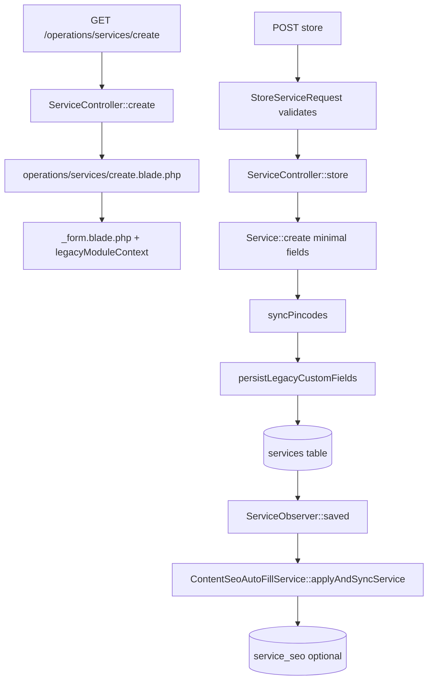

# Enterprise Services Module — Forensic Deep Dive

**Audit date:** 2026-06-03  
**Scope:** Operations → **Enterprise Services** (`operations.services.*`)  
**Mode:** Read-only — no code, database, routes, config, or UI changes.

**Label in UI:** “Enterprise Services” (`resources/views/components/operations/workspace.blade.php`).

---

## Executive summary

The platform has a **substantial Services domain** in the database and backend (models, relations, public routes, blocks, SEO sync, reviews). The **current Operations Services UI exposes only a thin subset**: basic metadata, publish flags, GEO pincodes, detail-page linking, and optional **custom fields** (Module Builder JSON).

Many capabilities exist in **schema + controller private methods + preview/fallback views** but are **not wired to the create/edit forms**. Rich content (description, FAQs, SEO, gallery, procedures, schema) is **intentionally redirected** to **Site Architect pages** via the detail-page panel—but **legacy `service_*` tables remain** and are still used by observers, duplication, preview, fallback public template, and migration into `page_faqs` / `pages`.

**Tables that do NOT exist:** `service_categories`, `service_gallery`, `service_packages`, `service_variants`, `service_features`, `service_benefits`, `service_deliverables`.

**Row counts (this environment):** `database/database.sqlite` — all service-related tables **0 rows** at audit time.

---

## 1. Service tables inventory

### 1.1 Tables that exist

| Table | Exists | Notes |
|-------|--------|-------|
| `services` | YES | Core entity |
| `service_faqs` | YES | Child rows |
| `service_seo` | YES | 1:1 child |
| `service_schema` | YES | 1:1 child (table name singular) |
| `service_pincodes` | YES | Pivot to `pin_codes` |
| `reviews` | YES | Service reviews (not named `service_reviews`) |
| `service_categories` | **NO** | Not in migrations |
| `service_gallery` | **NO** | Gallery = `services.gallery` JSON column |
| `service_packages` | **NO** | “Deployment packages” are unrelated (`deployment_packages`) |
| `service_variants` | **NO** | Block `style_variant` only (presentation) |
| `service_features` | **NO** | Marketing block `features-grid` / `services-benefits` only |
| `service_benefits` | **NO** | Block template `services-benefits`, not DB |
| `service_deliverables` | **NO** | — |

### 1.2 Related non-`service_*` tables

| Table | Service relationship |
|-------|---------------------|
| `pages` | `services.detail_page_id` → FK `pages.id` |
| `page_faqs` | FAQs on CMS detail pages (preferred path in UI copy) |
| `page_seo` | Growth mirror keyed by slug `services/{code}` |
| `page_elements` | Growth AEO mirror for service slug path |
| `pin_codes` | M:N via `service_pincodes` |
| `modules` + `field_definitions` | Legacy module slug `services` for `custom_fields` JSON |

---

## 2. Per-table documentation

### 2.1 `services`

#### Structure (migrations)

| Column | Type | Migration |
|--------|------|-----------|
| `id` | bigint PK | `2026_05_04_120000_create_services_table.php` |
| `title` | string | same |
| `service_code` | string unique | same |
| `short_summary` | text nullable | same |
| `description` | longText nullable | same |
| `price_range` | string nullable | same |
| `featured_image` | string nullable | same |
| `icon` | string nullable | same |
| `gallery` | json nullable | same |
| `image_alt` | string nullable | same |
| `target_keywords` | json nullable | same |
| `ai_keywords` | json nullable | same |
| `quality_score` | uint default 0 | same |
| `is_active` | boolean | same |
| `is_featured` | boolean | same |
| `publish_status` | enum draft/published | same |
| `visibility` | enum public/private | same |
| `sort_order` | integer | same |
| `procedures` | json nullable | `2026_05_19_185213_add_listing_arrays_to_services_table.php` |
| `specialized_care` | json nullable | same |
| `shifts` | json nullable | same |
| `detail_page_id` | FK nullable → `pages` | `2026_05_10_184534_add_detail_page_id_to_services_table.php` |
| `custom_fields` | json nullable | `2026_05_30_180000_add_custom_fields_to_legacy_managed_tables.php` |
| `created_at`, `updated_at` | timestamps | base |

#### Relationships

| Relation | Type | Model method |
|----------|------|--------------|
| `seo` | HasOne | `Service::seo()` |
| `faqs` | HasMany | `Service::faqs()` |
| `schema` | HasOne | `Service::schema()` |
| `detailPage` | BelongsTo Page | `Service::detailPage()` |
| `pincodes` | BelongsToMany PinCode | `Service::pincodes()` pivot `service_pincodes` |
| `reviews` | HasMany | `Service::reviews()` |

#### Foreign keys

- Outbound: `detail_page_id` → `pages.id` (`nullOnDelete`)
- Inbound: `service_faqs.service_id`, `service_seo.service_id`, `service_schema.service_id`, `service_pincodes.service_id`, `reviews.service_id`

#### Row count

**0** (SQLite audit environment)

#### Model

`App\Models\Service` — `app/Models/Service.php`

#### Controllers

| Controller | Usage |
|------------|--------|
| `App\Http\Controllers\Operations\Services\ServiceController` | CRUD, duplicate, preview, detail page actions |
| `App\Http\Controllers\Public\ServicePublicController` | Public catalog + detail |

#### Services (app layer)

| Service | Usage |
|---------|--------|
| `ServiceDetailPageProvisioner` | Create/link CMS detail page |
| `ServiceDetailPageSeoSync` | Copy service SEO/FAQs → page when empty |
| `ServicesDetailPageResolver` | Resolve page for `/services/{code}` |
| `ServiceContextCollector` | Schema.org registration |
| `ServiceBindingRegistry` | Block `{{service:code}}` variables |
| `ContentSeoAutoFillService` | Observer-driven SEO fill |
| `ServiceInsertCatalog` | Site Architect dropdown |
| `LegacyCustomFieldService` | `custom_fields` JSON |
| `PublicPagePresenter` | Near-you / localized listings |
| `SeoService` | Sitemap segment `services` |

#### Routes

| Route name | Method | Path |
|------------|--------|------|
| `operations.services.index` | GET | `/operations/services` |
| `operations.services.create` | GET | `/operations/services/create` |
| `operations.services.store` | POST | `/operations/services` |
| `operations.services.edit` | GET | `/operations/services/{service}/edit` |
| `operations.services.update` | PUT | `/operations/services/{service}` |
| `operations.services.destroy` | DELETE | `/operations/services/{service}` |
| `operations.services.duplicate` | GET | `/operations/services/{service}/duplicate` |
| `operations.services.preview` | GET | `/operations/services/{service}/preview` |
| `operations.services.detail-page.create` | GET | `/operations/services/{service}/detail-page/create` |
| `operations.services.detail-page.store` | POST | `/operations/services/{service}/detail-page` |
| `operations.services.detail-page.edit` | GET | `/operations/services/{service}/detail-page/edit` |
| `public.services.index` | GET | `/services-catalog` |
| `public.services.show` | GET | `/services/{code}` |
| `public.page.services` | GET | `/services` (CMS page slug) |

**Evidence:** `routes/web.php`

#### API endpoints

**None** dedicated to `services` in `routes/api.php`.

#### Views / components

| View | Role |
|------|------|
| `operations/services/index.blade.php` | List |
| `operations/services/create.blade.php` | Create shell |
| `operations/services/edit.blade.php` | Edit shell |
| `operations/services/_form.blade.php` | **Only fields exposed in UI** |
| `operations/services/_detail-page-panel.blade.php` | CMS bridge |
| `operations/services/preview.blade.php` | Admin preview (reads seo/faqs/description) |
| `operations/services/partials/toolbar.blade.php` | Create / list nav |
| `public/services/index.blade.php` | Catalog |
| `public/services/show.blade.php` | Fallback detail |
| `public/partials/near-you-services.blade.php` | Pincode-scoped list |
| Blocks under `resources/views/blocks/services/*` | Marketing layouts |

---

### 2.2 `service_faqs`

#### Structure

`2026_05_04_120002_create_service_faqs_table.php`

| Column | Type |
|--------|------|
| `id` | PK |
| `service_id` | FK → services CASCADE |
| `question` | text |
| `answer` | longText |
| timestamps | |

Index: `service_id`

#### Model

`App\Models\ServiceFaq` — `app/Models/ServiceFaq.php`

#### Controllers

- `ServiceController::syncFaqs()` — **private, never called from store/update**
- `ServiceController::duplicate()` — **replicates FAQs**
- `ServiceDetailPageSeoSync` — copies to `page_faqs` if page has none

#### Routes

No direct routes (child of service).

#### Views

- `operations/services/preview.blade.php` — displays FAQs
- `public/services/show.blade.php` — displays FAQs on **fallback** template
- **No admin form** to create/edit `service_faqs` (use Site Architect `page_faqs` per panel copy)

#### Status

**PARTIAL / LEGACY** — table active; admin CRUD **hidden** (migrated UX to Pages).

---

### 2.3 `service_seo`

#### Structure

`2026_05_04_120001_create_service_seo_table.php`

| Column | Type |
|--------|------|
| `id` | PK |
| `service_id` | FK unique |
| `meta_title`, `meta_description` | nullable |
| `focus_keywords` | json |
| `h1` | string |
| `h2`, `h3` | json |
| `ai_context` | text |
| `search_intent` | string |
| timestamps | |

#### Model

`App\Models\ServiceSeo` — `app/Models/ServiceSeo.php`

#### Controllers

- `ServiceController::syncSeo()` — **private, never called**
- `ServiceObserver` → `ContentSeoAutoFillService::applyAndSyncService()` — **auto-writes when service saved** (if config enabled)
- `ServiceDetailPageSeoSync` — copies to `pages` when empty

#### Routes

None direct.

#### Views

- `preview.blade.php`, `public/services/show.blade.php`, blocks using `$service->seo`
- **No Operations form** for manual SEO entry on service

#### Status

**PARTIAL** — populated by observer/Gemini/factory/tests; **not editable in Services UI**.

---

### 2.4 `service_schema`

#### Structure

`2026_05_04_120003_create_service_schema_table.php`

| Column | Type |
|--------|------|
| `id` | PK |
| `service_id` | FK unique |
| `schema_type` | string nullable |
| `schema_json` | json nullable |
| timestamps | |

#### Model

`App\Models\ServiceSchema` — `app/Models/ServiceSchema.php`

#### Controllers

- `ServiceController::syncSchema()` — **private, never called**
- `duplicate()` replicates schema
- Detail page sync copies `schema_json` → `pages.schema_json`

#### Status

**PARTIAL / HIDDEN** — use **Site Architect page schema** in practice.

---

### 2.5 `service_pincodes` (pivot)

#### Structure

`2026_05_04_120004_create_service_pincodes_table.php`

| Column | Type |
|--------|------|
| `id` | PK |
| `service_id` | FK |
| `pincode_id` | FK → `pin_codes` |
| unique (`service_id`, `pincode_id`) | |

#### UI

**ACTIVE** — `operations/services/_form.blade.php` section “GEO — serviceable pincodes”

#### Controller

`ServiceController::syncPincodes()` — **called** from `store` and `update`

#### Status

**Production ready** (in current UI)

---

### 2.6 `reviews` (service-related)

#### Structure

`2026_05_30_140001_create_reviews_table.php`

| Column | Type |
|--------|------|
| `user_id`, `service_id` | FKs |
| `rating`, `comment`, `pincode`, `status` | |

Unique (`user_id`, `service_id`)

#### Model

`App\Models\Review` — used by `Service::reviews()`

#### Public UI

`@livewire('reviews.review-form')` on `public/services/show.blade.php` only (fallback detail)

#### Admin UI

**None** in Operations Services (moderation elsewhere if any — not traced in Services routes)

#### Status

**PARTIAL** — public fallback only; not Enterprise Services admin screen

---

## 3. Feature discovery matrix

| Feature | EXISTS | LOCATION | STATUS |
|---------|--------|----------|--------|
| **Categories** | NO | — | Not implemented |
| **Subcategories** | NO | — | Not implemented |
| **Variants** | NO (inventory) | Block `style_variant` in `BlockSettingsEditor` | Presentation only — **not service SKUs** |
| **Packages** | NO (commercial) | `deployment_packages` table | **Different product** — site export |
| **Features** | PARTIAL | JSON `procedures` / blocks `features-grid` | DB columns **no admin UI**; blocks are static marketing |
| **Benefits** | PARTIAL | Block `blocks.shared.services-benefits` | **Not tied to `services` rows** |
| **Deliverables** | NO | — | — |
| **Procedures** | PARTIAL | `services.procedures` JSON | Render: `service-detail-carousel.blade.php`; **no admin UI** |
| **Specialized care** | PARTIAL | `services.specialized_care` JSON | Same partial |
| **Shifts** | PARTIAL | `services.shifts` JSON | Same partial |
| **FAQs** | PARTIAL | `service_faqs` + `page_faqs` | Service FAQs: **legacy/hidden**; Page FAQs: **active** via Site Architect |
| **Gallery** | PARTIAL | `services.gallery` JSON + `syncMedia()` | Controller method **never called**; **no upload UI** |
| **SEO** | PARTIAL | `service_seo` + `pages` SEO fields | Service SEO: observer + sync; **manual entry via Pages** |
| **Schema.org** | PARTIAL | `service_schema` + `pages.schema_json` | Hidden on service; active on page |
| **Related Services** | PARTIAL | Block `service-detail-related` + `{{service:code}}` tokens | **Site Architect / Block Factory** — not Operations form |
| **Service Areas** | YES | `service_pincodes` + `PinCode` | **Active** in Services form |
| **Service Hierarchies** | NO | — | Related services = manual tokens, not parent/child |
| **Description / summary** | PARTIAL | `services.description`, `short_summary` | Factory/tests; **not in `_form.blade.php`** |
| **Featured image / icon** | PARTIAL | columns + `syncMedia()` | **Dead controller path** (no UI) |
| **Target / AI keywords** | PARTIAL | JSON columns | **No UI** |
| **Custom fields** | YES | `services.custom_fields` + Module `services` | **Active** if definitions exist |
| **Detail CMS page** | YES | `detail_page_id`, provisioner | **Active** via panel |
| **Reviews** | PARTIAL | `reviews` table | Public fallback; no Services admin |
| **Duplicate service** | YES | `ServiceController::duplicate` | **Active** (copies seo/faqs/schema/pincodes) |
| **Public catalog** | YES | `ServicePublicController@index` | **Active** |
| **Pincode-gated listing** | YES | `scopeLocalizedListing`, near-you partial | **Active** |
| **Sitemap** | YES | `SeoService` + `Service::publicListing` | **Active** |
| **Auto SEO (Gemini)** | YES | `ContentSeoAutoFillService` via `ServiceObserver` | **Background** — requires save + config |

---

## 4. UI trace — Enterprise Services admin

### 4.1 Navigation path

```
Sidebar: Operations (module:operations)
  → Primary tab: Services
    → URL: /operations/services
    → Route: operations.services.index
```

**Evidence:**

- `resources/views/operations/partials/primary-tabs.blade.php` — “Services” tab
- `app/Support/AdminNavigation.php` — `operations.*` highlights Operations
- Workspace title: `__('Enterprise Services')` when `operations.services.*`

**Operations hub default** redirects to Job Portal, **not** Services:

- `OperationsHubController` → `operations.job-portal.overview`

### 4.2 Screen map

| Admin URL | Route name | Controller | View |
|-----------|------------|------------|------|
| `/operations/services` | `operations.services.index` | `index` | `operations/services/index` |
| `/operations/services/create` | `operations.services.create` | `create` | `operations/services/create` |
| POST `/operations/services` | `operations.services.store` | `store` | redirect → edit |
| `/operations/services/{id}/edit` | `operations.services.edit` | `edit` | `operations/services/edit` |
| PUT `/operations/services/{id}` | `operations.services.update` | `update` | redirect |
| `/operations/services/{id}/preview` | `operations.services.preview` | `preview` | `operations/services/preview` |
| GET duplicate | `operations.services.duplicate` | `duplicate` | redirect edit |
| Detail page create/edit | `operations.services.detail-page.*` | `storeDetailPage` / redirects | panel + Site Architect |

**Middleware:** `auth`, `active`, `verified`, `auto.logout`, `module:operations`, `role:manager,admin,super_admin`

**Policy:** `App\Policies\ServicePolicy` — all actions require `ModuleAccess::OPERATIONS`

### 4.3 What the form actually saves (create/update)

**Evidence:** `StoreServiceRequest`, `UpdateServiceRequest`, `ServiceController::store/update`

| Field | In UI (`_form`) | Persisted |
|-------|-----------------|-----------|
| title | YES | YES |
| service_code | YES (create only editable) | YES |
| price_range | YES | YES |
| publish_status, visibility | YES | YES |
| sort_order | YES | YES |
| is_active, is_featured | YES | YES |
| detail_page_id | YES | YES |
| pincodes[] | YES | YES |
| custom_fields | YES (if module defs) | YES |
| description, short_summary | **NO** | **NO** |
| procedures, specialized_care, shifts | **NO** | **NO** |
| gallery, featured_image, icon | **NO** | **NO** |
| service SEO / FAQs / schema | **NO** | **NO** (except observer side effects) |

### 4.4 Where “hidden” capabilities are meant to be edited

`_detail-page-panel.blade.php` states:

> Content layout, meta tags, FAQs, JSON-LD, and OG image live on the linked Site Architect page.

| Capability | Intended UI | Route |
|------------|-------------|-------|
| Blocks layout | Site Architect → Pages | `site-architect.pages.index?edit={id}` |
| Page FAQs | Livewire `SiteArchitect\Pages` | `syncPageFaqs()` |
| Page SEO / schema | Same Livewire editor | — |
| Block tokens for related services | Block Factory + page content | `site-architect.block-factory.index` |
| Custom field **definitions** | Unified table (schema managers only) | `PUT operations/managed-modules/{module}/fields` |

**Orphan view:** `operations/partials/managed-module-schema.blade.php` — **never included** in any layout (dead template).

### 4.5 Why features exist but are not in Services UI

| Reason | Examples |
|--------|----------|
| **Architectural shift** | SEO/FAQs moved to `pages` / `page_faqs` |
| **Dead wiring** | `syncSeo`, `syncFaqs`, `syncSchema`, `syncMedia` implemented but not invoked |
| **Request traits unused** | `NormalizesServiceListingLines`, `NormalizesServiceKeywordArrays` not used by FormRequests |
| **Never built UI** | Categories, packages, variants, gallery upload |
| **Block-only presentation** | `service-detail-carousel` not in default provisioned blocks (only hero + related) |
| **Factory/seed only** | Rich `ServiceFactory` fields without forms |

---

## 5. Orphan analysis

### 5.1 Tables with no meaningful admin UI

| Table | Orphan? | Notes |
|-------|---------|-------|
| `service_faqs` | **De facto yes** | No CRUD UI; duplicate + observer + page sync only |
| `service_seo` | **Partial** | Observer writes; no manual service form |
| `service_schema` | **De facto yes** | Same |
| `services` columns (description, gallery, …) | **Yes for UI** | Columns exist; form omits them |

### 5.2 Models with no dedicated routes

| Model | Routes |
|-------|--------|
| `ServiceFaq` | None (nested) |
| `ServiceSeo` | None |
| `ServiceSchema` | None |

### 5.3 Routes with no sidebar beyond Operations tab

All `operations.services.*` routes are reachable from Services tab/toolbar **except** users landing on `/operations` (redirects to Job Portal).

### 5.4 Controllers / methods with no active usage

| Artifact | Issue |
|----------|-------|
| `ServiceController::syncSeo` | Dead — not called |
| `ServiceController::syncFaqs` | Dead — not called |
| `ServiceController::syncSchema` | Dead — not called |
| `ServiceController::syncMedia` | Dead — not called |
| `managed-module-schema.blade.php` | Never rendered |
| `NormalizesServiceListingLines` trait | Orphaned — no consuming FormRequest |

### 5.5 Features implemented but hard to access

| Feature | Access path |
|---------|-------------|
| Full SEO on service row | DB + preview only; edit via **Page** after detail-page link |
| Procedures carousel | Add block to page manually; populate DB via factory/tinker |
| Related services carousel | Insert `{{service:code}}` in `service-detail-related` block |
| Schema manager for custom fields | `config/module_builder.php` `schema_manager_names` + `User::canManageDynamicModuleSchema()` |

---

## 6. Data flow (exact files)

### 6.1 Create service



**Files:**

- `routes/web.php` (route group)
- `app/Http/Controllers/Operations/Services/ServiceController.php` (`create`, `store`)
- `app/Http/Requests/Operations/Services/StoreServiceRequest.php`
- `resources/views/operations/services/create.blade.php`
- `resources/views/operations/services/_form.blade.php`
- `app/Http/Controllers/Concerns/InteractsWithLegacyManagedModules.php`
- `app/Observers/ServiceObserver.php`
- `app/Services/Growth/ContentSeoAutoFillService.php`

### 6.2 Edit / save service

Same as create via `UpdateServiceRequest` + `update()` — still **no** syncFaqs/Seo/Schema/Media.

Optional: `detail-page` actions → `ServiceDetailPageProvisioner` → `Page` + `ServiceDetailPageSeoSync`.

### 6.3 Database

| Data | Table |
|------|-------|
| Core | `services` |
| GEO | `service_pincodes` |
| Extras | `services.custom_fields` |
| Auto SEO | `service_seo` (observer) |
| Legacy copies | `service_faqs`, `service_schema` (duplicate / old data) |
| CMS | `pages`, `page_faqs` after provision |

### 6.4 Frontend rendering

```mermaid
flowchart TD
    A[GET /services/{code}] --> B[ServicePublicController::show]
    B --> C{ServicesDetailPageResolver}
    C -->|page found| D[layouts/app + page]
    D --> E[ContentParser::parse page.content]
    E --> F[Blocks + service vars in ContentRenderContext]
    C -->|no page| G[public/services/show.blade.php]
    G --> H[Uses service.seo faqs description reviews]
    E --> I[ServiceContextCollector Schema.org head]
```

**Files:**

- `app/Http/Controllers/Public/ServicePublicController.php`
- `app/Services/Public/ServicesDetailPageResolver.php`
- `resources/views/layouts/app.blade.php`
- `app/Services/ContentParser.php`
- `resources/views/public/services/show.blade.php`
- `app/Services/ServiceContextCollector.php`
- `app/Services/Operations/ServiceDetailPageProvisioner.php`

**Catalog:** `GET /services-catalog` → `public/services/index.blade.php`  
**Near you:** home/CMS → `public/partials/near-you-services.blade.php` → `PublicPagePresenter::nearYouPayload()`

---

## 7. Service module maturity report

| Feature / artifact | Classification | Rationale |
|--------------------|----------------|-----------|
| Service list + filters | **Production ready** | Fully wired |
| Create/edit basic + GEO pincodes | **Production ready** | Form + validation |
| Detail page linker / provisioner | **Production ready** | Panel + provisioner |
| Public catalog + detail URL | **Production ready** | Routes + controllers |
| Pincode localization | **Production ready** | Scopes + middleware |
| Custom fields (JSON) | **Production ready** | If definitions configured |
| Site Architect SEO/FAQs/blocks | **Production ready** | Intended primary content path |
| `service_pincodes` | **Production ready** | In UI |
| `service_seo` auto-fill | **Hidden** | Observer only; no form |
| `service_faqs` | **Legacy** | Table + sync code; UI moved to Pages |
| `service_schema` | **Legacy / hidden** | Same |
| `syncSeo/Faqs/Schema/Media` | **Dead code** | Private methods never called |
| `description`, `short_summary` | **Incomplete** | DB + public/preview; no admin form |
| `procedures`, `specialized_care`, `shifts` | **Incomplete** | DB + partial view; no admin form |
| `gallery`, `featured_image`, `icon` | **Incomplete** | `syncMedia` dead; no UI |
| `service-detail-carousel` partial | **Orphaned UI asset** | Not in default provisioned blocks |
| `NormalizesServiceListingLines` | **Dead code** | Unused trait |
| `managed-module-schema.blade.php` | **Dead code** | Never included |
| Categories / packages / variants | **Not implemented** | No tables |
| Commercial “packages” | **N/A** | Deployment packages only |
| `reviews` moderation in Services | **Incomplete** | Public form only |
| API CRUD for services | **Not implemented** | No routes |
| Row data in prod DB (this env) | **Empty** | 0 services at audit |

---

## 8. Answers to audit objective

> Determine whether service-related capabilities already exist but are not exposed in the current Services UI.

**Yes — extensively.**

| Layer | Exists? | Exposed in Enterprise Services UI? |
|-------|---------|-----------------------------------|
| DB columns on `services` | Many | Only subset |
| `service_seo` / `service_faqs` / `service_schema` | Yes | No (use Pages or observer) |
| Controller sync methods | Yes | **Not hooked** |
| Preview / public fallback views | Yes | Preview link only |
| Blocks / carousel / related | Yes | Via Site Architect |
| Custom fields module | Yes | Yes (values + optional schema) |
| Categories, packages, SKU variants | No | No |

The UI is **not** missing because the code was never written—it is **split** between a **minimal Operations form** and **Site Architect**, with **legacy service child tables** and **dead sync methods** left from an earlier or parallel design.

---

## 9. Evidence index (quick reference)

| Item | Path |
|------|------|
| Main controller | `app/Http/Controllers/Operations/Services/ServiceController.php` |
| Public controller | `app/Http/Controllers/Public/ServicePublicController.php` |
| Service model | `app/Models/Service.php` |
| Form (UI surface) | `resources/views/operations/services/_form.blade.php` |
| Detail panel | `resources/views/operations/services/_detail-page-panel.blade.php` |
| Workspace label | `resources/views/components/operations/workspace.blade.php` |
| Routes | `routes/web.php` lines ~230–242, 69–89 |
| Migrations | `database/migrations/2026_05_04_120000_*` through `120004`, `2026_05_19_185213_*`, `2026_05_10_184534_*`, `2026_05_30_180000_*` |
| Tests | `tests/Feature/OperationsServicesStoreTest.php`, `tests/Feature/ServiceDetailPagesTest.php`, `tests/Feature/ServicesBlockLayoutsTest.php` |
| Provisioner | `app/Services/Operations/ServiceDetailPageProvisioner.php` |
| SEO sync | `app/Services/Operations/ServiceDetailPageSeoSync.php` |

---

**End of audit.** No fixes applied.
