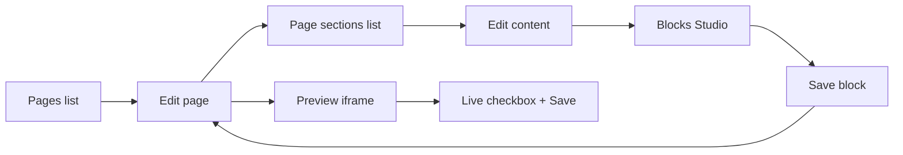

# Site Architect — User Journey & UX Architecture Autopsy

**Date:** 2026-06-03  
**Perspective:** “Can a normal user understand and use this backend?”  
**Evidence:** `SITE-ARCHITECT-UX-FORENSIC-AUTOPSY.md`, `SITE-ARCHITECT-SIMPLIFICATION-REPORT.md`, `PLATFORM-COMPLETION-STATUS.md`, live navigation (`SiteArchitectNavigation`), Pages/Blocks Studio workflows, role gates (`DeploymentEnginePolicy`, `module:site_architect`)  
**Constraints:** No feature loss, no route/DB/render changes, no Operations/Services redesign  

---

## Executive summary

Site Architect is **enterprise-capable** but historically **developer-shaped**. After the simplification pass (Content / Blocks / Deploy / Advanced, renamed Blocks Studio & Templates), a **content editor can publish** if they stay on **Pages → Blocks Studio**. They still **trip** on raw `{{block:slug}}` tokens, the **Add section** modal (code), and **three block-related tabs** that sound interchangeable.

**Target mental model:** WordPress-simple daily path, enterprise power behind admin tabs.

**Verdict on page-centric loop:** **Partially achievable today** with guidance; **not fully intuitive** without the new compose journey banner and copy (implemented as SAFE UX).

---

# PHASE 1 — User journey forensic autopsy

## Role 1: First-time Admin

| Dimension | Finding |
|-----------|---------|
| **Expects** | Dashboard → “Edit website” → pages list → click Home → change text → preview → publish |
| **Sees** | Sidebar “Site Architect” → lands on **Pages** table; four tab groups; gold admin chrome |
| **Confuses** | Blocks Factory vs Blocks Studio vs Templates; “Live” vs preview; slug vs title; SEO/Schema tabs on same form |
| **Redundant** | Inline block code modal vs Factory vs Studio; Deploy shortcuts on blueprint (admin) |
| **Hidden** | Global Content (Settings), theme (Appearance), Blueprint/Packages (tabs hidden but URLs work for manager) |
| **Unclear** | What a “block slug” is; when to use modules |

## Role 2: Content Editor

| Dimension | Finding |
|-----------|---------|
| **Expects** | Edit Home hero headline and Near You text without code |
| **Sees** | Pages → Edit → long form (Basic, Page sections, SEO, FAQs, GEO, Schema) |
| **Confuses** | `{{block:hero-home}}` lines; “Add existing block” vs creating new block; Studio redirect errors on managed blocks |
| **Redundant** | Templates tab (optional for daily work) |
| **Hidden** | Deploy / Advanced (good); Factory still visible and tempting |
| **Unclear** | Whether changing block order requires code |

**Happy path (after SAFE UX):** Pages → Edit Home → **Edit content** on `hero-home` / `near-you-home` → Save → Live on.

## Role 3: Marketing User

| Dimension | Finding |
|-----------|---------|
| **Expects** | Campaign landing page, fast copy tests, preview link |
| **Sees** | Same as editor + Growth/SEO hints on page form |
| **Confuses** | Hijack strategies, readability panels mixed with publish controls |
| **Redundant** | Blogs tab if unused |
| **Hidden** | Service insert tokens (ties to Operations mentally) |
| **Unclear** | Pincode GEO section vs Locations page |

## Role 4: Power User

| Dimension | Finding |
|-----------|---------|
| **Expects** | Bulk operations, presets, packages, blueprint regen |
| **Sees** | Templates, Factory, optional Deploy (if admin), workspace search |
| **Confuses** | Templates vs theme Appearance presets |
| **Redundant** | Duplicate preview (iframe + new tab) — actually helpful |
| **Hidden** | Legacy Sections (admin Advanced) |
| **Unclear** | Section tokens vs block tokens on old pages |

## Role 5: Developer

| Dimension | Finding |
|-----------|---------|
| **Expects** | Git blocks, `blocks:sync`, Factory, modules, packages |
| **Sees** | Full surface; code modals; schema config in PHP |
| **Confuses** | Managed flag blocking inline edit |
| **Redundant** | Compose journey banner (can ignore) |
| **Hidden** | Nothing critical |
| **Unclear** | N/A — system matches expectations |

---

# PHASE 2 — Mental model analysis

## Mismatch matrix

| Surface | System thinks it is | User thinks it is | Naming OK? | Workflow intuitive? |
|---------|---------------------|-------------------|------------|---------------------|
| **Pages** | Token composer for `pages.content` | WordPress Pages | ✅ | ⚠️ Tokens visible |
| **Blocks Studio** | `settings_json` editor | “Edit section text” | ✅ | ✅ From Pages; ⚠️ cold entry |
| **Blocks Factory** | Block registry + Blade | Another editor | ❌ | ❌ Marketing users open by mistake |
| **Templates** | `block_presets` styles | Page templates | ✅ | ⚠️ Optional |
| **Modules** | Dynamic CMS types | Plugins | ❌ | ✅ Hidden from editors |
| **Blueprint Builder** | Bulk site generator | Setup wizard | ✅ | ✅ Admin-only tab |
| **Packages** | Import/export bundles | Backup ZIP | ⚠️ | ✅ Admin-only |
| **Legacy Sections** | `{{section:}}` groups | Old sections | ✅ | ✅ Behind Advanced + badge |

---

# PHASE 3 — Page-centric UX analysis

## Ideal journey

```
Create Page → Add Block → Edit Block → Preview → Publish
```

## Can a normal user do this **without** understanding schemas, factories, presets, legacy sections, packages?

| Step | Possible today? | Friction points |
|------|-----------------|-----------------|
| **Create Page** | ✅ | Slug jargon; layout mode “canvas” unexplained |
| **Add Block** | ⚠️ | Must know slug (`hero-home`) or open modal with **code**; no searchable picker (MEDIUM fix) |
| **Edit Block** | ✅ if managed | Modal pushes code; must discover **Edit content** / Blocks Studio |
| **Preview** | ✅ | Must save once; iframe vs “Open full preview” |
| **Publish** | ✅ | “Live” checkbox non-obvious vs WordPress “Publish” |

### Documented friction (pre–SAFE UX)

1. Raw tokens in “Page sections” list  
2. “Add block” opened developer modal  
3. “Studio” label too terse  
4. No top-of-module journey strip  
5. Blocks Factory visible to editors with no “developers only” banner  
6. Templates sound required  
7. Three block tabs without group hint copy  
8. Near You / managed blocks invisible if slug missing from DB (ops issue, not UX)  

### After SAFE UX (this pass)

- Compose journey strip on Pages + Blocks workspaces  
- Tab group hints under Content / Blocks / Deploy / Advanced  
- Renamed actions: **Add existing block**, **Edit content**, **Page sections**  
- Factory banner: “For developers”  
- Studio copy: plain language, no `settings_json` in primary sentence  
- Empty states on Pages list  

**Remaining friction (needs MEDIUM+):** block slug picker on Pages; merge Templates into Studio panel; hide Factory from editor role tab (visibility only — already considered HIGH if policy-linked).

---

# PHASE 4 — Simplified UX design (existing architecture)

## Navigation (implemented)

```
CONTENT          → start here
├ Pages          → compose + publish
├ Blogs          → same model, optional
├ Navigation     → header/footer menus
└ Media          → uploads for Studio

BLOCKS
├ Blocks Studio  → edit copy & images (daily)
├ Blocks Factory → developers only
└ Templates      → optional styles

DEPLOY (admin)   → blueprint + packages
ADVANCED (admin) → modules + legacy sections
```

## User flow — recommended daily path



## Current UX → Recommended UX

| Area | Before | After (design + SAFE impl.) |
|------|--------|-----------------------------|
| Module welcome | “Structure-only content…” | “Build pages under Content → Pages” |
| Block tabs | Four peers | Studio primary; Factory labeled dev-only |
| Page sections | “Blocks & modules (structure)” | “Page sections” + plain hints |
| Add block | “Add block” + code modal | “Add existing block” + dev code labeled optional |
| Edit | “Studio” | “Edit content” + Blocks Studio link |
| Deploy hub | MarkOnMinds engine on 5 screens | Deploy shortcuts on 2 admin screens only |
| Legacy | In Blocks group | Advanced + Legacy badge |

---

# PHASE 5 — Implementation candidates

| Recommendation | Class | Status |
|----------------|-------|--------|
| Rename labels (Studio, Factory, Templates) | SAFE | ✅ Done (simplification) |
| Role-hide Deploy/Advanced tabs | SAFE | ✅ Done |
| Compose journey banner | SAFE | ✅ Implemented |
| Tab group hint lines | SAFE | ✅ Implemented |
| Page sections copy + Edit content | SAFE | ✅ Implemented |
| Factory “developers only” banner | SAFE | ✅ Implemented |
| Empty states (Pages list) | SAFE | ✅ Implemented |
| Block slug dropdown on Pages | MEDIUM | Not done |
| Hide Factory tab for editor role | MEDIUM | Not done (manager still sees) |
| Templates panel inside Studio | MEDIUM | Not done |
| Merge Blogs into Pages sub-tab | MEDIUM | Not done |
| Navigation as Pages sub-tab | MEDIUM | Not done |
| Remove code modal from Pages | HIGH | Not done |
| Parser / route / DB changes | HIGH | Not done |

---

# PHASE 6 — SAFE improvements implemented

See **`SITE-ARCHITECT-UX-IMPROVEMENTS.md`** for file list and verification.

---

## Final goal scorecard

| Criterion | Score | Notes |
|-----------|-------|-------|
| Understand without Factory | ⚠️→✅ | Banner + journey say to avoid |
| Understand without schemas | ⚠️→✅ | Studio shows form fields, not schema file |
| Understand without Templates | ✅ | Marked optional |
| Understand without Legacy | ✅ | Hidden from editors |
| Understand without Deploy | ✅ | Tabs hidden |
| WordPress-simple path | ⚠️→✅ | With journey strip |
| Enterprise power preserved | ✅ | All routes/features intact |

---

*UX audit complete. MEDIUM items logged for a future sprint without blocking daily Medca editing.*
