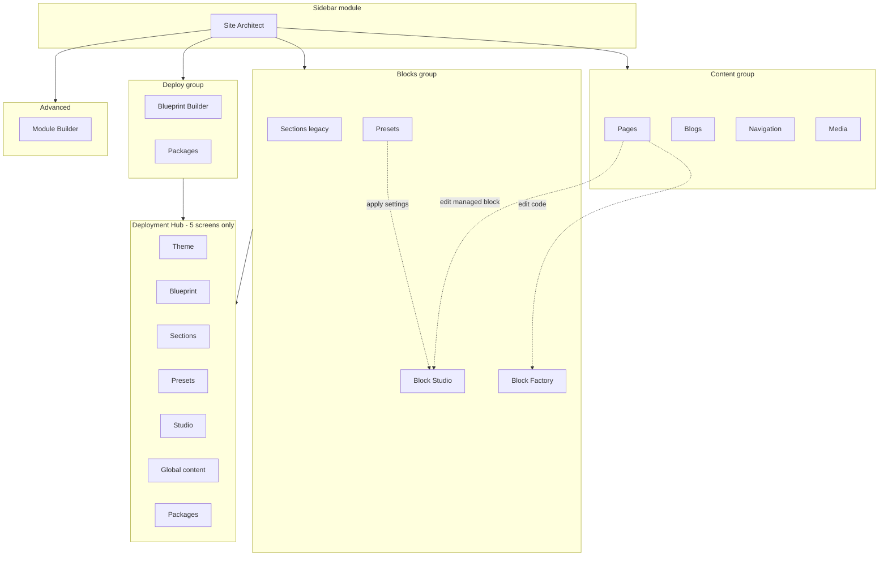
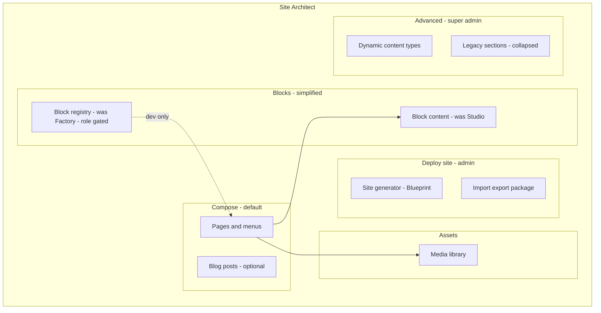

# Site Architect — UX Architecture Forensic Autopsy

**Project:** Medca Health Care (MarkOnMinds platform)  
**Date:** 2026-06-03  
**Scope:** Site Architect backend only — information architecture, navigation, workflows, discoverability, duplication, complexity  
**Out of scope:** Business features (Services, SEO, Growth, Marketing campaigns), public frontend UX  
**Method:** Read-only code and config audit — **no routes, UI, DB, or code modified**

---

## Executive summary

Site Architect is a **single sidebar module** (`site_architect`) with **four tab groups** (Content, Blocks, Deploy, Advanced) exposing **12 primary workspaces** plus **2 URL aliases**, a **secondary Deployment Hub** on five deploy-related screens, and **three competing block-editing surfaces** (Pages inline modal, Block Factory, Block Studio). Production Medca usage is concentrated in **Pages**, **Navigation**, **Block Studio**, and **Media**; **Section Library** is deprecated and empty; **Blueprint Builder / Packages** are bootstrap/admin tools; **Module Builder** serves dynamic CMS modules (not the public careers Livewire registry).

**Primary UX debt:** Same capability (block appearance/copy) split across Presets, Studio, and Factory; page composition still exposes legacy `{{section:}}` and inline code editing; Deploy tools use platform branding (“MarkOnMinds Deployment Engine”) and duplicate navigation; role gates are inconsistent (module vs `DeploymentEnginePolicy`).

**Goal alignment:** 100% functionality can be preserved while **hiding**, **renaming**, and **merging navigation** — not removing backend systems.

---

## 1. Current information architecture

### 1.1 Sidebar (module level)

| Order | Label | Module key | Default route | Roles (middleware) |
|------:|-------|------------|---------------|---------------------|
| — | Site Architect | `site_architect` | `site-architect.pages.index` | `editor`, `manager`, `admin`, `super_admin` |

**Source:** `app/ModuleAccess.php`, `routes/web.php` (`module:site_architect`).

There is **no nested sidebar** under Site Architect — all sub-features are reached via in-module tabs only.

### 1.2 In-module navigation (`primary-tabs.blade.php`)

| Group | Item | Route name | Alias redirect |
|-------|------|------------|----------------|
| **Content** | Pages | `site-architect.pages.index` | — |
| | Blogs | `site-architect.blogs.index` | — |
| | Navigation | `site-architect.navigation.index` | — |
| | Media | `site-architect.media.index` | — |
| **Blocks** | Sections (legacy) | `site-architect.sections.index` | → `section-library` |
| | Presets | `site-architect.presets.index` | → `block-presets` |
| | Block Studio | `site-architect.block-studio.index` | — |
| | Block Factory | `site-architect.block-factory.index` | — |
| **Deploy** | Blueprint Builder | `site-architect.blueprint-builder.index` | — |
| | Packages | `site-architect.deployment-packages.index` | — |
| **Advanced** | Module Builder | `site-architect.modules.index` | — |

### 1.3 Secondary navigation (Deployment Hub)

Shown only on: Blueprint Builder, Section Library, Block Presets, Block Studio, Deployment Packages shells.

**Steps (duplicate links):** Theme & header → Blueprint → Sections → Presets → Block studio → Global content → Packages.

**Source:** `resources/views/site-architect/partials/deployment-hub.blade.php`.

**Not shown on:** Pages, Blogs, Navigation, Media, Block Factory — creates **two mental maps** for the same features.

### 1.4 Hidden / indirect entry points

| Entry | Where | Audience |
|-------|--------|----------|
| `modules.site-architect` | Redirect to Pages | Bookmark |
| Pages/Blogs preview routes | `site-architect.pages.preview`, `blogs.preview` | Composer QA |
| `?block=` query | Block Studio deep link from Pages/Blogs | Editors |
| Workspace global search | `WorkspaceGlobalSearch` | Power users |
| Operations → “open detail page in Site Architect” | `ServiceController` | Ops + architect |
| Public header “Live Edit” (super_admin) | `admin.site-architect.live-edit.toggle` | Dev-only (if route registered) |
| Settings (outside module) | Theme, Global content | Cross-module |

---

## 2. Feature-by-feature forensic record

### CONTENT

#### Pages

| Dimension | Detail |
|-----------|--------|
| **1. Original purpose** | CMS for marketing/static pages: slug, tokens, SEO, layout mode, publish. |
| **2. Current purpose** | **Primary composition surface** — `pages.content` with `{{block:}}`, `{{module:}}`, legacy `{{section:}}`; production preview iframe; pincode GEO on page (hyper-local); SEO/FAQ/schema tabs. |
| **3. Production usage** | **Critical** — Home, About, Services, Locations, Contact, Careers hub, service detail pages (`service-{code}`). |
| **4. Dependencies** | `ContentParser`, `PageRenderContextRegistrar`, `Block`, `PagePolicy`, optional `SiteNavigationItem`, Growth `PageObserver` (SEO autofill). |
| **5. Database** | `pages`, `page_faqs`, pivot tables for pins if used. |
| **6. Routes** | `site-architect.pages.index`, `site-architect.pages.preview`. |
| **7. Rendering** | Public: `CmsPageController` + `layouts.app` + `ContentParser::parse`. Preview: `PagePublicPreviewService`. |
| **8. Merge?** | No — canonical composer. |
| **9. Rename?** | Optional: “Page composer” or “Pages & layouts”. |
| **10. Hide?** | No. |
| **11. Deprecate?** | No. |
| **12. Must remain visible?** | **Yes** — default landing (`/site-architect` → Pages). |

**Workflow complexity:** Inline block modal (code/CSS) **duplicates** Block Factory; “Studio” button redirects for `is_managed` / schema blocks; service/module insert controls overlap Operations catalog.

---

#### Blogs

| Dimension | Detail |
|-----------|--------|
| **1. Original purpose** | Article CMS parallel to Pages. |
| **2. Current purpose** | Same composition model as Pages (parts list, block modal, preview iframe, Studio redirect). |
| **3. Production usage** | **Low** on Medca launch surface (no seeded blog posts in launch seeder); capability ready. |
| **4. Dependencies** | `Blog` model, `ContentParser`, `BlogPolicy` (via module). |
| **5. Database** | `blogs`. |
| **6. Routes** | `site-architect.blogs.index`, `site-architect.blogs.preview`, public `blog.public`. |
| **7. Rendering** | `layouts.app` + parser on blog content. |
| **8. Merge?** | **Candidate** — UI merge with Pages as “Content → Pages | Blog posts” tabs (backend stays separate tables). |
| **9. Rename?** | “Blog posts” clearer than “Blogs”. |
| **10. Hide?** | Optional for Medca-only editors until needed. |
| **11. Deprecate?** | No. |
| **12. Must remain visible?** | Yes if blogging is a roadmap item; else hide behind role flag. |

---

#### Navigation

| Dimension | Detail |
|-----------|--------|
| **1. Original purpose** | Header/footer menu builder tied to `Page` records. |
| **2. Current purpose** | Drag-order `site_navigation_items` (zones: header/footer), custom labels, pool of active pages. |
| **3. Production usage** | **Critical** — Medca header nav (Home, About, Services, Locations, Careers, Contact). |
| **4. Dependencies** | `Page`, `SiteNavigationItem`, theme header partial. |
| **5. Database** | `site_navigation_items`. |
| **6. Routes** | `site-architect.navigation.index`. |
| **7. Rendering** | `global/header.blade.php`, `public_pages.default_header_nav` fallback. |
| **8. Merge?** | Could be a **tab inside Pages** (“Menus”) — same data model. |
| **9. Rename?** | “Menus” or “Header & footer links”. |
| **10. Hide?** | No. |
| **11. Deprecate?** | No. |
| **12. Must remain visible?** | **Yes**. |

---

#### Media

| Dimension | Detail |
|-----------|--------|
| **1. Original purpose** | Asset library for uploads reused in blocks/theme. |
| **2. Current purpose** | Upload, search, filter, edit title/alt/description; feeds Block Studio media slots indirectly. |
| **3. Production usage** | **Medium** — launch placeholders; real brand assets expected via Operations or here. |
| **4. Dependencies** | `Media` model, `MediaPolicy`, `MediaUploadProcessor`. |
| **5. Database** | `media`. |
| **6. Routes** | `site-architect.media.index`. |
| **7. Rendering** | URLs via storage; referenced in `blocks.settings_json.media` and theme. |
| **8. Merge?** | **Candidate** — sub-panel inside Block Studio (“Media library” tab). |
| **9. Rename?** | “Media library” (already close). |
| **10. Hide?** | No for editors who upload. |
| **11. Deprecate?** | No. |
| **12. Must remain visible?** | **Yes** (or merged into Studio). |

---

### BLOCKS

#### Sections (Legacy) — Section Library

| Dimension | Detail |
|-----------|--------|
| **1. Original purpose** | Reusable **multi-block groups** inserted as `{{section:slug}}`. |
| **2. Current purpose** | Deprecated admin; parser **still expands** sections; create blocked when `section_library_deprecated`. |
| **3. Production usage** | **None** — `platform_composition.section_library_deprecation_note`: no items in production. |
| **4. Dependencies** | `SectionLibraryRepository`, `section_library_items`, `ContentParser` section branch. |
| **5. Database** | `section_library_items`. |
| **6. Routes** | `site-architect.section-library.index`, alias `sections.index`. |
| **7. Rendering** | `ContentParser::renderSection` → nested blocks. |
| **8. Merge?** | **Yes** — into Pages as “Save selection as section” (future) or remove UI only. |
| **9. Rename?** | Already “Sections (legacy)”. |
| **10. Hide?** | **Yes** — recommended default. |
| **11. Deprecate?** | **Yes (UI)** — already flagged in config. |
| **12. Must remain visible?** | **No** for Medca editors; **Yes** for migration operators (export/import JSON). |

---

#### Presets — Block Presets

| Dimension | Detail |
|-----------|--------|
| **1. Original purpose** | Saved `settings_json` templates (style/media/section) applied to target blocks. |
| **2. Current purpose** | CRUD presets, apply/clone/import/export; overlaps Block Studio (same `settings_json` on `blocks`). |
| **3. Production usage** | **Low** post-launch — style packs applied at blueprint/bootstrap; daily copy edits use Block Studio. |
| **4. Dependencies** | `block_presets`, `BlockPresetRepository`, `DeploymentEnginePolicy::manageBlockPresets`. |
| **5. Database** | `block_presets`. |
| **6. Routes** | `block-presets.index`, alias `presets.index`. |
| **7. Rendering** | Indirect — mutates `blocks.settings_json`. |
| **8. Merge?** | **Strong candidate** — “Preset library” panel inside Block Studio or Blueprint deploy flow. |
| **9. Rename?** | “Block style presets” (disambiguate from theme presets). |
| **10. Hide?** | From **editor** role; keep for admin. |
| **11. Deprecate?** | UI only; keep export/import for packages. |
| **12. Must remain visible?** | **Admin/deploy only**. |

---

#### Block Studio

| Dimension | Detail |
|-----------|--------|
| **1. Original purpose** | Deployment Engine UI for block `settings_json` (content, media, section, style variant). |
| **2. Current purpose** | **Primary marketing copy editor** for hero/CTA (`block_content_schemas`); deep link `?block=`; panels: Content, Media, Section, Style. |
| **3. Production usage** | **Critical** for Medca — 14+ marketing blocks + catalog schemas; Pages/Blogs redirect here for managed/schema blocks. |
| **4. Dependencies** | `Block`, `BlockSettingsEditor`, `BlockContent`, `config/block_content_schemas.php`, Global Content (phone only). |
| **5. Database** | `blocks.settings_json`, `blocks.is_managed`. |
| **6. Routes** | `site-architect.block-studio.index`. |
| **7. Rendering** | Blade views under `resources/views/blocks/**` via `@include` on managed blocks. |
| **8. Merge?** | Partial — absorb Presets “apply”; do not merge Factory code editing. |
| **9. Rename?** | “Block content” or “Edit block content” (less jargon). |
| **10. Hide?** | No. |
| **11. Deprecate?** | No. |
| **12. Must remain visible?** | **Yes** — top-3 editor tool. |

---

#### Block Factory

| Dimension | Detail |
|-----------|--------|
| **1. Original purpose** | Developer registry of blocks: slug, Blade/code, custom CSS, schema JSON, active flag. |
| **2. Current purpose** | List/create blocks; **managed blocks** readonly code (synced templates); service/module token inserter; preview via `ContentParser`. |
| **3. Production usage** | **Medium** — template sync (`blocks:sync`), new custom blocks rare; editors should not live here daily. |
| **4. Dependencies** | `Block`, `BlockPolicy`, `BlockTemplateSyncService`, `ContentParser`, catalogs for service/module tokens. |
| **5. Database** | `blocks` (code, custom_css, schema_json, is_managed, is_active). |
| **6. Routes** | `site-architect.block-factory.index`. |
| **7. Rendering** | All `{{block:slug}}` resolution. |
| **8. Merge?** | **No full merge** — split “Block registry (dev)” from Studio; optional link-only from Studio admin panel. |
| **9. Rename?** | “Block registry” or “Blocks (advanced)” |
| **10. Hide?** | From **editor**; show **manager+** or `admin`. |
| **11. Deprecate?** | No — required for custom blocks and sync. |
| **12. Must remain visible?** | **Yes for technical roles**; hidden for marketing editors. |

---

### DEPLOY

#### Blueprint Builder

| Dimension | Detail |
|-----------|--------|
| **1. Original purpose** | Industry pack → bulk-generate pages/blocks from `config/blueprint_packs.php`. |
| **2. Current purpose** | Select industry/blueprint/style pack/theme → generate pages; optional activate; logs to `deployment_generations`. |
| **3. Production usage** | **Bootstrap** — Medca launch uses targeted seeders; full healthcare pack is **not** re-run daily. |
| **4. Dependencies** | `BlueprintPageGenerator`, `BlueprintRegistry`, `StylePackRegistry`, `ThemePresetRegistry`, `Page`, `Block`. |
| **5. Database** | `deployment_generations`, writes `pages`, `blocks`, `theme_configurations`. |
| **6. Routes** | `site-architect.blueprint-builder.index`. |
| **7. Rendering** | Same as Pages after generation. |
| **8. Merge?** | **Candidate** — single “Deploy site” wizard with Packages step 1/2/3. |
| **9. Rename?** | “Site generator” or “Industry site pack” |
| **10. Hide?** | Default hidden for `editor`; `manager+` per `generator_roles`. |
| **11. Deprecate?** | No. |
| **12. Must remain visible?** | **Admin/manager** only. |

---

#### Packages — Deployment Packages

| Dimension | Detail |
|-----------|--------|
| **1. Original purpose** | Export/import manifests: blueprints + sections + presets + style pack. |
| **2. Current purpose** | Validate JSON, export package, import package; ties Section Library + Presets slugs. |
| **3. Production usage** | **Very low** — agency/multi-tenant migration tool. |
| **4. Dependencies** | `deployment_packages`, `DeploymentPackageExporter/Importer/Validator`, SectionLibrary, BlockPreset. |
| **5. Database** | `deployment_packages`. |
| **6. Routes** | `site-architect.deployment-packages.index`. |
| **7. Rendering** | None direct. |
| **8. Merge?** | With Blueprint Builder under **Deploy** hub. |
| **9. Rename?** | “Site package import/export” |
| **10. Hide?** | **Yes** for `editor`/`manager` without package role. |
| **11. Deprecate?** | No for platform product. |
| **12. Must remain visible?** | **`admin`/`super_admin` only** (`package_roles`). |

---

### ADVANCED

#### Module Builder

| Dimension | Detail |
|-----------|--------|
| **1. Original purpose** | Dynamic CRUD modules (JSON field builder) + records — separate from `config/modules.php` Livewire map. |
| **2. Current purpose** | Create/edit `modules` table definitions; CRUD `records` per module; **not** where `job-portal` Livewire is registered. |
| **3. Production usage** | **Low on Medca** — careers use Blade blocks + `config/modules.php` (`job-portal`), not dynamic module records. |
| **4. Dependencies** | `Module` model, `ModuleManagerController`, `DynamicRecordController`, `ModulePolicy`. |
| **5. Database** | `modules`, dynamic record tables per module. |
| **6. Routes** | `site-architect.modules.*` (index/create/edit/records/*). |
| **7. Rendering** | `{{module:key}}` in parser → Livewire from `config/modules.php` only. |
| **8. Merge?** | No — but rename to avoid confusion with “service modules” or “Livewire modules”. |
| **9. Rename?** | **“Dynamic content types”** or “Custom data modules” |
| **10. Hide?** | Yes for standard Medca marketing editors. |
| **11. Deprecate?** | No — platform capability. |
| **12. Must remain visible?** | **Super_admin / integrator** only. |

---

## 3. Master matrix

| Feature | Purpose (current) | Used in Medca prod? | Critical? | Visible today? | Merge candidate? | Replacement / canonical |
|---------|-------------------|---------------------|-----------|----------------|------------------|-------------------------|
| Pages | Page composition + SEO | Yes | **Yes** | Yes | No | — |
| Blogs | Blog composition | Rare/none | Medium | Yes | UI merge with Pages | — |
| Navigation | Header/footer menus | Yes | **Yes** | Yes | Tab under Pages optional | — |
| Media | Asset library | Growing | High | Yes | Into Block Studio optional | — |
| Sections (legacy) | `{{section:}}` groups | **No** | Low (parser) | Yes (legacy label) | **Hide UI** | `{{block:}}` on Pages |
| Presets | Block settings templates | Bootstrap/low | Medium | Yes | **Block Studio** | Block Studio + style variant |
| Block Studio | Copy/media/section/style | Yes | **Yes** | Yes | Absorb Presets UI | — |
| Block Factory | Code registry / sync | Occasional | High (system) | Yes | No (gate by role) | Studio for copy only |
| Blueprint Builder | Bulk site generation | Bootstrap | Medium | Yes | Deploy wizard | `medca:launch-seed` / seeders |
| Packages | Import/export manifests | Rare | Low | Yes | Deploy wizard | — |
| Module Builder | Dynamic DB modules | **No** | Low | Yes (Advanced) | No | `config/modules.php` + blocks |

---

## 4. Duplicate concepts & confusing terminology

### 4.1 Duplicate concepts

| Concept A | Concept B | Relationship |
|-----------|-----------|--------------|
| Page `content` tokens | Section Library | Sections = macro of blocks; deprecated |
| Block Presets | Block Studio | Both write `blocks.settings_json` |
| Block Factory | Pages block modal | Both edit `blocks.code` for unmanaged blocks |
| Blueprint Builder | MedcaLaunchSeeder / Pages manual | Both create pages |
| Deployment Package | Blueprint pack config | Package bundles presets + sections + blueprints |
| Module Builder (`modules` table) | `config/modules.php` Livewire | **Different systems** — same word “module” |
| “Elements” (70 templates) | Block Factory / `blocks:sync` | Elements = filesystem views; **no admin nav** (`elements_admin_exposure: implementation_detail_only`) |
| Theme preset (Settings) | Style pack (Deploy) | Both affect `.medca-block--style_*` |
| Global content (Settings) | Block Studio content | Phone/brand global; hero copy per block |

### 4.2 Duplicate workflows

1. **Edit block copy:** Pages → Studio redirect vs Block Studio picker vs (wrongly) Factory.  
2. **Edit block code:** Pages modal vs Block Factory form.  
3. **Apply visual style:** Presets “Apply to block” vs Block Studio “Style variant” panel.  
4. **Generate site:** Blueprint Builder vs running seeders / launch command.  
5. **Navigate deploy tools:** Primary tabs “Deploy” vs Deployment Hub strip (5 screens).  
6. **Preview:** Pages/Blogs iframe vs Block Factory/Studio inline preview vs Operations service preview.

### 4.3 Duplicate menus

- `site-architect.sections` vs `section-library` (alias pair).  
- `site-architect.presets` vs `block-presets` (alias pair).  
- Deploy group tabs vs Deployment Hub links (Blueprint, Sections, Presets, Studio, Packages).  
- Workspace search duplicates tab labels without group context.

### 4.4 Legacy concepts (still in runtime)

| Legacy | Status |
|--------|--------|
| `{{section:slug}}` | Parser supported; UI discouraged |
| Section Library admin | Deprecated banner; export/import remains |
| Pages inline HTML/Blade editor for managed blocks | Guarded; redirects to Studio |
| `{{module:careers-listing}}` | Alias to `job-portal` in config |
| “MarkOnMinds Deployment Engine” hub title | White-label mismatch for Medca |

### 4.5 Tooling by audience

| Audience | Tools they need | Tools they see today |
|----------|-----------------|----------------------|
| **Marketing editor** | Pages, Navigation, Block Studio, Media | Also Factory, Presets, Sections, Deploy, Module Builder |
| **Admin / manager** | Above + Blueprint (once), Global content (Settings) | + Packages, Deployment hub |
| **Developer** | Factory, `blocks:sync`, Module Builder, Packages | Same module tab strip |
| **Hidden** | Global search, Live Edit toggle, `?block=` deep links | Not documented in UI |

---

## 5. User workflow maps (simplified)

### 5.1 Medca marketing editor (intended)

```
Site Architect → Pages → pick page → reorder {{block:}} / {{module:}}
                → Preview iframe
                → Edit block → Block Studio (content)
Settings → Global content (phone, WhatsApp)
Site Architect → Navigation → order header/footer
Site Architect → Media → upload assets
```

### 5.2 Actual platform-imposed paths

```
Pages → Edit block → [managed/schema?] → Block Studio
                    → [else] → Inline code modal (Factory duplicate)
Blocks tab → Factory | Studio | Presets | Sections (4 choices, unclear)
Deploy tab → Blueprint | Packages (no link to Pages after generate)
Deployment Hub → duplicates 6 destinations on subset of pages
```

---

## 6. Architecture diagrams

### A. Current UX architecture



### B. Recommended UX architecture



### C. Migration path (navigation only — no feature removal)

| Phase | Action | Risk |
|-------|--------|------|
| **1** | Rename tabs (copy only) | Low |
| **2** | Hide Sections (legacy), Module Builder, Packages from `editor` via policy-driven tab filter | Low |
| **3** | Collapse Presets into Block Studio as “Saved styles” section | Medium — training |
| **4** | Remove Deployment Hub OR mirror it on all Block/Deploy pages consistently | Low |
| **5** | Pages: remove inline code modal for all blocks → always route to Studio (copy) or Factory (code, admin) | Medium |
| **6** | Optional: Blogs as sub-tab under Compose | Low |
| **7** | Rebrand hub “Medca site setup” + link to Settings once | Low |

### D. Risk analysis

| Change | Functional risk | Mitigation |
|--------|-----------------|------------|
| Hide Section Library UI | Low — parser remains | Document `{{section:}}` in runbook |
| Hide Module Builder | Low for Medca | Keep route for super_admin |
| Hide Packages / Blueprint from editors | Low | Role-based tab component |
| Merge Presets UI into Studio | Low — same DB | Keep API/export paths |
| Remove Pages code modal | Medium — power users | Keep Factory for `admin` |
| Rename only | None | — |

---

## 7. Per-item decision checklist (summary)

| Item | Merge? | Rename? | Hide? | Deprecate UI? | Must visible? |
|------|--------|---------|-------|---------------|---------------|
| Pages | No | Optional | No | No | **Yes** |
| Blogs | UI only | Yes | Optional | No | Role-based |
| Navigation | Optional tab | Yes | No | No | **Yes** |
| Media | Optional | Minor | No | No | **Yes** |
| Sections | Into Pages future | Done | **Yes** | **Yes** | Admin only |
| Presets | **Yes → Studio** | Yes | Editors | Partial | Admin |
| Block Studio | No | **Yes** | No | No | **Yes** |
| Block Factory | No | **Yes** | Editors | No | Technical |
| Blueprint | Wizard | Yes | Editors | No | Manager+ |
| Packages | Wizard | Yes | **Yes** | No | Admin |
| Module Builder | No | **Yes** | **Yes** | No | Super admin |

---

## 8. Recommended simplified backend

### 8.1 Menu structure (proposed)

**Default entry:** `Site Architect → Compose → Pages` (unchanged route: `site-architect.pages.index`).

| Group | Label | Items | Roles |
|-------|-------|-------|-------|
| **Compose** | Compose | **Pages**, **Menus** (was Navigation), **Blog posts** (optional) | `editor+` |
| **Blocks** | Blocks | **Block content** (was Block Studio), **Block registry** (was Block Factory) | content: `editor+`; registry: `manager+` |
| **Assets** | Assets | **Media library** | `editor+` |
| **Deploy** | Deploy site | **Site generator** (Blueprint), **Import / export** (Packages) | `manager+` / `admin` |
| **Advanced** | Advanced | **Dynamic content types** (Module Builder), **Legacy sections** (collapsed link) | `admin+` |

**Remove from primary nav (keep routes):**

- Separate “Presets” top-level tab → inside Block content.  
- “Sections (legacy)” top-level → Advanced → Legacy.  
- Deployment Hub strip → replace with one-line contextual links on Deploy pages only, or remove entirely.

### 8.2 Naming changes

| Current | Recommended |
|---------|-------------|
| Site Architect | **Site** or **Website** (sidebar module label) |
| Block Studio | **Block content** |
| Block Factory | **Block registry** |
| Presets | **Saved block styles** (sub-panel) |
| Sections (legacy) | **Legacy section groups** |
| Blueprint Builder | **Site generator** |
| Packages | **Site package (import/export)** |
| Module Builder | **Dynamic content types** |
| MarkOnMinds Deployment Engine | **Medca site setup** (or white-label from config) |

### 8.3 Visibility changes

| Surface | Editor | Manager | Admin |
|---------|--------|---------|-------|
| Compose (Pages, Menus, Media) | ✓ | ✓ | ✓ |
| Block content | ✓ | ✓ | ✓ |
| Blog posts | Optional off | ✓ | ✓ |
| Block registry | — | ✓ | ✓ |
| Deploy generator | — | ✓ | ✓ |
| Import/export package | — | — | ✓ |
| Dynamic content types | — | — | ✓ |
| Legacy sections | — | — | ✓ |

Implementation note (future): tab visibility can mirror `DeploymentEnginePolicy` + `role` without removing routes (audit-compliant).

### 8.4 Merge opportunities (zero feature loss)

1. **Presets → Block content** — same `settings_json`; keep `BlockPresetRepository` APIs.  
2. **Deployment Hub → Deploy landing page** — single checklist component on Blueprint index only.  
3. **Navigation → Compose sub-tab** — same Livewire component, embedded route optional.  
4. **Media → Block content “Assets” tab** — optional; keep `site-architect.media.index` route as alias.

### 8.5 Role-based visibility opportunities

| Policy hook | Use |
|-------------|-----|
| `module:site_architect` | Module gate (existing) |
| `DeploymentEnginePolicy::useBlueprintBuilder` | Deploy tab |
| `DeploymentEnginePolicy::managePackages` | Import/export |
| `DeploymentEnginePolicy::manageBlockPresets` | Saved styles section (not separate nav) |
| `role:admin,super_admin` | Block registry, Module Builder, Legacy |
| `PagePolicy` / `BlockPolicy` | Unchanged CRUD |

### 8.6 Discoverability improvements (no new features)

1. **Pages composer:** Persistent CTA “Edit block content” → Studio with current slug (already partially via Studio button).  
2. **First-visit empty state** on Pages listing: link to Menus + Global content (Settings).  
3. **Workspace search:** Prefix results with group (`Compose · Pages`).  
4. **Remove duplicate paths** from search for deprecated sections.  
5. **In-app glossary** tooltip: “Block token” = `{{block:slug}}`.

---

## 9. What must not change (functionality preservation)

| System | Reason |
|--------|--------|
| `ContentParser` token types | Public site depends on block/module/service/section |
| `blocks` table + `is_managed` + template sync | Governance and Medca blades |
| `block_content_schemas` + Studio | Marketing ownership model |
| `site_navigation_items` | Public header |
| `site-architect.pages.preview` | Production-faithful QA |
| Blueprint / Package **backend** | Multi-tenant product capability |
| `section_library_items` table | Legacy content + package export |
| Module Builder CRUD | Dynamic sites / future verticals |
| All existing **route names** (aliases OK) | Bookmarks, tests, ops runbooks |

---

## 10. Evidence references

| Artifact | Path |
|----------|------|
| Tab IA | `resources/views/site-architect/partials/primary-tabs.blade.php` |
| Routes | `routes/web.php` (lines 154–218) |
| Deployment hub | `resources/views/site-architect/partials/deployment-hub.blade.php` |
| Composition policy | `config/platform_composition.php` |
| Deployment roles | `config/deployment_engine.php` |
| Ownership map | `SITE-COMPOSITION-OWNERSHIP-MAP.md` |
| Navigation audit | `docs/navigation-ia-restructure-audit.md` |
| Module access | `app/ModuleAccess.php` |
| Livewire surfaces | `app/Livewire/SiteArchitect/*.php` |
| Global search | `app/Services/WorkspaceGlobalSearch.php` |

---

## 11. Conclusion

Site Architect is **functionally complete** but **navigation-heavy**: twelve peer tabs plus a partial Deployment Hub present four block subsystems where **one composer (Pages) and one content editor (Block Studio)** suffice for Medca daily work. Simplification is **purely IA**: hide legacy and deploy surfaces by role, merge Presets into Studio, rename for non-developers, and eliminate duplicate menus — **without** removing routes, tables, or parser capabilities.

**Recommended priority:** (1) hide Sections + clarify Studio vs Factory, (2) role-gate Deploy and Module Builder, (3) collapse Presets into Studio, (4) unify or remove Deployment Hub, (5) optional Compose grouping for Navigation/Blogs.

---

*Audit only — no code, database, routes, or UI changes performed.*
