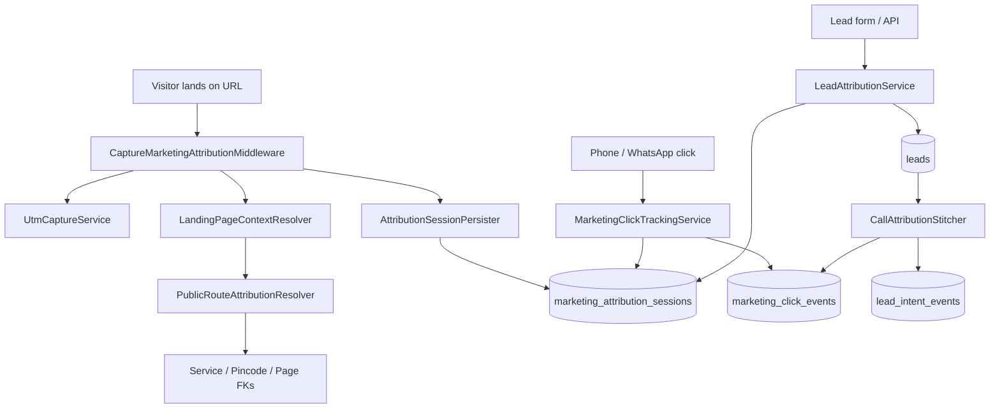
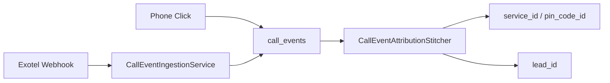

# Marketing Attribution Flow

Additive attribution layer on top of existing Medca marketing automation. Does **not** replace `ServiceMasterOrchestrator`, auto-page generation, or UTM cookie/session capture.

## End-to-end chain



## Components

| Component | Responsibility |
|-----------|----------------|
| `PublicRouteAttributionResolver` | URL → `page_id`, `service_id`, `pin_code_id`, `service_location_page_id` using the same rules as `ServicePublicController` |
| `LandingPageContextResolver` | Request path + visitor pincode → `LandingContext` DTO |
| `AttributionSessionPersister` | Upserts `marketing_attribution_sessions` per Laravel session |
| `MarketingClickTrackingService` | Copies session FKs onto `marketing_click_events` |
| `LeadAttributionService` | Applies UTM + session FKs before lead save |
| `CallAttributionStitcher` | Links recent phone clicks to new leads; backfills intents |
| `AttributionReportingService` | Service / pincode / campaign / landing-page rollups |

## Captured fields

**Session (`marketing_attribution_sessions`):** `landing_page_path`, entity FKs, UTM parameters, `gclid`, `fbclid`, `referrer`, `first_touch_json`, `last_touch_json`, `converted_lead_id`.

**Clicks, intents, leads:** `marketing_attribution_session_id`, `page_id`, `service_id`, `pin_code_id`, `service_location_page_id` (nullable; backward compatible).

## Configuration

`config/marketing_attribution.php`:

- `MARKETING_ATTRIBUTION_SESSIONS_ENABLED` — master switch (default `true`)
- `MARKETING_CLICK_STITCH_WINDOW` — minutes to link phone clicks to leads (default `120`)

## Feature flags

Disable the new layer without affecting legacy UTM capture:

```env
MARKETING_ATTRIBUTION_SESSIONS_ENABLED=false
```

## Phase 3 — Exotel call tracking



**Endpoint:** `POST /api/integrations/exotel/webhook`  
**Security:** `X-Exotel-Signature` HMAC-SHA256 (see `config/exotel.php`)  
**Idempotency:** `idempotency_key` from `CallSid` + `EventType` + `Status` + `DateUpdated`

**Statuses:** `started`, `connected`, `completed`, `missed`, `busy`, `failed`

**V1 constraints:** single primary Exotel number (`call_tracking_numbers.is_primary`); no DNI pool.

```env
EXOTEL_ENABLED=true
EXOTEL_WEBHOOK_HMAC_SECRET=
EXOTEL_PRIMARY_EXOPHONE_SID=
EXOTEL_PRIMARY_PHONE_NUMBER=
```

## Phases 4–5 — Admissions & revenue

**Operations UI:** `/operations/admissions`, `/operations/revenue-events`  
Manual V1 workflow; stitches `lead_id`, `service_id`, `pin_code_id`, `marketing_attribution_session_id`.

## Phases 6–7 — Sitemap queue & pagination

`RegenerateSitemapJob` → `SeoSitemapFileGenerator` → `storage/app/sitemaps/`  
Observers on `Page`, `Blog`, `Service`, `ServiceLocationPage` dispatch regeneration.

Paginated index: `sitemap-static-pages.xml`, `sitemap-services.xml`, `sitemap-locations-NNN.xml` (10k URLs/chunk), `sitemap-categories.xml`, `sitemap-subservices.xml`, `sitemap-blogs.xml`, `sitemap-images.xml`.

```env
SITEMAP_CACHE_ENABLED=true
SITEMAP_QUEUE_ENABLED=true
SITEMAP_PAGINATED_ENABLED=true
SITEMAP_LOCATION_CHUNK_SIZE=10000
```
