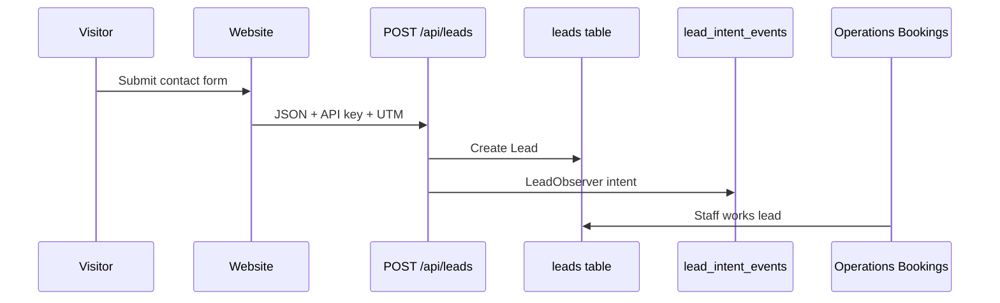
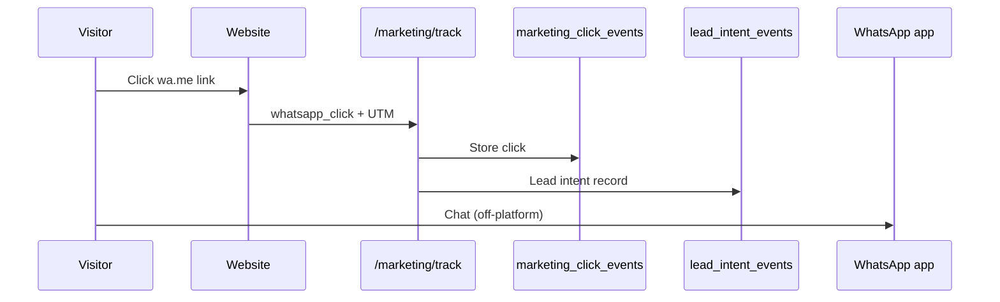
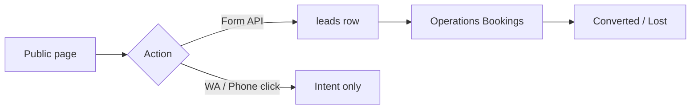
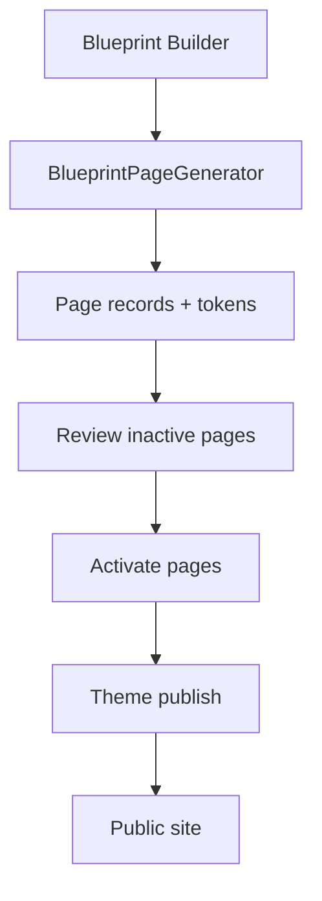
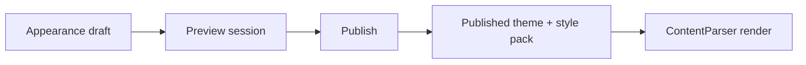

# MarkOnMinds / Medca Health Care — Platform Bible & Forensic Autopsy

**Document type:** Master operator, administrator, marketer, developer, and owner reference  
**Version:** 1.0 (documentation-only synthesis)  
**As-of date:** 2026-05-30  
**Code changes in this sprint:** None — documentation only  

**Test baseline cited:** 385 automated tests passing  

**Prior audit sources (last ~72 hours):**  
`00-executive-summary-production-readiness.md`, navigation IA restructure audit, Phase 1–7 platform docs, Phase 8.5 deployment docs, Phase 11 marketing, security hardening sprint, WhatsApp integration, lead intent sprint, element library sprint, industry blueprint packs, production readiness validation, final production patch.

---

## Table of contents

1. [Executive overview](#section-1--executive-overview)  
2. [Complete information architecture](#section-2--complete-information-architecture)  
3. [Complete feature inventory](#section-3--complete-feature-inventory)  
4. [User roles & permissions](#section-4--user-roles--permissions)  
5. [Website system](#section-5--website-system)  
6. [Deployment engine](#section-6--deployment-engine)  
7. [Element library (70 templates)](#section-7--element-library-70-templates)  
8. [Industry blueprint packs](#section-8--industry-blueprint-packs)  
9. [Operations](#section-9--operations)  
10. [Marketing](#section-10--marketing)  
11. [Growth Center](#section-11--growth-center)  
12. [Lead intelligence engine](#section-12--lead-intelligence-engine)  
13. [Integrations](#section-13--integrations)  
14. [Security](#section-14--security)  
15. [Production infrastructure](#section-15--production-infrastructure)  
16. [Complete workflow maps](#section-16--complete-workflow-maps)  
17. [Production readiness autopsy](#section-17--production-readiness-autopsy)  
18. [Known limitations](#section-18--known-limitations)  
19. [Operator manual](#section-19--operator-manual)  
20. [Final platform assessment](#section-20--final-platform-assessment)  

**Deep-dive companions:** [route-inventory.md](route-inventory.md) · [feature-inventory.md](feature-inventory.md) · [module-permission-matrix.md](module-permission-matrix.md) · [deployment-engine.md](deployment-engine.md) · [industry-blueprint-packs-sprint.md](industry-blueprint-packs-sprint.md)

---

## Section 1 — Executive overview

### What this platform is

**MarkOnMinds** is the internal product name for the **Medca Health Care** digital operations platform. It is a **Laravel 13** monolith that combines:

- A **public marketing website** (CMS-driven pages, services, careers, hyper-local coverage)
- An **admin workspace** (Livewire + Authority-themed UI) for content, deployment, operations, marketing, and growth
- **First-party analytics and lead intelligence** (click tracking, attribution, lead pipeline)
- **Integrations** (WhatsApp, Google Business Profile, Gemini, GA4/Meta tags, outbound webhooks)

There is no separate microservice tier for core CMS features; optional **queue workers** handle async webhooks and heavy jobs.

### Why it exists

| Stakeholder | Purpose |
|-------------|---------|
| **Business** | Run premium home healthcare in Bangalore (≈25 km Arekere radius) with digital acquisition, service catalog, hiring, and lead follow-up |
| **Operators** | Publish and re-skin sites without developers; generate industry sites from blueprints |
| **Marketers** | See campaigns, attribution, WhatsApp/call/form signals |
| **Growth team** | SEO/AEO/GEO, competitors, War Room |
| **Owners** | One system for leads, content, and compliance boundaries |

### Primary objectives

1. **Publish** trustworthy healthcare marketing sites quickly (blueprints + element library).  
2. **Capture** leads via forms, WhatsApp clicks, and phone clicks with attribution.  
3. **Operate** services, PIN codes, vacancies, and the lead pipeline (“Bookings”).  
4. **Grow** via competitor intelligence and search surfaces.  
5. **Govern** access through modules + roles + audit signals.

### Core business workflows

1. **Visitor → intent → lead** — Browse site → click/call/WhatsApp or submit form → `leads` row in Operations.  
2. **Content → deploy** — Site Architect pages/blocks → theme publish → public site.  
3. **Blueprint → site** — Select industry pack → generate inactive pages → review → activate.  
4. **Marketing → optimize** — GA4/Meta + first-party events → Lead Intent dashboard.  
5. **Growth → compete** — Competitors, SEO entity data, War Room intercepts.

### System boundaries

| In scope | Out of scope (by design) |
|----------|-------------------------|
| CMS, deployment engine, operations leads | Full CRM replacement |
| Click-to-WhatsApp + Business API (optional) | Inbound WhatsApp message analytics (without API) |
| Manual GMB metric snapshots | Automated GBP Performance API (future) |
| Job portal for hiring | Hospital EMR / billing |

---

## Section 2 — Complete information architecture

### Navigation map (sidebar)

Source: `App\ModuleAccess::navigation()` + `App\Support\AdminNavigation`

```
┌─────────────────────────────────────────────────────────────┐
│  WORKSPACE                                                     │
├─────────────────────────────────────────────────────────────┤
│  Dashboard                                                     │
│  Site Architect                                                │
│  Operations                                                    │
├─────────────────────────────────────────────────────────────┤
│  Marketing                                                     │
│  Growth Center                                                 │
├─────────────────────────────────────────────────────────────┤
│  User Management                                               │
│  Security                                                      │
│  System          ← uses Settings module grant                  │
│  Settings                                                      │
└─────────────────────────────────────────────────────────────┘
```

### Module reference

| Module | Purpose | Primary users | Why it exists | Dependencies | Connected to |
|--------|---------|---------------|---------------|--------------|--------------|
| **Dashboard** | Executive snapshot | All granted roles | Orientation | Users, vacancies, modules | All modules (links) |
| **Site Architect** | Website structure & deployment | Editor+ | Own the public site | Blocks, theme, blueprints | Settings (theme), Operations (services) |
| **Operations** | Run the business | Manager+ | Leads, services, hiring, coverage | Leads API, PIN DB | Marketing (attribution on leads) |
| **Marketing** | Acquisition intelligence | Manager+ | ROI and channel mix | GA4/Meta config, tracking | Settings, public site |
| **Growth Center** | SEO & competitors | Viewer+ read, Editor+ write | Market positioning | Gemini (optional), competitors DB | Operations (PIN), Site Architect |
| **User Management** | People & grants | Manager+ mutate | Access control | `users.module_access` | Security audit |
| **Security** | Posture & audit | Admin+ | Compliance visibility | Activity logs | User Management |
| **System** | Platform health | Admin+ (settings grant) | Ops for integrations/queue | Settings grant | Integrations, webhooks |
| **Settings** | Brand & config | Admin+ | Theme, global content, backup | Theme presets, Redis | Site Architect, public site |

**System** is not a separate permission key; it requires **`settings`** module access (`AdminNavigation::SYSTEM_NAV_KEY`).

### Submodule navigation (horizontal tabs)

Each major module uses **tab strips** (not sidebar children):

- **Site Architect:** Content | Blocks | Deploy | Advanced  
- **Operations:** Job Portal | PIN Codes | Services | Bookings  
- **Marketing:** Dashboard | Intelligence | Campaigns | Attribution | Reports  
- **Growth Center:** Readiness, Competitors, War Room, SEO, AEO, GEO, GA4, AI Pulse (tabs + deep links)  
- **System:** Overview | Health | Integrations | Webhooks | Queue | Scheduler  
- **Settings:** Appearance | Global Content | Backup | Maintenance  

---

## Section 3 — Complete feature inventory

**Classification legend:** Website · Deployment · Marketing · Growth · Operations · Security · System

| Feature | Purpose | Route (canonical) | Module | Roles (typical) | Class |
|---------|---------|-------------------|--------|-----------------|-------|
| Public home/CMS pages | Render `Page` content | `/`, `/p/{slug}` | — | Public | Website |
| Services catalog | Service marketing | `/services-catalog`, `/services/{code}` | — | Public | Website |
| Careers | Vacancies | `/careers/{slug}` | — | Public | Website |
| Pages CRUD | CMS pages | `site-architect.pages.*` | site_architect | editor+ | Website |
| Blogs | Articles | `site-architect.blogs.*` | site_architect | editor+ | Website |
| Navigation menus | Header/footer links | `site-architect.navigation.*` | site_architect | editor+ | Website |
| Media library | Assets | `site-architect.media.*` | site_architect | editor+ | Website |
| Block Factory | Custom blocks | `site-architect.block-factory.*` | site_architect | editor+ | Deployment |
| Section Library | Multi-block sections | `site-architect.section-library.*` | site_architect | editor+ | Deployment |
| Block Presets | Saved block settings | `site-architect.block-presets.*` | site_architect | editor+ | Deployment |
| Block Studio | Media/section per block | `site-architect.block-studio.*` | site_architect | editor+ | Deployment |
| Blueprint Builder | Generate site from pack | `site-architect.blueprint-builder.*` | site_architect | manager+ | Deployment |
| Deployment packages | Export/import site | `site-architect.deployment-packages.*` | site_architect | admin+ | Deployment |
| Module Builder | Dynamic schemas | `site-architect.modules.*` | site_architect | editor+ | Website |
| Job Portal | Vacancies/applications | `operations.job-portal.*` | operations | manager+ | Operations |
| Services admin | Service catalog | `operations.services.*` | operations | manager+ | Operations |
| Bookings | Lead pipeline | `operations.bookings.*` | operations | manager+ | Operations |
| PIN Codes | Coverage | `operations.pin-codes.*` | operations | manager+ | Operations |
| Marketing Dashboard | GA4/Ads summary | `marketing.dashboard` | marketing | manager+ | Marketing |
| Marketing Intelligence | Deep analytics | `marketing.intelligence` | marketing | manager+ | Marketing |
| Lead Intent tab | Calls/WA/forms intents | `marketing.dashboard` (tab) | marketing | manager+ | Marketing |
| Lead export | CSV | `modules.marketing.reports.leads.export` | marketing | manager+ | Marketing |
| Growth competitors | Competitor CRUD | `growth-center.competitors.*` | growth_center | viewer+/editor+ | Growth |
| War Room | Intercepts | `growth-center.war-room.*` | growth_center | editor+ | Growth |
| SEO / GEO / AEO | Search surfaces | `growth-center.seo.*`, `geo.*`, `aeo.*` | growth_center | viewer+/editor+ | Growth |
| User directory | Users | `user-management.*` | user_management | manager+ | Security |
| Security overview | Metrics | `modules.security` | security | admin+ | Security |
| Appearance / Theme | Brand | `settings.appearance` | settings | admin+ | System |
| Integrations | API keys | `settings.integrations` | settings | admin+ | System |
| Webhooks | Outbound HTTP | `settings.webhooks` | settings | admin+ | System |
| Backup / Maintenance | DR / downtime | `settings.backup`, `settings.maintenance` | settings | super_admin† | System |

†Backup also requires operator name allowlist.

**Full route list:** [route-inventory.md](route-inventory.md) (~130+ named routes).

---

## Section 4 — User roles & permissions

### Roles

| Role | Intent |
|------|--------|
| **viewer** | Read-only growth; dashboard |
| **editor** | Content, blocks, growth mutations |
| **manager** | Operations, marketing, blueprint generate |
| **admin** | Settings, security, deployment packages |
| **super_admin** | Full authority, maintenance, user delete |

Enforced by middleware `role:...` on route groups + Laravel policies.

### Module access model

- Stored in `users.module_access` JSON: 8 boolean keys (`ModuleAccess::keys()`).  
- **`null` module_access:** After security hardening (2026-05-30), non–super-admin users are treated as **no modules** until explicitly granted. Super Admin and root account retain full access.  
- Configured in **User Management → Edit** (checkboxes per module).

### What each role typically cannot do

| Role | Cannot |
|------|--------|
| viewer | Site Architect, Operations, Marketing, Settings, Security |
| editor | Operations, Marketing, User Management (mutate), Settings |
| manager | Security, Settings (unless granted), super_admin-only deletes |
| admin | — (broad); backup without operator name |
| super_admin | — |

### Super Admin authority

- Root account email in `config('root_account.email')` — protected from peer deletion.  
- `super_admin` role bypasses module denial at `resolvedModuleAccess()`.  
- Maintenance mode, backup restore (with operator allowlist).

### Permission workflow (operators)

1. Create user in User Management.  
2. Assign **role** (enforces route middleware ceiling).  
3. Toggle **module_access** checkboxes (enforces sidebar + `module:*` middleware).  
4. User verifies email; `active` flag must be true.  
5. Optional: review Security module for failed logins / denials.

**Matrix:** [module-permission-matrix.md](module-permission-matrix.md)

---

## Section 5 — Website system

### Pages

| Question | Answer |
|----------|--------|
| **What** | `pages` table: slug, title, content (tokens), SEO fields, `block_overrides_json`, layout mode |
| **Why** | Composable public site without redeploying code |
| **How** | Content uses `{{block:slug}}`, `{{section:slug}}`, `{{service:code}}`, `{{module:key}}` |
| **Workflow** | Site Architect → Pages → edit → preview → set active |

### Blocks

| Question | Answer |
|----------|--------|
| **What** | Reusable Blade fragments in `blocks` table; 70 Git-managed templates |
| **Why** | Consistency + governance (`php artisan blocks:sync`) |
| **How** | Managed blocks cannot be deleted in UI; code from `config/block_templates.php` |
| **Workflow** | Block Factory for custom; sync for Git templates |

### Sections (Section Library)

| Question | Answer |
|----------|--------|
| **What** | Ordered list of blocks with style variants (`sections` / builtin config) |
| **Why** | Reuse funnels across pages |
| **How** | `{{section:slug}}` expands to chained blocks |
| **Workflow** | Section Library → create → insert slug on page |

### Block Presets / Block Studio

- **Presets:** Saved `settings_json` (variants, media) — never replaces block code.  
- **Studio:** Per-block media slots + section controls (background, spacing).

### Navigation, Blogs, Module Builder

- **Navigation:** Menus for header/footer.  
- **Blogs:** `/blog/{slug}` public posts.  
- **Module Builder:** Dynamic CRUD modules (advanced); rare for Medca core site.

---

## Section 6 — Deployment engine

### Components

| Piece | Config / UI |
|-------|-------------|
| Blueprints | `config/blueprints.php` + `config/blueprint_packs.php` |
| Style packs | `config/style_packs.php` |
| Theme presets | `config/theme_presets.php` |
| Global content | Settings → Global Content (`{{global:key}}`) |
| Generator | `BlueprintPageGenerator` |

### How a site is generated

1. **Blueprint Builder** → choose blueprint (e.g. `home_healthcare`).  
2. Choose **style pack** + **theme preset** + layout.  
3. **Generate** → creates/updates `Page` rows with block tokens + overrides.  
4. Pages default **inactive** — review in Pages list.  
5. **Activate** pages when ready.  
6. **Settings → Appearance** → preview theme → **Publish** (live brand).

### Themes & style packs

- **Theme** controls colors, typography, header preset, layout width (draft vs published).  
- **Style pack** maps block types → `style_1`…`style_5` CSS modifiers on `.medca-block`.  
- Publishing theme does not auto-publish all pages.

**Detail:** [deployment-engine.md](deployment-engine.md) · [phase8.5/STYLE-PACKS.md](../phase8.5/STYLE-PACKS.md)

---

## Section 7 — Element library (70 templates)

**Sync:** `php artisan blocks:sync`

### Grouped inventory

| Category | Count | Representative slugs |
|----------|------:|----------------------|
| **Hero** | 11 | `hero-home`, `hero-healthcare`, `hero-centered`, `hero-split`, `hero-video`, … |
| **CTA** | 6 | `cta-home`, `cta-banner`, `cta-sticky`, `cta-simple`, … |
| **Features / Services** | 12+ | `features-grid`, `services-grid-full`, `services-benefits`, `services-block-carousel`, … |
| **Statistics** | 2 | `statistics-row`, `statistics-cards` |
| **Process** | 2 | `process-steps`, `process-flow` |
| **Testimonials / Reviews** | 5 | `testimonials-grid`, `testimonials-carousel`, `reviews-grid`, … |
| **FAQ** | 2 | `faq-accordion`, `faq-columns` |
| **Team** | 2 | `team-grid`, `team-leaders` |
| **Gallery / Before-After** | 4 | `gallery-grid`, `gallery-showcase`, `before-after` |
| **Video** | 2 | `video-embed`, `video-sidecar` |
| **Contact / Forms** | 4 | `contact-info`, `contact-split`, `form-callback`, … |
| **Pricing / Comparison** | 3 | `pricing-tiers`, `pricing-table`, `comparison-features` |
| **Trust / Logos** | 3 | `trust-bar-icons`, `logos-partners`, … |
| **Location** | 3 | `locations-coverage`, `location-radius`, … |
| **Timeline / Cards / Content** | 7 | `timeline-milestones`, `cards-icon-row`, `content-prose`, … |
| **Callouts / Lead magnets** | 4 | `callout-tip`, `lead-magnet-guide`, … |
| **Careers / Layout** | 4 | `careers-open-roles`, `services-detail-layout`, … |

**Variants:** Each slug supports style pack variants `style_1`–`style_5`; many categories have **multiple layout slugs** (e.g. hero centered vs split).

**Detail:** [element-library-completion-sprint.md](element-library-completion-sprint.md)

---

## Section 8 — Industry blueprint packs

| Slug | Label | Pages | Landings | Default pack / theme |
|------|-------|------:|---------:|----------------------|
| `home_healthcare` | Healthcare Pack | 14 | 3 | healthcare_professional / clinical_blue |
| `care_home` | Care Home Pack | 8 | 1 | healthcare_premium / premium_gold |
| `real_estate` | Real Estate Pack | 5 | 1 | modern_purple |
| `cosmetics_clinic` | Cosmetics Clinic | 6 | 1 | luxury_black |
| `construction`, `painting`, `consultancy`, `education` | Legacy verticals | 1–2 | 0 | Various |

### Healthcare pack highlights

- **Services:** Home Care, Elder Care, Nursing, Doctor Visits, Physiotherapy, Palliative Care (dedicated pages).  
- **Funnel pages:** FAQ, Testimonials, About, Contact.  
- **CTA strategy:** `cta-home` (home), `cta-banner` (services), `cta-sticky` + `form-callback` (landings).

### Deployment workflow (operator)

1. `php artisan blocks:sync`  
2. Site Architect → Blueprint Builder  
3. Select pack → Generate  
4. Review pages → Activate  
5. Publish theme  
6. Configure integrations (WhatsApp, GA4, Meta)  
7. Optional: `php artisan lead-intent:backfill --days=90`

**Detail:** [industry-blueprint-packs-sprint.md](industry-blueprint-packs-sprint.md)

---

## Section 9 — Operations

### Bookings = Lead Center

**“Bookings” is the Operations UI label for the `leads` table.** There is no separate `bookings` database entity. A “booking” in business language is a **lead** progressing through pipeline stages (new → qualified → converted).

| Area | What it does |
|------|----------------|
| **Bookings** | List/filter leads, edit, notes, status, assignment |
| **Services** | Catalog powering `/services/{code}` and detail pages |
| **PIN Codes** | Hyper-local serviceability (Arekere 25 km narrative) |
| **Job Portal** | Vacancies + applications (separate from patient leads) |

### Lead handling workflow

1. Visitor submits **API form** (`POST /api/leads` with `X-API-KEY`) or staff creates lead manually.  
2. Lead appears in **Operations → Bookings**.  
3. Marketing attribution fields (`utm_*`, `source`) visible when captured.  
4. Staff calls/WhatsApps customer; updates status.  
5. **Converted** may fire outbound webhook `service.booked`.

---

## Section 10 — Marketing

| Surface | Purpose |
|---------|---------|
| **Dashboard** | GA4 summary, Google/Meta Ads cards, communication snapshots, **Lead Intent** tab |
| **Intelligence** | Deeper reporting (attribution, WhatsApp, calls) |
| **Campaigns** | Manual campaign registry |
| **Attribution** | First/last touch on leads |
| **Reports** | Lead CSV export |

### Metrics glossary

| Metric | Meaning |
|--------|---------|
| **Lead Intent (total)** | Count of `lead_intent_events` — clicks + form intents (not necessarily unique people) |
| **Calls / WhatsApp / Forms** | Channel breakdown on Lead Intent tab |
| **Organic vs Google Ads vs Meta vs GBP** | Attribution bucket from UTM + rules |
| **GA4 active users** | From GA4 Data API (if configured) |

### Tracking (unchanged scripts)

- Public: `gtag`, `fbq`, `medcaTrack()` → `POST /marketing/track` → `marketing_click_events`.  
- **Lead intent layer** mirrors key events into `lead_intent_events` (additive).

**Detail:** [marketing.md](marketing.md) · [lead-intent-tracking-sprint.md](lead-intent-tracking-sprint.md)

---

## Section 11 — Growth Center

| Tab | Strategic use |
|-----|----------------|
| **Readiness** | Checklist before campaigns |
| **Competitors** | Track rival entities |
| **War Room** | Intercept opportunities |
| **SEO / AEO / GEO** | Entity, technical, location/pincode coverage |
| **GA4** | Admin GA4 widgets |
| **AI Pulse** | Gemini-assisted scans (`config('gemini.api_key')`) |

**Workflow:** Viewer monitors → Editor updates competitor data → Manager acts on War Room intercepts.

**Detail:** [growth-center.md](growth-center.md)

---

## Section 12 — Lead intelligence engine

### What is tracked

| Signal | Storage | Creates Booking? |
|--------|---------|----------------|
| Form submit (click) | `marketing_click_events` + intent | No |
| API lead | `leads` + intent `form_submit` / `google_ads_form` | **Yes** |
| WhatsApp click | marketing + intent | No |
| Phone click (`tel:`) | marketing + intent (after May 2026 fix) | No |
| GBP proxy clicks | marketing event types | No |

### What is NOT tracked

- Actual phone call connected / duration  
- WhatsApp message sent or replied (without Business API inbound)  
- Automated GBP call/direction counts (manual snapshot only)

### Flow (form lead)



### Flow (WhatsApp click)



---

## Section 13 — Integrations

| Integration | Where | Required fields | Test |
|-------------|-------|-----------------|------|
| **WhatsApp** | System → Integrations table row | Up to 5 numbers; optional Business API: Phone Number ID, Access Token, Webhook Verify Token | Test on row; `medca:validate-production-readiness` |
| **GA4** | Marketing settings / `google_services` | Measurement ID, property (API) | Growth/Marketing GA4 tab |
| **Meta Pixel** | Marketing settings / `meta_ads` | Pixel ID | Browser Events Manager |
| **Google Business Profile** | Integrations | OAuth, account/location IDs | Sync reviews button |
| **Gemini** | Integrations | API key via `config('gemini.api_key')` | AI Pulse / insights |
| **Webhooks** | System → Webhooks | URL, events, secret | Test delivery + `webhook_deliveries` |

### WhatsApp operator steps

1. Settings → Integrations → Add **WhatsApp**.  
2. Configure up to 5 numbers (display, phone, message, enabled, order).  
3. Enable floating button if desired.  
4. Advanced: enable **WhatsApp Business API** for automation (optional).  
5. Public site uses `x-whatsapp.*` components automatically.

**Detail:** [whatsapp-integration-enhancement.md](whatsapp-integration-enhancement.md)

---

## Section 14 — Security

### Model

**Defense in depth:** `auth` → `active` → `verified` → `auto.logout` → `module:{key}` → `role:{list}` → policies.

### Key controls

| Control | Location |
|---------|----------|
| Module middleware | `EnsureModuleAccess` |
| Role middleware | `CheckRole` |
| Integrations API | Now requires `module:settings` (post-hardening) |
| Audit / security UI | Security module |
| Backup | super_admin + `backup.operator` names |
| Maintenance | super_admin only |

**Detail:** [phase-7-security-validation.md](phase-7-security-validation.md) · [sprint-security-navigation-hardening.md](sprint-security-navigation-hardening.md)

---

## Section 15 — Production infrastructure

| Component | Why required | Failure if missing |
|-----------|--------------|-------------------|
| **Redis** | Session, cache, queue (default) | Login/session instability; queues stall |
| **Queue worker** | Outbound webhooks (async) | Webhooks never deliver |
| **Scheduler** (`cron`) | Scheduled tasks | Reviews sync, cleanup jobs skip |
| **Supervisor** | Keep workers alive | Intermittent webhook loss |
| **Storage** | Media, backups | Uploads/backups fail |
| **Mail** | Notifications | Silent mail failures |

### Monitoring checklist

- `php artisan queue:failed`  
- System → Health / Queue  
- Log channel stack (`LOG_CHANNEL`)  
- Disk space for `storage/` and backups  

---

## Section 16 — Complete workflow maps

### Visitor → Lead → Booking (Operations)



### Blueprint → site generation



### Theme publish



---

## Section 17 — Production readiness autopsy

| Sprint / audit | Outcome |
|----------------|---------|
| Navigation IA restructure | Sidebar order; System hub; canonical marketing URLs |
| Security hardening | `module_access` null fix; integrations middleware |
| WhatsApp integration | Click-to-chat + table row; Business API advanced |
| Lead intent layer | `lead_intent_events` + dashboard tab |
| Element library | 48 shared elements (70 total templates) |
| Industry blueprint packs | 4 production packs + 4 legacy |
| Production validation | Phone `tel:` bug found |
| Final patch | Phone tracking fixed; 385 tests |
| User Management | **Intentionally frozen** (known create-user gaps documented) |

### Pending (operational, not code blockers)

- Configure production webhooks + queue worker  
- Set GA4/Meta IDs + browser QA  
- Enable WhatsApp integration in admin  
- Run `lead-intent:backfill` on deploy  
- UM sprint when freeze lifts (role on create, etc.)  

---

## Section 18 — Known limitations

1. **Intent ≠ conversion** — Clicks do not create leads automatically.  
2. **GBP insights** — Manual GMB snapshots; no Performance API ingest.  
3. **Dynamic forms** — Module Builder or `/contact`; form blocks are CTAs.  
4. **Single `home` slug collision** — Generating multiple blueprints on same env overwrites `home` if same slug used.  
5. **Careers / competitor leads** — Separate tables from patient leads.  
6. **Backup operator** — Name allowlist, not role-only.  

---

## Section 19 — Operator manual

### When to use what

| I need to… | Go to… | Why |
|------------|--------|-----|
| Change homepage content | Site Architect → Pages | CMS tokens |
| Generate full healthcare site | Blueprint Builder → `home_healthcare` | Fastest path |
| Work new patient enquiry | Operations → Bookings | Lead pipeline |
| See WhatsApp interest | Marketing → Lead Intent | Aggregated clicks |
| Change brand colors | Settings → Appearance | Theme draft/publish |
| Add API key | System → Integrations | Centralized secrets |
| Fix failed webhook | System → Webhooks → logs | Delivery rows |
| Track competitors | Growth Center | SEO/competitive intel |

### Site Architect (editor)

1. Open **Site Architect → Pages**.  
2. Edit page → insert `{{block:slug}}` or `{{section:slug}}`.  
3. Preview → set **Active**.  
4. Do not delete Git-managed blocks in Block Factory.

### Blueprint operator (manager+)

1. Run `blocks:sync` after deploy.  
2. Blueprint Builder → select pack → Generate.  
3. Review all generated slugs.  
4. Activate pages; publish theme.  
5. Smoke-test public URLs.

### Marketing operator

1. Configure GA4/Meta in settings.  
2. Open **Lead Intent** tab weekly.  
3. Compare source breakdown to ad spend.  
4. Export leads CSV for campaigns as needed.

### Operations operator

1. Monitor **Bookings** daily.  
2. Filter by source/UTM.  
3. Update status and follow-up date.  
4. Keep **Services** and **PIN codes** current.

---

## Section 20 — Final platform assessment

| Dimension | Score | Notes |
|-----------|------:|-------|
| **Platform (overall)** | **88** | Cohesive CMS + ops + marketing |
| **Architecture** | **90** | Clear modules; monolith appropriate |
| **Security** | **86** | Hardened; UM edge cases remain |
| **Deployment** | **92** | Blueprints + packs + packages mature |
| **Operations** | **85** | Solid leads; naming “Bookings” needs training |
| **Marketing** | **87** | Lead intent + GA4; webhook/GA config ops-dependent |
| **Growth** | **84** | Rich; tab complexity |

### Is the platform complete?

**Functionally complete** for Medca’s defined scope: public site, deployment engine, operations leads, marketing intelligence, growth tools, integrations framework.

### Is it production ready?

**Yes — with operational preflight** (NEEDS ATTENTION, not NOT READY):

| Must do before high-traffic launch |
|-----------------------------------|
| ✅ Deploy latest code (phone `tel:` fix) |
| Configure WhatsApp + enable integration |
| Set GA4 / Meta pixel IDs |
| Configure & test outbound webhooks + queue worker |
| `php artisan migrate` + `lead-intent:backfill` |
| `php artisan blocks:sync` |
| Browser QA: form, WhatsApp, phone click |
| Runbook: backups, Redis, scheduler |

### What should happen next (recommended)

| Priority | Action |
|----------|--------|
| P0 | Production deploy + monitoring runbook |
| P1 | Configure webhooks & marketing IDs |
| P1 | Operator training on Bookings vs Lead Intent |
| P2 | User Management sprint (when unfrozen) |
| P2 | GBP Performance API ingest (optional product sprint) |
| P3 | Inbound WhatsApp via Business API webhooks |

---

## Document maintenance

| When | Update |
|------|--------|
| New blueprint pack | `industry-blueprint-packs-sprint.md` + Section 8 here |
| New elements | `element-library-completion-sprint.md` + Section 7 |
| Permission change | `module-permission-matrix.md` + Section 4 |
| Route change | `route-inventory.md` + Section 3 |

**Owner:** Platform lead / MarkOnMinds engineering  
**Classification:** Internal — operator bible & forensic autopsy (no customer PII)

---

*End of Platform Bible — Master Document*
